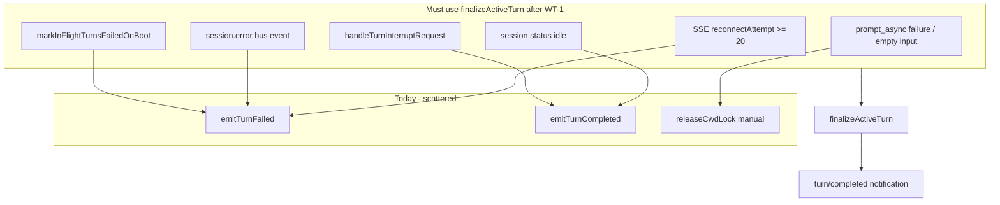

# Architect contract — WT-1 transport (SSE / turn lifecycle)

**Status:** Pre-implementation contract (helpers not yet in tree; WT-1 implements inline per P0 plan).

## Planned helpers (WT-1)

### `finalizeActiveTurn(state, binding, { status, message, releaseLock })`

**Purpose:** Single terminal path for active turns — clears `turnPhase`, `activeRemodexTurnId`, optional cwd lock, turn reducer, and emits one terminal notification.

**Signature (JSDoc target):**

```javascript
/**
 * @param {OpenCodeTransportState} state
 * @param {ThreadBinding} binding
 * @param {{
 *   status: "completed"|"failed"|"interrupted",
 *   message?: string,
 *   releaseLock?: boolean,
 * }} options
 * @returns {string|null} JSON-RPC line for phone, or null if reducer already terminal
 */
function finalizeActiveTurn(state, binding, { status, message, releaseLock = true })
```

**Must:**

- Set `binding.turnPhase` to terminal value matching `status`
- Clear `binding.activeRemodexTurnId` when terminal
- Call `releaseCwdLock(state, binding.cwd, turnId)` when `releaseLock` and turn id known
- Call `resetTurnReducer(state, binding.remodexThreadId)`
- `persistBindings(state)`
- Emit via existing `emitTurnCompleted` / `emitTurnFailed` (dedupe via reducer `terminalEmitted`)

### `formatOpenCodeModel(bindingOrParamsModel)`

**Purpose:** Map Remodex/Codex-shaped model refs to OpenCode HTTP body for POST only.

**Signature:**

```javascript
/**
 * @param {string|{ provider?: string, model?: string, id?: string }|null} value
 * @returns {{ providerID: string, modelID: string }|undefined}
 */
function formatOpenCodeModel(value)
```

**Wire:** `POST .../prompt_async` body uses `{ providerID, modelID }` (not flat `model` string). Catalog/bindings may still store `{ provider, model }`.

**Current gap:** `readModelReference` in `opencode-transport.js` returns a string/id only — WT-1 replaces POST body construction only.

### `makeJsonRpcRequest(id, method, params)`

**Purpose:** Approval and user-input flows must be JSON-RPC **requests** (top-level `id`, `method`, `params`), not notifications.

**Signature:**

```javascript
/**
 * @param {string|number} id
 * @param {string} method
 * @param {object} params
 * @returns {string} single JSON-RPC line
 */
function makeJsonRpcRequest(id, method, params)
```

**Consumers:** `CodexService+Incoming.swift` — matches existing request/reply pairing for `item/tool/*` methods.

## Terminal path call graph (current → target)



| Path | File:region | Today | WT-1 |
|------|-------------|-------|------|
| Boot in-flight turns | `opencode-transport.js` ~211–219 | `emitTurnFailed` only | `finalizeActiveTurn(..., failed)` |
| `prompt_async` HTTP error | ~1370–1373 | `releaseCwdLock` + throw | `finalizeActiveTurn` on failure |
| Empty input | ~1348–1350 | `releaseCwdLock` + throw | `finalizeActiveTurn` or pre-lock guard |
| `session.status` idle | ~1587–1601 | manual lock + phase clear | `finalizeActiveTurn(completed)` |
| `session.error` | ~1605–1620 | `emitTurnFailed` + manual clear | `finalizeActiveTurn(failed)` |
| `turn/interrupt` | ~1421–1436 | `emitTurnCompleted` + manual | `finalizeActiveTurn(interrupted)` |
| SSE 20-attempt ceiling | ~2934–2949 | `emitTurnFailed` **without** lock/phase clear | `finalizeActiveTurn(failed)` **must** clear lock |

## `turn/start` 204 / null body

- After `openCodeFetch`, treat `result === null` or empty body as **success** when no `result.__opencodeError`.
- Guard: `if (result?.__opencodeError)` before throwing (fixes null deref).

## Approval example line (request shape)

```json
{"jsonrpc":"2.0","id":"perm-abc","method":"item/tool/requestApproval","params":{"threadId":"…","itemId":"…","permissionId":"…","request":{}}}
```

iOS: `CodexService+Incoming.swift` — route by `method` + correlate `id` on client response.
