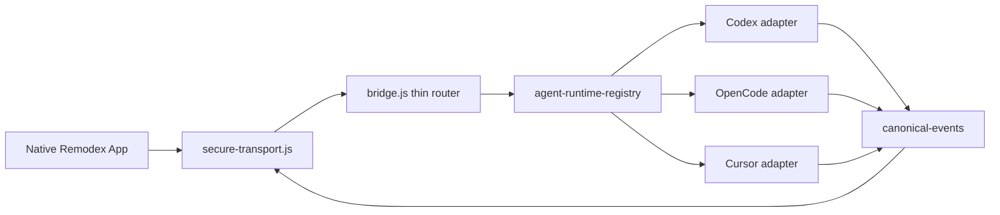

# Multi-agent runtime implementation blueprint

**Status:** Planning complete for implementation handoff (2026-05-23)  
**Branch:** `feat/multi-agent-runtime`  
**Issue tracker:** [kartikkabadi/remodex #16-#29](https://github.com/kartikkabadi/remodex/issues/16)  
**Primary decisions:** [ADR 002](../adr/002-agent-runtime-and-canonical-events.md), [ADR 003](../adr/003-cursor-agent-runtime.md)

This blueprint turns the parent PRD and issue set into build order, module ownership, schemas, and review notes. It intentionally keeps Remodex local-first: the Mac bridge owns runtime credentials and process control; client surfaces receive sanitized status and canonical events only.

## Source facts checked

- Local branch is `feat/multi-agent-runtime`; `origin/main` and `fork/main` are aligned at the handoff base.
- Current bridge is Codex-centric: `phodex-bridge/src/bridge.js` owns secure relay setup, Codex transport lifecycle, desktop refresh, push tracking, thread state, and RPC routing.
- `phodex-bridge/src/codex-transport.js` is a Codex adapter today. Keep it Codex-only and wrap it; do not mutate it into the generic runtime layer.
- `opencode --version` is `1.15.7`; local `opencode serve --help` reports `--hostname 127.0.0.1 --port 0`, while the current official server docs list default port `4096`. Do not rely on defaults; pass `--hostname 127.0.0.1 --port 0` explicitly. `--mdns` widens binding to `0.0.0.0`, so do not enable it.
- `opencode attach <url>` supports `--session`, `--dir`, and basic-auth flags, which matches the planned desktop handoff path.
- Cursor Agent is installed locally, but not through this shell's current `PATH`: `/Users/user/.local/bin/agent` points at `/Users/user/.local/share/cursor-agent/versions/2026.05.20-2b5dd59/cursor-agent`, and `agent acp --help` works. `/Applications/Cursor.app/Contents/Resources/app/bin/cursor` is Cursor `3.5.33` and supports the `agent` subcommand. Runtime discovery must check these installed paths before reporting `not_installed`.
- `origin/codex/add-opencode-provider` and `origin/codex/add-cursor-provider` are reference branches only. Mine icons, tests, ACP JSON-RPC client pieces, and UI affordances; do not merge their `modelProvider` router or OpenCode `opencode run --format json` path.
- `origin/codex/ipad-os` is too broad to merge wholesale. It deletes and rewrites large assets and app shell files; cherry-pick only target/build wiring and still-relevant pad UI.

## Runtime model

Every Remodex thread gets exactly one **Agent Runtime** in V1:

| Runtime | Runtime id | Agent Session id | Transport | V1 scope |
|---------|------------|------------------|-----------|----------|
| Codex | `codex` | Codex thread id | existing Codex app-server JSON-RPC | Full existing parity |
| OpenCode | `opencode` | OpenCode session id | bridge-spawned `opencode serve` HTTP/SSE on loopback | PR1 Core plus gated Stretch |
| Cursor | `cursor` | Cursor ACP session id | `agent acp` or verified Cursor Agent equivalent over JSON-RPC stdio | PR2 Core only |

Thread metadata:

```json
{
  "agentRuntime": "codex | opencode | cursor",
  "agentSessionId": "runtime-owned-session-id",
  "opencodeBuildAgentName": "build",
  "opencodePlanAgentName": "plan"
}
```

`agentRuntime` is set at thread creation and locked after the first successful `thread/start`. Forks and continuations inherit the source thread's runtime metadata unless the user explicitly starts a new thread.

Bridge runtime state should live under `~/.remodex/thread-agent-state.json`:

```json
{
  "version": 1,
  "threads": {
    "remodex-thread-id": {
      "agentRuntime": "opencode",
      "agentSessionId": "ses_123",
      "cwd": "/Users/user/Documents/Projects/example",
      "opencodeBuildAgentName": "build",
      "opencodePlanAgentName": "plan",
      "createdAt": "2026-05-23T00:00:00.000Z",
      "updatedAt": "2026-05-23T00:00:00.000Z"
    }
  }
}
```

Legacy threads with no runtime metadata backfill as `codex` with `agentSessionId = thread.id`.

## Bridge architecture

### New modules

| Module | Interface | Implementation notes | Tests |
|--------|-----------|----------------------|-------|
| `agent-runtime-registry.js` | `listRuntimes`, `resolveThreadRuntime`, `startThread`, `startTurn`, `stopTurn`, `resumeThread`, `handleRuntimeResponse` | Owns dispatch by `agentRuntime`; never exits the bridge because a non-Codex runtime fails | registry route tests; child failure isolation |
| `thread-agent-state.js` | `load`, `save`, `get`, `set`, `inherit`, `backfillCodex` | Uses `daemon-state.js` JSON helpers; redacts bearer-like ids in logs | state migration and corruption tests |
| `agent-runtime-capabilities.js` | Capability matrix for queue, steer, photos, plan mode, permissions, desktop handoff | Shared by `initialize`, iOS gating, and tests | table snapshot tests |
| `canonical-events.js` | Canonical envelope builders and validators | One schema table for all runtimes | fixture validation tests |
| `codex-runtime-adapter.js` | Runtime adapter around `codex-transport.js` | Keeps Codex lifecycle behavior but removes direct bridge ownership from callers | Codex legacy parity tests |
| `codex-to-canonical-adapter.js` | Codex JSON-RPC notification to canonical event | Converts `codex/event/*`, `turn/*`, item events, approvals, and plan updates | one fixture per schema row |
| `opencode-server.js` | Spawn/status/dispose loopback server | `OPENCODE_SERVER_PASSWORD=<random> opencode serve --hostname 127.0.0.1 --port 0 --pure --print-logs`; never enable mdns | spawn command/status tests |
| `opencode-runtime-adapter.js` | Session start, prompt, abort, permission reply, status | HTTP/SSE allowlist; never forwards auth endpoints; maps agents by turn mode | mocked HTTP/SSE tests |
| `opencode-to-canonical-adapter.js` | OpenCode event stream to canonical event | Handles assistant deltas, tools, diffs, permissions, completion, degraded events | captured fixture tests |
| `cursor-acp-client.js` | JSON-RPC stdio client for ACP | May mine upstream branch client; must be runtime-neutral and testable | newline JSON-RPC tests |
| `cursor-runtime-adapter.js` | `session/new`, `session/prompt`, `session/cancel`, status | Does not auto-approve permissions; failure isolated from Codex/OpenCode | mocked ACP tests |
| `cursor-to-canonical-adapter.js` | ACP update to canonical event | Maps session updates, plan mode, tools, permissions, completion | ACP fixture tests |

### Bridge routing flow



`bridge.js` should shrink to orchestration: relay/secure transport setup, handler registration, and delegating runtime-specific RPCs to the registry. Existing bridge-managed RPCs that are not runtime-specific can remain in place until a later cleanup.

### Runtime status contract

All statuses are sanitized and safe for iOS:

| Status | Meaning | Required details |
|--------|---------|------------------|
| `ready` | Runtime can start a turn | Version, display name, capabilities |
| `not_installed` | Binary/app is missing | User-safe install hint, no shell path secrets |
| `needs_auth` | Runtime is installed but cannot start authenticated work | Runtime name and short remediation hint only |
| `degraded` | Runtime is present but a feature is unavailable | Feature flag and reason |
| `starting` | Spawn or handshake is in progress | Runtime id and retryable flag |
| `error` | Last attempt failed unexpectedly | Redacted message and stable code |

OpenCode discovery uses `opencode --version` and server handshake. Cursor discovery checks an explicit env/config override, `/Users/user/.local/bin/agent`, `agent`, `cursor-agent`, the app-bundled `cursor agent` command, and any documented Cursor.app embedded candidates; only if all verified candidates fail should status become `not_installed`.

## Canonical event schema

Wire methods sent to client surfaces use the `remodex/event/*` namespace for timeline/runtime events. The iOS adapter may then project those into existing internal state mutations.

Canonical envelope:

```json
{
  "jsonrpc": "2.0",
  "method": "remodex/event/assistant_delta",
  "params": {
    "schemaVersion": 1,
    "agentRuntime": "opencode",
    "threadId": "remodex-thread-id",
    "agentSessionId": "runtime-session-id",
    "turnId": "remodex-turn-id",
    "itemId": "optional-stable-item-id",
    "createdAt": "2026-05-23T00:00:00.000Z",
    "payload": {}
  }
}
```

Required event rows for PR1:

| Canonical method | Codex source | OpenCode source | iOS projection |
|------------------|--------------|-----------------|----------------|
| `remodex/event/thread_started` | `thread/started` | `session/new` result | active thread hydrate |
| `remodex/event/turn_started` | `turn/started` | `prompt_async` accepted | running turn state |
| `remodex/event/user_message` | `codex/event/user_message` | prompt echo if needed | user row |
| `remodex/event/assistant_delta` | assistant delta/content delta | SSE assistant delta | streaming assistant row |
| `remodex/event/assistant_completed` | `item/completed` / agent message final | SSE message complete | complete assistant row |
| `remodex/event/tool_started` | exec/search/read/patch begin | tool event start | tool row start |
| `remodex/event/tool_delta` | command output / patch background | tool output delta | tool output append |
| `remodex/event/tool_completed` | exec/patch/image end | tool event end | tool row complete |
| `remodex/event/diff_updated` | `turn/diff/updated` and legacy aliases | session diff after turn | diff state |
| `remodex/event/turn_completed` | `turn/completed` | stream complete/session complete | running turn cleared |
| `remodex/event/error` | `error` / `turn/failed` | stream or HTTP failure | error row/status |
| `turn/plan/updated` | existing plan event | plan-mode update | existing plan reducer |
| `item/plan/delta` | existing plan delta | plan-mode delta | existing plan row |
| `remodex/request/permission` | app-server approval request | permission request | pending permission UI |
| `serverRequest/resolved` | app-server resolution | runtime permission resolution | clear pending prompt |

The important rule is not the final spelling of each internal reducer event; it is that production iOS receives one bridge-owned canonical vocabulary, and raw `codex/event/*` is limited to adapter tests after #23.

## iOS architecture

### Model and persistence

Add runtime identity to `CodexThread`:

- `agentRuntime: AgentRuntime`
- `agentSessionId: String?`
- `opencodeBuildAgentName: String?`
- `opencodePlanAgentName: String?`

`CodexThreadRuntimeOverride` currently means model/reasoning/service tier. Do not overload that type. Add a separate runtime-selection state or rename the current type before extending it. Fork/continue code in `CodexService+ThreadFork.swift` and merge helpers in `CodexService+Helpers.swift` must preserve runtime fields.

### RemodexEventAdapter

Place `RemodexEventAdapter` at `CodexService+Incoming.handleIncomingRPCMessage`, before state mutation. It should:

- accept only canonical production methods plus server requests;
- normalize into existing downstream handlers for messages, plan state, tool rows, diff, permissions, and run badge state;
- keep raw `codex/event/*` compatibility inside adapter tests only;
- preserve item-scoped assistant rows, late reasoning merge behavior, background reconnect behavior, and Stop visibility guardrails from `AGENTS.md`.

### Composer and controls

The composer should show two separate concepts:

- **Agent pill:** Codex, OpenCode, Cursor.
- **Environment pill:** Quick Chat, Local project, Worktree.

OpenCode runtime selection is visible in PR1. Cursor remains hidden until PR2.

Runtime capability matrix:

| Capability | Codex | OpenCode PR1 Core | OpenCode PR1 Stretch | Cursor PR2 Core |
|------------|-------|-------------------|----------------------|-----------------|
| Start/stream/stop | yes | yes | yes | yes |
| Plan mode | yes | yes | yes | best effort |
| Phone permissions | yes | yes | yes | yes |
| Diffs | yes | yes | yes | fixture-backed |
| Queue | yes | hide until proven | yes if fixtures pass | hidden |
| Steer running turn | yes | hide until proven | yes if fixtures pass | hidden |
| Photos/camera | yes | hide until proven | yes if fixtures pass | hidden |
| Desktop handoff | Codex-native | hidden until proven | `opencode attach` | out of scope |
| Subagent rows | yes | hide until proven | yes if fixtures pass | out of scope |

Readiness gating belongs in `TurnViewModel` send validation and the composer host state, not only in button styling. For a not-ready runtime, keep send disabled and show a short inline runtime status; do not silently fall back to Codex.

## Issue-by-issue build order

1. **#17 Wave 0 — bridge hygiene and CI tests**
   - Update `.github/workflows/bridge-check.yml` to run `phodex-bridge npm test` and relay tests when present.
   - Add `private` and Node engine floor to `phodex-bridge/package.json`.
   - Add baseline tests for `session-state`, `workspace-checkpoints`, and apply-patch helpers.
   - Verify relay server logs redact live relay `sessionId`; keep QR/debug pairing surfaces out of that criterion because they intentionally display pairing data.

2. **#18 Bridge agent registry and transports**
   - Introduce registry, runtime capabilities, and thread runtime state.
   - Wrap Codex as the first runtime adapter with no behavior change.
   - Add OpenCode status stub and process-failure isolation.
   - `initialize` returns `defaultAgentRuntime`, runtime capabilities, OpenCode defaults, and sanitized runtime statuses.

3. **#19 Canonical schema and Codex adapter**
   - Add canonical event builders and Codex adapter fixtures.
   - Make bridge output canonical events for Codex before iOS cutover.
   - Include `push-notification-tracker.js`, `rollout-live-mirror.js`, and `desktop-ipc-action-follower.js` in the review because they currently know raw Codex shapes.

4. **#20 OpenCode spawn, security, and status**
   - Spawn `opencode serve --hostname 127.0.0.1 --port 0 --pure --print-logs` with a bridge-owned random `OPENCODE_SERVER_PASSWORD`.
   - Never enable `--mdns`; never proxy `PUT /auth`; allowlist runtime API endpoints.
   - Map startup/auth/HTTP/SSE failures into the status contract.
   - Capture fixture README with OpenCode version, command, endpoints, and redaction notes.

5. **#21 iOS Agent UX and send gating**
   - Add runtime fields to `CodexThread`; add settings default; add composer/sidebar runtime badges.
   - Persist OpenCode build/plan agent names.
   - Implement readiness gating and runtime capability hiding.
   - Keep Cursor hidden until PR2.

6. **#22 OpenCode adapter and turn mapping**
   - Implement `thread/start`/`thread/resume` to OpenCode session creation.
   - Implement prompt path, SSE demux, stop via session abort, permission round trip, session diff after turn, and Codex-only sidecar gating.
   - Treat `desktop/continueOnOpenCode` as Stretch behind fixture-backed readiness.

7. **#23 iOS RemodexEventAdapter and timeline cutover**
   - Add adapter at the incoming RPC boundary.
   - Port existing incoming/plan/message tests to canonical fixtures.
   - Remove production raw `codex/event/*` parsing after parity tests pass.

8. **#24 OpenCode E2E parity on iPhone**
   - Agents prove bridge/relay tests, `xcodebuild` compile, and Mac OpenCode smoke.
   - Kartik verifies physical iPhone Core: stream, stop, plan, permissions, tools, diff, runtime selection, Codex regression.
   - Stretch controls either pass or remain hidden with an explicit PR note.

9. **#25 Cursor ACP transport and status**
   - Discover Cursor Agent robustly, including `/Users/user/.local/bin/agent` and the app-bundled Cursor CLI; report `not_installed` only when all verified candidates fail.
   - Implement ACP stdio lifecycle and failure isolation.
   - Add mocked `session/new`, `session/prompt`, and cancel tests.

10. **#26 Cursor to canonical adapter**
    - Map ACP session updates, assistant/reasoning/tool updates, permissions, plan mode, cancel, and completion to canonical events.
    - Phone permission response is mandatory; no transport-level auto-allow.

11. **#27 Cursor E2E parity on iPhone**
    - Core-only smoke: stream, stop, phone permissions, best-effort plan, runtime list, Codex/OpenCode regression.
    - Queue, steer, and photos stay hidden.

12. **#28 RemodexPad iPad port**
    - Cherry-pick target/config/scheme and surviving iPad shell deltas only.
    - Build `RemodexPad` and keep `CodexMobile` building.
    - Physical iPad install remains human QA; do not mark fully agent-complete without it.

13. **#29 Upstream PR prep**
    - Stack branches explicitly: `main -> PR1 OpenCode -> PR2 Cursor -> PR3 iPad`.
    - PR1 references ADR 002 and issues through #24.
    - PR2 references ADR 003 and contrasts with upstream PR #141.
    - PR3 references RemodexPad scope and iPad QA.

## Review findings

- **High:** #28 was labeled `ready-for-agent` even though its acceptance includes physical iPad install. The implementation part is agent-ready; final verification is human.
- **High:** #18 is the choke point. Starting #20/#21 before runtime state and registry exist will create incompatible local shims.
- **High:** Canonical schema must include bridge sidecars, not just iOS timeline rows. Push tracking, rollout replay, and desktop IPC followers currently understand raw Codex event names.
- **Medium:** Cursor Agent is installed here but not on this shell's current `PATH`. #25 must begin with robust discovery/status, not adapter happy path or a PATH-only lookup.
- **Medium:** Existing upstream OpenCode branch uses `opencode run --format json`; that conflicts with ADR 002. Reuse fixtures and UI ideas only.
- **Medium:** Current iOS runtime naming is model-oriented. Avoid extending `modelProvider` or making OpenCode agents look like runtimes.
- **Medium:** `origin/codex/ipad-os` is a bulk app-shell branch. A direct merge would clobber newer local-first work.

## Verification plan

Run by agents before handing each implementation slice to Kartik:

```bash
cd phodex-bridge && npm test
cd relay && npm test
xcodebuild -project CodexMobile/CodexMobile.xcodeproj -scheme CodexMobile -destination 'generic/platform=iOS' build
```

Run only for PR3 after the target exists:

```bash
xcodebuild -project CodexMobile/CodexMobile.xcodeproj -scheme RemodexPad -destination 'generic/platform=iOS' build
```

Manual QA remains scoped:

- PR1: Kartik physical iPhone OpenCode Core and Codex regression.
- PR2: Kartik physical iPhone Cursor Core and Codex/OpenCode regression.
- PR3: Kartik physical iPad RemodexPad re-smoke.
