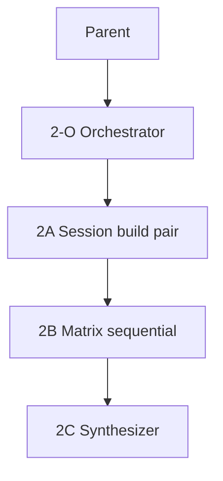

# OpenCode — simulator QA runbook

**PR matrix:** [#54](https://github.com/kartikkabadi/remodex/pull/54)  
**Status doc:** [opencode-runtime-status.md](./opencode-runtime-status.md)  
**Subagent model:** `composer-2.5` only (never `composer-2.5-fast`)

## Prerequisites (Wave 1 exit gate)

- [ ] Wave 0 + 1a pushed to `fork/multi-agents/opencode`
- [ ] `127.0.0.1` in `run-local-remodex.sh`, embedded relay snippet, `relay/server.js`
- [ ] `Docs/adr/001-opencode-runtime-shape.md` on branch
- [ ] `PrivateOverrides.xcconfig` with `ws://127.0.0.1:9000/relay`
- [ ] One successful XcodeBuildMCP preflight (`build_run_sim` via MCP or CLI)

## Orchestration (collapsed Wave 2)



| Role | Owns | Must not |
|------|------|----------|
| **2-O** | Spawn 2A → 2B → 2C; retry caps | Product code edits |
| **2A** | Launcher, pair, `npm test`, filtered `test_sim` | Parallel sim sessions |
| **2B** | PR #54 rows in order, screenshots | Check boxes without proof |
| **2C** | Update status doc + PR checklist | Fake device pass |

**Retry caps:** pairing ≤2 attempts; each PR row ≤1 retry then `blocked`.

## Infra profile (loopback)

```sh
export STOP_LAUNCHER=1   # conceptual: kill prior launcher before mode switch
./run-local-remodex.sh --opencode
```

Health: `curl -sf http://127.0.0.1:9000/health`

## XcodeBuildMCP tools

| Workflow | Tools |
|----------|--------|
| Simulator | `list_sims`, `boot_sim`, `build_sim`, `build_run_sim`, `install_app_sim`, `launch_app_sim`, `screenshot`, `snapshot_ui`, `stop_app_sim` |
| UI | `tap`, `type_text`, `swipe`, `snapshot_ui` |
| Tests | `test_sim` with `-only-testing:` **only** (two classes max in 2A) |
| Debug | `debug_attach_sim`, `debug_lldb_command` on failure only |

**CLI fallback** (from repo root):

```sh
sfw npx --yes xcodebuildmcp@2.5.2 simulator build-and-run
sfw npx --yes xcodebuildmcp@2.5.2 simulator screenshot --output-path .qa-screenshots/opencode-sim/
```

**Do not** run full `CodexMobileUITests` unless Kartik asks.

## 2A sequence

1. Start `./run-local-remodex.sh --opencode`; capture pairing code
2. `build_run_sim` (or MCP equivalent)
3. Pair via paste code; screenshot connected state
4. `cd phodex-bridge && npm test`
5. Filtered `test_sim` e.g. `CodexThreadRuntimeOverrideTests`, `TurnComposerReviewModeTests`

Exit: `{ paired, logPaths, bundleId, unitTestsPass }` or stop Wave 2.

## 2B matrix (sequential, one Simulator)

Run rows 1–11 from PR #54. Save screenshots:

`.qa-screenshots/opencode-sim/row-NN-<slug>.png`

**Row 9 — Codex regression (mandatory):**

1. Stop OpenCode launcher
2. `./run-local-remodex.sh` **without** `--opencode`
3. Re-pair if needed; smoke test
4. Stop launcher
5. Restore `./run-local-remodex.sh --opencode`

| Row | Automation | Notes |
|-----|------------|-------|
| 1–4, 10 | Partial | Menus fragile; unit tests backstop |
| 5–8 | Low | Live turn + Stop; logs + screenshots |
| 9 | Partial | Launcher mode switch above |
| 11 | Partial | Needs real RPC failure for toast copy |

Mark **blocked** when honesty is low—never check PR boxes without evidence.

## 2C deliverables

- Update [opencode-runtime-status.md](./opencode-runtime-status.md) per row (pass/fail/blocked + screenshot paths)
- PR #54 checklist comment or body section with links
- Parent runs **thermo on evidence** before “T2 complete” language

## Failure escalation

1. `snapshot_ui` + screenshot
2. Bridge/relay logs from launcher terminal
3. `debug_attach_sim` only if repro unclear
4. File `blocked` with reason—no silent pass

## Evidence layout

```
.qa-screenshots/opencode-sim/
  row-01-agent-runtime.png
  ...
  row-09-codex-regression.png
```

Directory is gitignored.
