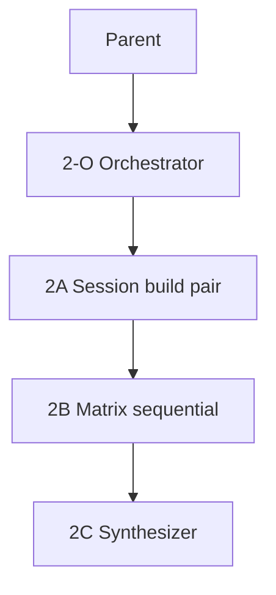

# OpenCode — simulator QA runbook

**PR matrix:** [#54](https://github.com/kartikkabadi/remodex/pull/54)  
**Status doc:** [opencode-runtime-status.md](./opencode-runtime-status.md)  
**Subagent model:** `composer-2.5` only (never `composer-2.5-fast`)

## Wave 0 — integration lane bootstrap

Wave 0 lands on `opencode/integration` before parallel workers fan out:

| Step | Command / artifact |
|------|-------------------|
| Integration branch | `opencode/integration` from `multi-agents/opencode` |
| Upstream merge | `git merge origin/main` (no `fork/main` wholesale merge) |
| Worktrees | `scripts/worktree-bootstrap.sh <slug>` → `.worktrees/<slug>` |
| Audit trail | `scripts/audit-log.sh` → `.audit/opencode-p0-ship.tsv` |
| Bridge + relay gates | `cd phodex-bridge && sfw npm test`; `cd relay && sfw npm test` |

**Exit:** `opencode/integration` contains `origin/main` with bridge ≥490 pass and relay 41 pass.

## Wave 1a — sim infra on fork branch

Wave 1a pushes simulator automation to `multi-agents/opencode` (fork) before Wave 2 orchestration:

| Deliverable | Path |
|-------------|------|
| DEBUG pairing hook | `RemodexDebugPairing.swift`, `ContentViewModel.attemptDebugPairingOnLaunchIfNeeded` |
| RMX1 emitter | `scripts/opencode-emit-pairing-rmx1.sh` |
| Preflight + row 9 smoke | `scripts/opencode-sim-preflight.sh` (`codex-smoke` subcommand) |
| Screenshot validator | `scripts/validate-qa-screenshot.sh` |
| Matrix recorder | `scripts/opencode-sim-record-row.sh` → `opencode-sim-matrix.json` |
| XcodeBuildMCP defaults | `.xcodebuildmcp/config.yaml` |
| Evidence dir (gitignored) | `.qa-screenshots/opencode-sim/` |

**Exit:** `./scripts/opencode-sim-preflight.sh --check-only` passes on a machine with relay health + committed MCP config.

## Prerequisites (Wave 1 exit gate)

- [ ] Wave 0 + 1a on `multi-agents/opencode` (fork `kartikkabadi/remodex`)
- [ ] `127.0.0.1` in `run-local-remodex.sh`, embedded relay snippet, `relay/server.js`
- [ ] `Docs/adr/001-opencode-runtime-shape.md` on branch
- [ ] `PrivateOverrides.xcconfig` with `ws://127.0.0.1:9000/relay`
- [ ] One successful `./scripts/opencode-sim-preflight.sh` (or `--check-only` after manual launcher)

## Fresh manual onboarding (reset sim + pairing)

Full clean reset (stop stack, `resetBridgeDeviceState`, uninstall sim app, loopback overrides, optional build):

```sh
./scripts/opencode-fresh-onboarding.sh --build-sim --start-launcher
```

Then paste the **short pairing code** from the launcher log or `~/.remodex/pairing-session.json` (`pairingCode`). Do **not** use `-RemodexDebugPairingRMX1` for this flow.

## DEBUG simulator pairing (Wave 2A)

**DEBUG builds only** (`#if DEBUG`). Supply the full paste token from the Mac bridge:

| Source | Example |
|--------|---------|
| Environment | `REMODOX_DEBUG_PAIRING_RMX1='RMX1:…'` |
| Launch argument | `-RemodexDebugPairingRMX1` `RMX1:…` (two argv entries) |
| Launch argument (combined) | `-RemodexDebugPairingRMX1=RMX1:…` |

Emit a fresh token while the OpenCode launcher is healthy:

```sh
./run-local-remodex.sh --opencode --hostname 127.0.0.1
# separate terminal:
./scripts/opencode-emit-pairing-rmx1.sh
```

Preflight wires launcher + emit + `build_run_sim` with launch args:

```sh
./scripts/opencode-sim-preflight.sh
# health + config only:
./scripts/opencode-sim-preflight.sh --check-only
```

`attemptDebugPairingOnLaunchIfNeeded` runs **before** onboarding auto-connect so a fresh Simulator can pair without manual paste (fallback: paste code ≤2 attempts per retry caps).

## Orchestration (collapsed Wave 2)



| Role | Owns | Must not |
|------|------|----------|
| **2-O** | Spawn 2A → 2B → 2C; retry caps | Product code edits |
| **2A** | Launcher, pair, `npm test`, filtered `test_sim` | Parallel sim sessions |
| **2B** | PR #54 rows in order, screenshots | Check boxes without proof |
| **2C** | Update status doc + PR checklist | Fake device pass |

**Retry caps:** pairing ≤2 attempts; each PR row ≤1 retry then `blocked`.

## Infra profile (loopback)

```sh
export STOP_LAUNCHER=1   # stop background launcher started by preflight
./run-local-remodex.sh --opencode --hostname 127.0.0.1
```

Health: `curl -sf http://127.0.0.1:9000/health`

## XcodeBuildMCP tools

| Workflow | Tools |
|----------|--------|
| Simulator | `list_sims`, `boot_sim`, `build_sim`, `build_run_sim`, `install_app_sim`, `launch_app_sim`, `screenshot`, `snapshot_ui`, `stop_app_sim` |
| UI | `tap`, `type_text`, `swipe`, `snapshot_ui` |
| Tests | `test_sim` with `-only-testing:` **only** (two classes max in 2A) |
| Debug | `debug_attach_sim`, `debug_lldb_command` on failure only |

**CLI fallback** (from repo root):

```sh
./scripts/opencode-sim-preflight.sh
sfw npx --yes xcodebuildmcp@2.5.2 simulator screenshot --output-path .qa-screenshots/opencode-sim/row-00-connected.png
./scripts/validate-qa-screenshot.sh .qa-screenshots/opencode-sim/row-00-connected.png
```

**Do not** run full `CodexMobileUITests` unless Kartik asks.

## 2A sequence

1. `./scripts/opencode-sim-preflight.sh` (launcher + RMX1 + `build_run_sim`)
2. Confirm connected UI; screenshot `row-00-connected.png`
3. `./scripts/validate-qa-screenshot.sh` on connected screenshot (exit 0)
4. `cd phodex-bridge && sfw npm test`
5. Filtered `test_sim` e.g. `CodexThreadRuntimeOverrideTests`, `TurnComposerReviewModeTests`

Exit: `{ paired: true, logPaths, bundleId, unitTestsPass }` or stop Wave 2.

## 2B matrix (sequential, one Simulator)

Run rows 1–11 from PR #54. Record each row:

```sh
./scripts/opencode-sim-record-row.sh 1 agent-runtime pass .qa-screenshots/opencode-sim/row-01-agent-runtime.png
```

Save screenshots under `.qa-screenshots/opencode-sim/row-NN-<slug>.png`.

**Row 9 — Codex regression (mandatory):**

```sh
./scripts/opencode-sim-preflight.sh codex-smoke
# then restore OpenCode:
./scripts/opencode-sim-preflight.sh
```

| Row | Automation | Notes |
|-----|------------|-------|
| 1–4, 10 | Partial | Menus fragile; unit tests backstop |
| 5–8 | Low | Live turn + Stop; logs + screenshots |
| 9 | Partial | `codex-smoke` subcommand above |
| 11 | Partial | Needs real RPC failure for toast copy |

Mark **blocked** when honesty is low—never check PR boxes without evidence.

## 2C deliverables

- Update [opencode-runtime-status.md](./opencode-runtime-status.md) from `opencode-sim-matrix.json` only
- PR #54 checklist comment or body section with links
- Parent runs **thermo on evidence** before “T2 complete” language

## Failure escalation

1. `snapshot_ui` + screenshot
2. Bridge/relay logs from launcher terminal (`OPENCODE_LAUNCHER_LOG`, default `/tmp/remodex-opencode-launcher.log`)
3. `debug_attach_sim` only if repro unclear
4. File `blocked` with reason—no silent pass

## Evidence layout

```
.qa-screenshots/opencode-sim/
  row-00-connected.png
  row-01-agent-runtime.png
  ...
  row-09-codex-regression.png
opencode-sim-matrix.json
```

`.qa-screenshots/opencode-sim/` is gitignored; commit the matrix JSON when publishing sim evidence.
