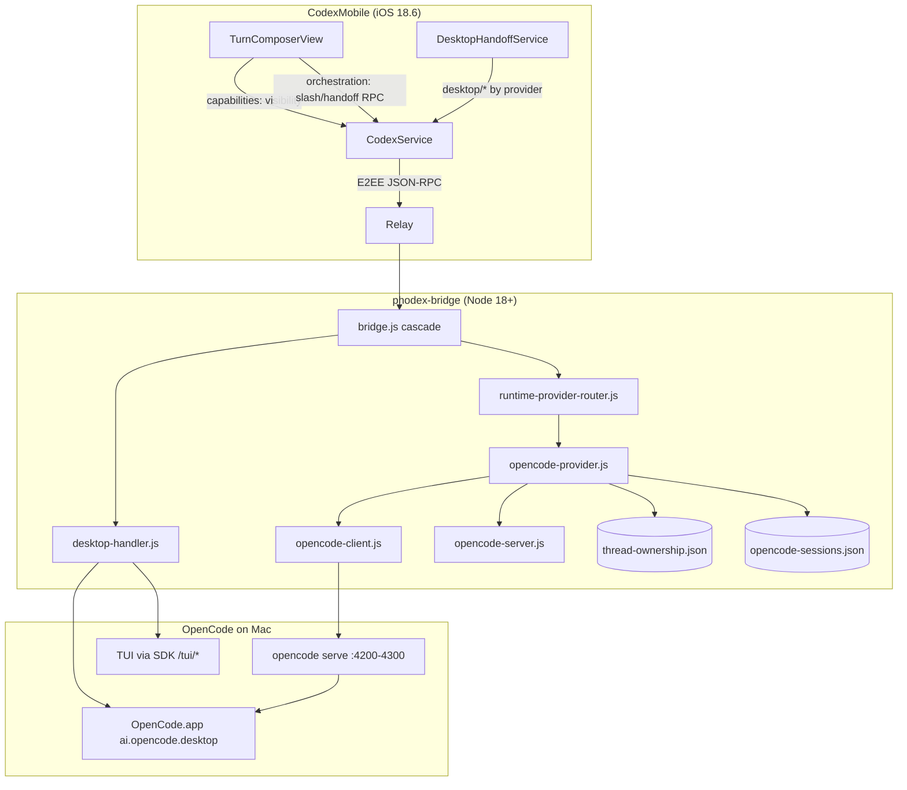
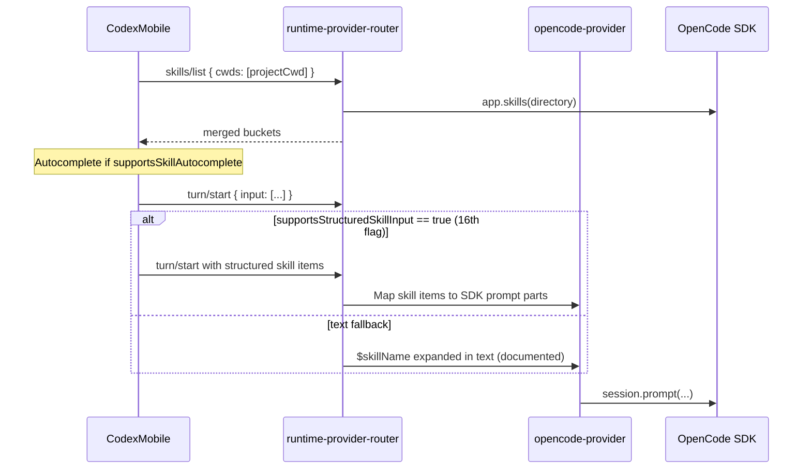
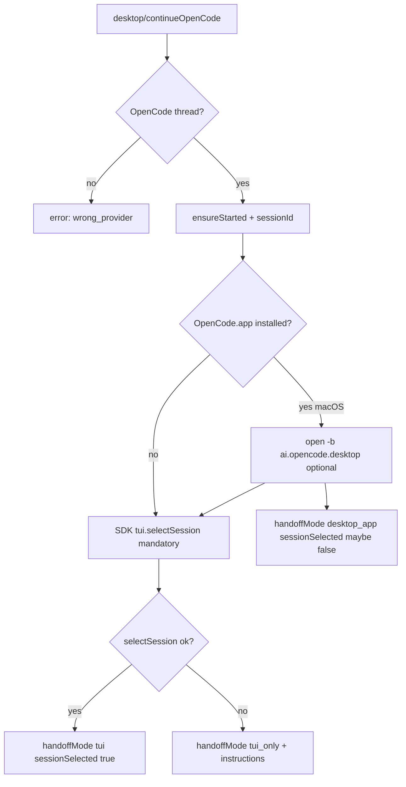

# Full OpenCode Support in Remodex — Design Document

> **Superseded for planning and PR order.** Use [master-opencode-integration.md](master-opencode-integration.md) as the canonical source of truth. **Device E2E signed off on `main`** — [device-e2e-signoff.md](../operations/device-e2e-signoff.md). This file remains as historical context for the original PR1–8 draft.

| Field | Value |
|-------|-------|
| **Title** | Full OpenCode Integration for Remodex (iPhone + Mac Bridge) |
| **Author** | Systems Architecture (draft) |
| **Date** | 2026-06-02 |
| **Status** | Draft (rev. 3 — review round 2) |
| **Revision** | 2026-06-02 rev. 2 (14 issues); rev. 3 (5 issues) — `/tmp/grok-design-review-b1f675f4.md` |
| **Primary workspace** | `/Users/user/.grok/worktrees/downloads-remodexopencode/2026-06-02-2b14d8ff` |
| **Active implementation** | `repos/remodex-opencode/` (`phodex-bridge/` + `CodexMobile/`) |

---

## Overview

Remodex is an iPhone app that controls AI coding agents on a paired Mac via an encrypted relay and Node.js bridge (`phodex-bridge`). **OpenCode** is integrated as a second runtime alongside Codex using `opencode serve` HTTP and `@opencode-ai/sdk/v2` (ADR-004). The bridge routes provider-aware RPCs through `runtime-provider-router.js`; iOS renders composer controls exclusively from **capability flags** in `runtime/catalog` and per-model capabilities in `model/list`.

This document audits the **current** implementation (June 2026), defines the **complete** OpenCode surface the user requested (skills, slash commands, desktop handoff, capability-driven UX), and plans incremental, reviewable PRs. It does **not** assume prior work is correct: several paths are implemented but not wired end-to-end, and documentation has drifted from code.

**Bottom line:** Core session/turn streaming, model/agent catalog, thread ownership, permissions, and fork are largely in place on the bridge. **Gaps blocking “full” support** are: (1) iOS slash commands still Codex-hardcoded despite bridge `command/list`; (2) no OpenCode desktop/TUI handoff; (3) skills autocomplete without structured skill payload or SDK parity; (4) thread rehydration after bridge restart; (5) device E2E not signed off; (6) contract/doc drift (15 capability flags vs ADR “12”, stale `bridge-rpc.md` examples).

---

## Background & Motivation

### Problem

Users want to drive **OpenCode** from the phone with the same rigor as Codex: discover skills, use slash commands, continue a session on the Mac desktop app or TUI, and never see fake-enabled UI. Remodex must remain a **Codex regression-safe** product (`REMODEX_DISABLE_OPENCODE=1`).

### Current state (verified in code)

| Layer | What exists | Maturity |
|-------|-------------|----------|
| **Bridge routing** | `bridge.js` handler cascade; `runtime-provider-router.js` handles `model/list`, `thread/list`, `runtime/catalog`, `command/list`, `skills/list`, thread/turn methods | **Strong** — load-bearing order documented in `docs/contracts/bridge-rpc.md` |
| **OpenCode transport** | `opencode-server.js` spawns `opencode serve`; `opencode-client.js` dynamic ESM import `@opencode-ai/sdk/v2` | **Strong** — matches ADR-004; ACP in vendored `repos/opencode/` is **reference only**, not used by Remodex |
| **Provider harness** | `opencode-provider.js` — lazy session on `turn/start`, SSE event mapping, permissions, fork | **Medium** — works in unit tests; restart rehydration incomplete |
| **Persistence** | `~/.remodex/thread-ownership.json`, `~/.remodex/opencode-sessions.json` | **Partial** — ownership + session IDs survive restart; in-memory `threads` Map does not |
| **Capabilities** | `provider-capabilities.js` — **15** flags (not 12 per ADR-002 text) | **Strong** for gating; docs/examples stale |
| **iOS composer** | Capability-driven rows in `TurnComposerView` / `ComposerCapabilityCopy` | **Medium** — simulator-tested; device E2E pending |
| **Slash commands** | Bridge `command/list` → `client.command.list()` | **Bridge only** — iOS uses hardcoded `TurnComposerSlashCommand` enum |
| **Skills** | Bridge `skills/list` merge + `client.app.skills()` | **Partial** — autocomplete UI; `buildPromptFromTurnInput` flattens to plain text |
| **Desktop handoff** | `desktop-handler.js` → Codex.app only; `supportsDesktopHandoff: false` for OpenCode | **Not started** for OpenCode |

### OpenCode enablement policy (code truth)

Implemented in `opencode-runtime-policy.js`:

| Env var | Effect |
|---------|--------|
| *(default)* | OpenCode runtime **registered and enabled** |
| `REMODEX_DISABLE_OPENCODE=1` (or `true`) | OpenCode disabled — Codex-only regression |
| `REMODEX_ENABLE_OPENCODE=0` (legacy) | Same as disable (backward compat) |

**Doc drift (fix in PR1):** `docs/contracts/bridge-rpc.md` still describes opt-in `REMODEX_ENABLE_OPENCODE=1` and maps `opencode_not_enabled` to that flag. `docs/operations/release-compatibility.md` step 76 says “without `REMODEX_ENABLE_OPENCODE`” for Codex regression — wrong; must say `REMODEX_DISABLE_OPENCODE=1` per `AGENTS.md` and `device-e2e-checklist.md` step 10.

PR1 adds a doc snippet + `opencode-runtime-policy.test.js` reference proving default-on behavior.

### Pain points

1. **False parity claims:** `docs/operations/release-compatibility.md` marks OpenCode slash commands **enabled** (row 38), but iOS never calls `command/list` — **PR1 downgrades to `partial`; PR8 may promote to `enabled` only after PR3 + device checklist.**
2. **Bridge restart breaks OpenCode threads:** `thread/read` / `thread/resume` require `threads.get(threadId)`; after restart only ownership stubs appear in `thread/list`.
3. **Handoff asymmetry:** Codex has `desktop/continueOnDesktop` + `DesktopHandoffService`; OpenCode desktop app exists (`ai.opencode.desktop`) and SDK has `client.tui.selectSession()` etc., but Remodex does not use them.
4. **ACP confusion:** Vendored `repos/opencode/packages/opencode/src/acp/` is mature for CLI/IDE; Remodex correctly avoided ACP for reliability (incomplete `session/update` streaming per ADR-004).

### Reference repos (read-only)

| Repo | Use |
|------|-----|
| `repos/opencode/` | SDK surface (`packages/sdk/js`), desktop bundle IDs, TUI HTTP routes |
| `repos/dpcode/` | Production pattern for `opencode serve` + SDK (`OpenCodeAdapter.ts`) |
| `repos/litter/` | Mobile architecture inspiration; no OpenCode |

---

## Goals & Non-Goals

### Goals

1. **Skills:** Discovery via `skills/list`, `$` autocomplete in composer, correct turn payload (text and/or structured items per runtime truth).
2. **Slash commands:** Dynamic list from OpenCode `command/list` on OpenCode threads; Codex keeps existing behavior where appropriate.
3. **Desktop handoff:** On OpenCode threads, “Continue on Mac” opens **OpenCode.app** when installed; else attaches/resumes session in **TUI** via SDK (`tui.selectSession`, optional terminal launch).
4. **Capability-driven UX:** Feature **visibility** (show / hide / grey) is driven exclusively by capability flags and `ComposerCapabilityCopy`. **Provider id** (`modelProvider` / thread metadata) may select **data sources and RPC methods** (e.g. `command/list` vs Codex slash enum, `desktop/continueOpenCode` vs `desktop/continueOnDesktop`) — it must not enable controls that capabilities mark false (ADR-002 intent; existing code already uses provider for labels like `OpenCodeBetaCapsule`).
5. **Codex regression:** Identical behavior with `REMODEX_DISABLE_OPENCODE=1`.
6. **Device E2E:** Sign off parity matrix per `docs/operations/device-e2e-checklist.md` before upstream PRs (per `AGENTS.md`).

### Non-Goals (v1 of this design)

- Upstream PRs to `opencode` or Remodex public repos before Kartik device E2E.
- Replacing HTTP SDK with ACP stdio (explicitly rejected in ADR-004).
- OpenCode **voice** or **Codex Plan mode (+)** on OpenCode threads (remain hidden/greyed via capabilities).
- **Steer** for OpenCode until SDK exposes it (`supportsSteer: false`).
- **Worktree handoff** for OpenCode (`supportsWorktree: false` — git panel stays bridge-local).
- Modifying vendored `repos/opencode/` source.

---

## Proposed Design

### Architecture (target)



### Handler cascade (unchanged invariant)

New OpenCode desktop methods extend **`desktop-handler.js`** at position **8** in `bridge.js:handleApplicationMessage()` (`bridge.js:568–614`; `docs/contracts/bridge-rpc.md` lines 14–31) — after notifications, before git and **before** runtime router.

**PR5 wiring rule:** Add new `case` branches inside `handleDesktopRequest` → `handleDesktopMethod` switch in `desktop-handler.js`. **Do not** register a separate handler after `runtime-provider-router` or at the end of `handleApplicationMessage()`.

### Capability model (source of truth)

**Authoritative list** — `phodex-bridge/src/provider-capabilities.js` (`CAPABILITIES` array, 15 flags):

| Flag | Codex default | OpenCode default | Notes |
|------|---------------|------------------|-------|
| `supportsAgentSelection` | false | true | From `runtime/catalog.agents` |
| `supportsReasoningEffort` | true | false* | *Per-model override when SDK lists efforts |
| `supportsFastMode` | true | false* | *Per-model override |
| `supportsPlanMode` | true | false | Hidden on OpenCode |
| `supportsVoice` | true | false | Hidden on OpenCode |
| `supportsDesktopHandoff` | true | **false** (until proven) | Stays **false** in `OPENCODE_CAPABILITIES` until **TUI handoff** passes device E2E; then optional desktop-app launch. See §3. |
| `supportsWorktree` | true | false | Git UI bridge-local |
| `supportsFork` | true | true | SDK `session.fork` |
| `supportsApprovals` | true | true | `permission.reply` |
| `supportsStreamingTools` | true | true | Event mapping in `opencode-client.js` |
| `supportsSlashCommands` | true | true | Requires iOS `command/list` wiring |
| `supportsMCP` | true | true | Settings copy only; MCP runs in OpenCode process |
| `supportsSkillAutocomplete` | true | true | Requires prompt/skill contract |
| `supportsSteer` | true | false | Greyed |
| `supportsQueue` | true | true | iOS-local queue |

**Action (PR1):** Rewrite `docs/architecture/002-capability-model.md` — replace “12 capability flags” title/table with full **15-flag** table and per-runtime defaults (including `supportsSkillAutocomplete`, `supportsSteer`, `supportsQueue`). Fix `bridge-rpc.md` `runtime/catalog` example JSON to match `OPENCODE_CAPABILITIES` (`supportsSkillAutocomplete: true`). Document opt-out enablement policy (§ above).

**Future (PR4):** Optional **16th** flag `supportsStructuredSkillInput` — see §1; not part of the 15-flag baseline until spike completes.

### 1. Skills (discovery, autocomplete, structured input)

#### Current behavior

| Component | Behavior |
|-----------|----------|
| `runtime-provider-router.js` | `skills/list` merges Codex `sendCodexRequest("skills/list")` + `opencodeProvider.listSkills(cwd)` per cwd bucket; dedupe by name |
| `opencode-client.js` | `client.app.skills({ query: { directory } })` with defensive parsing |
| iOS `CodexService.listSkills` | Calls `skills/list`; `TurnViewModel` debounces `$query` autocomplete |
| `buildPromptFromTurnInput` | **Flattens** all input items to newline-separated text; images become `[image attached: path]` placeholders |
| iOS `supportsStructuredSkillInput` | **Client-only** on `CodexService` / `CodexService+Connection.swift` (defaults `true`); toggled off on RPC failure in `CodexService+ThreadsTurns.swift` — **not** one of the 15 bridge flags today |

#### Structured skills — explicit decision (Issue 4)

**Do not** overload `supportsSkillAutocomplete` (autocomplete ≠ structured turn payload).

| Approach | Decision |
|----------|----------|
| **(a) 16th bridge flag `supportsStructuredSkillInput`** | **Chosen after PR4 spike.** Add to `CAPABILITIES`, `OPENCODE_CAPABILITIES` default **`false`**, Codex default **`true`** (or per-model). iOS reads from `ProviderCapabilities` / model capabilities — remove silent client-only default for OpenCode threads. |
| **(b) Client probe only** | **Rejected for OpenCode** — would leave phone and bridge out of sync. |

**PR4 file list:** `provider-capabilities.js`, `runtime-provider-router.js` (catalog), `opencode-models.js` (`buildPromptFromTurnInput` + skill expansion), `opencode-provider.js`, `docs/contracts/opencode-sdk.md` (document `session.prompt` shape post-spike), `ProviderCapabilities.swift`, `CodexService+Connection.swift`, `CodexService+ThreadsTurns.swift`, `ComposerCapabilityCopy.swift` (grey-out copy if flag false).

Until spike proves SDK shape: OpenCode sends `$skill` as expanded plain text in prompt; `supportsStructuredSkillInput` remains **false** on catalog for OpenCode.

#### Target behavior



**Design decisions:**

1. **Spike (PR4 gate):** On Kartik’s Mac, call live `session.prompt` with skill-shaped parts; document payload in `docs/contracts/opencode-sdk.md`. Only then set OpenCode `supportsStructuredSkillInput: true` in catalog.

2. **Skill metadata on iOS:** Continue using `CodexSkillMetadata` from merged `skills/list`; autocomplete gated by `supportsSkillAutocomplete`; structured send gated by `supportsStructuredSkillInput`.

3. **Caching:** Bridge returns empty on SDK failure; iOS force-reload on cwd change (`forceReload` on `skills/list`).

**Risks**

| Risk | Severity | Mitigation |
|------|----------|------------|
| SDK has no structured skill input | Medium | Text expansion + capability false; document in parity matrix |
| Empty `app.skills()` on user machine | Medium | Device E2E step; bridge warning logs |
| Skill name collisions in merge | Low | Existing dedupe by name (enabled wins) |

### 2. Slash commands

#### Current behavior

- **Bridge:** `command/list` implemented; returns `{ commands: [{ token, title, description }] }` from `client.command.list({ query: { directory } })`.
- **iOS:** `TurnComposerSlashCommand` enum — six **Codex-specific** commands (`/review`, `/compact`, `/fork`, …). **No RPC** to `command/list`. `supportsSlashCommands` gates panel but list is not runtime-aware.

#### iOS routing rule (implementable — Issue 3)

`TurnComposerRuntimeState` exposes `capabilities` but not provider id. **Orchestration** (which list to show) uses **model provider**, not capability alone:

```swift
// Pseudocode — lives in TurnViewModel / CodexService, not in SwiftUI views
func slashCommandSource(threadId: String) -> SlashCommandSource {
    guard runtimeState.capabilities.supportsSlashCommands else { return .disabled }
    let provider = CodexModelOption.normalizedProvider(
        selectedModel?.modelProvider ?? thread.modelProvider
    )
    if provider == "opencode" {
        return .bridgeCommands // fetch command/list
    }
    return .codexEnum // TurnComposerSlashCommand.allCommands
}
```

| Condition | Command source |
|-----------|----------------|
| `supportsSlashCommands == false` | Panel hidden / greyed (`ComposerCapabilityCopy.slashCommands`) |
| Provider **opencode** + flag true | `command/list` |
| Provider **codex** (or default) + flag true | Existing `TurnComposerSlashCommand` enum |

**ADR alignment:** Capabilities gate *whether* slash UI is allowed; provider id gates *which backend list* — same pattern as handoff RPC selection (§3).

#### `BridgeSlashCommand` contract (decode from `command/list` result)

```json
{
  "commands": [
    { "token": "/build", "title": "Build", "description": "Build the project" }
  ]
}
```

```swift
struct BridgeSlashCommand: Codable, Equatable, Identifiable {
    let token: String      // required, e.g. "/compact"
    let title: String
    let description: String
    var id: String { token }
}
```

**RPC:** `command/list` params `{ "directory": "<thread.cwd>" }` (`cwd` alias accepted by bridge). **Cache:** per-directory, TTL ~60s; invalidate on relay reconnect and when `thread.cwd` changes. **Errors:** RPC failure → empty list + log; if OpenCode runtime enabled and list empty after success, show inline hint “No commands for this project” (no new iOS `reasonCode` required until bridge adds `opencode_commands_unavailable` to catalog).

**Tests (PR3 — iOS only):** `BridgeSlashCommandDecodeTests` mirroring `CodexSkillsListDecodeTests`; ViewModel filter tests. **Bridge:** `runtime-provider-router.test.js` already covers `command/list` (~line 513) — **do not duplicate** unless router behavior changes.

#### Target behavior

1. **`CodexService.fetchSlashCommands(directory:)`** — wraps `command/list`.
2. **`TurnComposerCommandState`** — OpenCode: filter `BridgeSlashCommand`; Codex: unchanged enum.
3. **Send path:** Insert token into draft; OpenCode `turn/start` prompt includes `/token` text.
4. **Contract doc:** Add slash-command section to `docs/contracts/ios-composer-state.md` (routing table + cache rules).

**Parity matrix (PR1):** OpenCode slash commands → **`partial`** (“bridge `command/list` only; iOS uses Codex enum until PR3”). **`enabled`** only after PR3 + device E2E checklist composer step.

### 3. Desktop handoff (OpenCode.app → TUI fallback)

#### Current behavior

- `desktop-handler.js`: `desktop/continueOnDesktop` / `desktop/continueOnMac` opens **Codex.app** (`com.openai.codex`, `/Applications/Codex.app`), waits for rollout file materialization, deep-links thread.
- iOS `TurnView.continueOnDesktopApp()` guarded by `supportsDesktopHandoff` from model capabilities (false for OpenCode models).
- OpenCode SDK (vendored): `client.tui.selectSession`, `appendPrompt`, `executeCommand`, etc. (`packages/sdk/js/src/v2/gen/sdk.gen.ts`).

#### Target behavior

**New bridge methods** (bridge-local category):

| Method | Purpose |
|--------|---------|
| `desktop/continueOpenCode` | Primary handoff for OpenCode-owned threads |
| `desktop/detectOpenCodeApp` | Optional probe for iOS prefetch (or fold into `runtime/catalog`) |

**`desktop/continueOpenCode` params:**

```json
{
  "threadId": "opencode-thread-...",
  "sessionId": "ses_...",
  "directory": "/path/to/project",
  "preferDesktopApp": true
}
```

**Algorithm (`opencode-desktop-handoff.js` new module, wired from `desktop-handler.js`):**



**Detection (macOS):**

```javascript
// Bundle IDs from repos/opencode/packages/desktop (prod + dev)
const OPENCODE_BUNDLE_IDS = [
  "ai.opencode.desktop",
  "ai.opencode.desktop.dev",
  "ai.opencode.desktop.beta",
];
// Test: mdfind "kMDItemCFBundleIdentifier == 'ai.opencode.desktop'" || ls /Applications/OpenCode.app
```

**Capability flip (conservative — Issue 7):**

| Milestone | `supportsDesktopHandoff` (OpenCode) |
|-----------|-------------------------------------|
| PR5 lands (code only) | **`false`** — feature behind `REMODEX_OPENCODE_HANDOFF=1` |
| TUI path proven on device (E2E) | **`true`** — catalog + `model/list` updated |
| Desktop deeplink confirmed (spike) | Optional: still `true`; desktop may return `sessionSelected: false` |

**Do not** set OpenCode `supportsDesktopHandoff: true` until **`client.tui.selectSession`** handoff is verified on iPhone + Mac (device E2E). Desktop-app-only launch without session selection is insufficient for “enabled”.

**PR5 spike acceptance:** On device, document whether `open -b ai.opencode.desktop` selects the phone session. If **no** deeplink/URL contract exists (Open Question #1), return:

```json
{
  "handoffMode": "desktop_app",
  "sessionSelected": false,
  "sessionId": "ses_...",
  "instructions": "OpenCode opened; use Terminal or in-app session picker."
}
```

and **always** invoke TUI `selectSession` in the same handler (mandatory fallback, not best-effort).

**iOS** — `DesktopHandoffService` selects RPC by provider (orchestration, not visibility):

```swift
func continueOnDesktop(threadId: String, modelProvider: String) async throws {
  let method = CodexModelOption.normalizedProvider(modelProvider) == "opencode"
    ? "desktop/continueOpenCode"
    : "desktop/continueOnDesktop"
  // ...
}
```

**iOS UX:** Toolbar button when `supportsDesktopHandoff`; display `handoffMode` / `instructions` from result per `bridge-rpc.md` (PR5).

**TUI fallback (required path):** After `ensureStarted`, `client.tui.selectSession({ sessionID })`. Example success:

```json
{
  "handoffMode": "tui",
  "sessionSelected": true,
  "sessionId": "ses_...",
  "instructions": "Session selected in OpenCode TUI. Run `opencode` in Terminal if needed."
}
```

**Risks**

| Risk | Severity | Mitigation |
|------|----------|------------|
| Desktop app has no thread deep link | **High** | PR5 spike; `sessionSelected: false`; **mandatory** TUI `selectSession`; block catalog flag until TUI E2E passes |
| `opencode serve` not running | Medium | `ensureStarted` in handoff handler |
| Codex handoff regression | High | Separate RPC + `desktop-handler.test.js` unsafe thread id cases |

### 4. Thread rehydration after bridge restart

**Bug class today:** `opencode-provider.js` keeps `threads` in a `Map`. `restoreSessions()` only reattaches `sessionId` to entries **already in memory**. After bridge restart, `thread/read` for owned thread IDs throws `thread_not_found` although `thread/list` shows stubs from `ownership.getAllOwnedBy`.

**Fix (required for “full” support) — PR2 acceptance criteria:**

Introduce `rehydrateThreadIfNeeded(threadId)` called from:

| Method | Today (`opencode-provider.js`) | After fix |
|--------|-------------------------------|-----------|
| `thread/read` | `threads.get` or throw (~313–317) | Rehydrate on miss |
| `thread/resume` | Same as read (~246–248) | Rehydrate on miss |
| `turn/start` | `threads.get` or throw (~357–359) | Rehydrate on miss |
| `thread/turns/list` | `threads.get` or throw (~330–331) | Rehydrate on miss |
| `thread/fork` | Requires in-memory thread | Rehydrate source thread on miss |

**Rehydrate algorithm:**

1. Confirm ownership via `thread-ownership-store` + optional `sessions.get(threadId)`.
2. Load persisted `cwd`, `model`, `agent`, `sessionId` from extended `opencode-sessions.json`.
3. `client.session.get({ sessionID })` — on **404 / invalid session**: remove stale store entry; return `opencode_session_expired` with action `restart_thread` (or synthesize archived stub — **default: error, no silent empty thread**).
4. Optionally `session.messages` for title/turn hints; rebuild `threads` Map entry.
5. **`activeTurns`:** On provider init / rehydrate, **clear** in-memory `activeTurns` (new process). Before `turn/start`, optionally query SDK session status; reject with `thread_turn_active` only if SDK reports in-flight turn (avoid stale Map after restart).
6. `restoreSessions()` after restart: for each store entry, call `rehydrateThreadIfNeeded` (not only attach `sessionId` to existing Map entries — today ~662–668 only updates in-memory threads).

Persist **cwd + agent + model** (+ optional `title`) on each successful `turn/start` / session bind. Store today only has `sessionId` + `updatedAt` (`opencode-session-store.js:35–38`).

**Tests:** New `test/opencode-restart-rehydrate.test.js` (or extend `opencode-session-lifecycle.test.js`) with **mocked** SDK — fresh `createOpenCodeProvider` instance + persisted json store. **Note:** `test-env.js` sets `REMODEX_DISABLE_OPENCODE=1` by default; rehydration tests must opt in (explicit env) like existing `opencode-regression.test.js`.

```json
{
  "sessions": {
    "opencode-thread-xxx": {
      "sessionId": "ses_abc",
      "cwd": "/Users/user/proj",
      "model": "anthropic/claude-sonnet-4-5",
      "agent": "build",
      "updatedAt": "2026-06-02T12:00:00.000Z"
    }
  }
}
```

### 5. Transport / ACP comparison (no change)

| Aspect | ACP (`repos/opencode/.../acp/`) | Remodex (`opencode serve` + SDK v2) |
|--------|----------------------------------|-------------------------------------|
| Turn completion | Unreliable `session/update` | `event.subscribe()` + `turn.completed` |
| History | Weak `session/load` | `session.messages` |
| Permissions | Notification-only | `permission.reply` |
| Agent/skills listing | Extra CLI | `app.agents`, `app.skills` |
| **Decision** | Reference for upstream | **Keep HTTP SDK** per ADR-004 |

Bridge dependency: `@opencode-ai/sdk` `^1.15.11` (imports `/v2`). Release matrix documents OpenCode CLI min **2.0.0** for `serve` — **verify** against installed binary in device E2E; vendored repo version label may lag.

### 6. Observability

Align with `docs/operations/observability.md`:

- Log prefix `[remodex:opencode]` for serve lifecycle, handoff branch taken (`handoffMode`, `sessionSelected`), `command/list` / `skills/list` empty results.
- **Required for PR2–PR5:** structured logs above; no new metrics gate.

**Post-E2E / nice-to-have (does not block PR8):**

| Item | Acceptance |
|------|------------|
| Bridge status `opencode: { version, serveUrl, sessionCount, lastError }` | Optional follow-up in `bridge-status.js` |
| p95 `model/list` < 3s, first token < 5s | Aspirational LAN targets; measure during device E2E video, not CI gate |
| Single histogram in bridge tests | Only if adding timing to existing `bridge-status.test.js` — optional |

**CI prerequisite (audit note):** `npm test` requires `npm install` in `phodex-bridge` so `@opencode-ai/sdk` resolves for `opencode-client.test.js`.

---

## API / Interface Changes

### New / modified bridge RPC

Document all new methods in **`docs/contracts/bridge-rpc.md`** (PR5) under Bridge-Local Methods, mirroring `desktop/continueOnDesktop` security notes.

#### `desktop/continueOpenCode` (PR5)

**Routing:** `bridge-local` — `desktop-handler.js` (macOS only).

**Params:**
```json
{
  "threadId": "opencode-thread-1717000000-a1b2c3",
  "sessionId": "ses_abc123",
  "directory": "/path/to/project",
  "preferDesktopApp": true
}
```

**Result:**
```json
{
  "success": true,
  "handoffMode": "tui",
  "sessionSelected": true,
  "sessionId": "ses_abc123",
  "desktopAppInstalled": true,
  "instructions": "Session selected in OpenCode TUI. ..."
}
```

| `handoffMode` | Meaning |
|---------------|---------|
| `tui` | `tui.selectSession` succeeded |
| `desktop_app` | App launched; check `sessionSelected` |
| `tui_only` | No desktop app; TUI/CLI instructions only |

**Errors (mirror Codex desktop patterns):**

| errorCode | When |
|-----------|------|
| `wrong_provider` | Thread not owned by `opencode` |
| `thread_not_found` | Unknown thread or rehydrate failed |
| `invalid_thread_id` | Fails `DESKTOP_THREAD_ID_PATTERN` (see `desktop-handler.test.js`) |
| `opencode_session_expired` | No `sessionId` / stale session |
| `opencode_server_unreachable` | `ensureStarted` failed |
| `unsupported_platform` | Non-macOS bridge |
| `opencode_handoff_disabled` | `REMODEX_OPENCODE_HANDOFF` unset or not `"1"` (see § env gate below) |

**`REMODEX_OPENCODE_HANDOFF` env gate (PR5 — Issue 2):**

| Env value | Bridge behavior | iOS behavior |
|-----------|-----------------|--------------|
| unset, `0`, `false` | `desktop/continueOpenCode` returns JSON-RPC error with `errorCode: opencode_handoff_disabled` and message “OpenCode handoff is not enabled on this Mac bridge.” **No silent success.** | Toolbar hidden if `supportsDesktopHandoff == false` (catalog). If user forces RPC (old build), show bridge error. |
| `1`, `true` | Handoff handler runs (subject to ownership/session checks). | Same; button visible only when catalog flag true (PR8). |

**Default at PR5 merge:** flag **off** (reject RPC). Catalog keeps `supportsDesktopHandoff: false` for OpenCode until PR8. **No disagreement during internal testing:** iOS does not show handoff until catalog flips; bridge rejects RPC if env off even if someone patches catalog locally.

**`desktop/detectOpenCodeApp`:** When handoff env is off, return `{ "installed": <probe>, "handoffEnabled": false }` (no error — probe is informational).

**Validation:** Read `threadId` from params; verify `thread-ownership.json` provider is `opencode`; resolve `sessionId` from params or `opencode-sessions.json`; never trust iOS for filesystem paths beyond validated `directory` under user projects.

#### `desktop/detectOpenCodeApp` (optional, PR5)

**Result:** `{ "installed": true, "bundleId": "ai.opencode.desktop", "appPath": "/Applications/OpenCode.app" }`

#### Other changes

| Method / artifact | Change |
|-------------------|--------|
| `runtime/catalog` | OpenCode `supportsDesktopHandoff: true` **only after TUI device E2E**; optional `handoffTargets: ["tui","desktop_app"]` |
| `runtime/catalog` | Optional 16th flag `supportsStructuredSkillInput` (PR4) |
| `opencode-sessions.json` | Add `cwd`, `model`, `agent`, `title?` |
| `reasonCode` table (PR1) | `opencode_not_enabled` → “OpenCode disabled via `REMODEX_DISABLE_OPENCODE` or missing binary”, not legacy enable flag |

### iOS RPC clients

| Area | Change |
|------|--------|
| `DesktopHandoffService` | Provider-aware method selection |
| `CodexService` | `fetchSlashCommands(directory:)` |
| `TurnViewModel` | Dynamic slash list for OpenCode |
| `ProviderCapabilities` | Decode 15 flags (+16th when PR4 lands); handoff/slash use service-layer provider routing |
| `docs/contracts/ios-composer-state.md` | Slash command routing + `BridgeSlashCommand` (PR3) |

### Before / after: slash commands

| | Before | After |
|---|--------|-------|
| **Discovery** | Hardcoded `TurnComposerSlashCommand` | `command/list` for OpenCode |
| **Gating** | `supportsSlashCommands` | Same |
| **Send** | Codex app-server / OpenCode plain prompt | OpenCode prompt includes `/token` |

### Before / after: desktop handoff

| | Before | After |
|---|--------|-------|
| **OpenCode** | Hidden (`supportsDesktopHandoff: false`) | `desktop/continueOpenCode` |
| **Codex** | `desktop/continueOnDesktop` | Unchanged |

---

## Data Model Changes

| Store | Path | Change |
|-------|------|--------|
| Thread ownership | `~/.remodex/thread-ownership.json` | No schema change |
| OpenCode sessions | `~/.remodex/opencode-sessions.json` | Add optional `cwd`, `model`, `agent`, `title` per thread |
| In-memory threads | `opencode-provider` Map | Rebuilt from store + SDK on read |

**Migration:** additive fields; old entries treated as session-only rehydrate (fallback `cwd` from `project-registry` or `process.cwd()`).

---

## Alternatives Considered

### 1. ACP stdio as primary transport (re-open ADR-004)

| Pros | Cons |
|------|------|
| Single long-lived process | Incomplete streaming; bogus sessions for model list |
| No HTTP port management | No `permission.reply`; weak history |

**Rejected** — already decided; Remodex implementation matches ADR-004.

### 2. iOS opens OpenCode.app directly via URL scheme (no bridge)

| Pros | Cons |
|------|------|
| Less bridge code | Violates composition root; session secret exposure; no TUI fallback |

**Rejected** — bridge must own Mac-side orchestration.

### 3. Unified slash command enum (map OpenCode → Codex commands)

| Pros | Cons |
|------|------|
| Single UI code path | Wrong semantics (`/review` ≠ OpenCode commands) |

**Rejected** — dynamic list for OpenCode only.

### 4. Always launch Terminal CLI for handoff (skip desktop app)

| Pros | Cons |
|------|------|
| Simpler | Poor UX when desktop app installed |

**Rejected** — user request explicitly prefers desktop app with TUI fallback.

---

## Security & Privacy Considerations

| Topic | Handling |
|-------|----------|
| **Trust boundary** | OpenCode on Mac inherits user FS and API keys — same as Codex subprocess; document in user-facing copy |
| **E2EE / relay** | Unchanged; no provider secrets on wire |
| **Handoff** | Only acts on threads owned by `opencode` in `thread-ownership.json`; validate `threadId` format |
| **AppleScript / `open`** | Same as Codex handoff — no arbitrary shell from iOS params; bridge sanitizes paths |
| **Permissions** | Continue mapping iOS approval UI to `permission.reply`; avoid global `--dangerously-skip-permissions` unless user opts in |
| **Logging** | No full prompts in logs when `REMODEX_DIAGNOSTICS≠1` |

---

## Observability

| Signal | Where |
|--------|-------|
| Serve start/stop/idle shutdown | `opencode-provider.js`, `opencode-server.js` |
| Router method timing | `runtime-provider-router.js` `withModelListBudget` patterns |
| Handoff branch | New `opencode-desktop-handoff.js` info logs |
| iOS | Existing relay connection logs; add handoff result `handoffMode` in debug builds |

**Alerts (operator):** repeated `opencode_server_failed` in catalog → surface `runtime/catalog.unavailableReason` on iOS banner (already partially implemented).

---

## Rollout Plan

| Phase | Scope | Flag |
|-------|-------|------|
| **0** | Docs + capability count alignment | — |
| **1** | Thread rehydration + session schema | — |
| **2** | `command/list` iOS wiring | — |
| **3** | Skills prompt + capability probe | — |
| **4** | OpenCode desktop handoff | `REMODEX_OPENCODE_HANDOFF=1` required for RPC; catalog flag still false until PR8 |
| **5** | Device E2E + parity matrix `enabled` cells | **PR3, PR4, PR5 (TUI E2E), PR6** |

**Parity matrix promotion rules (PR8):**

| Feature | OpenCode cell until… | PR8 acceptance |
|---------|---------------------|----------------|
| Slash commands | PR3 merged + device composer step | Matrix row → `enabled` |
| Skills | PR4 merged + device `$` autocomplete step | Matrix row → `enabled` (not optional) |
| Desktop handoff | PR5/6 + TUI E2E + catalog flip in PR8 | Matrix row → `enabled` after `provider-capabilities.js` change |

**Rollback:** `REMODEX_DISABLE_OPENCODE=1` (Codex-only); `REMODEX_OPENCODE_HANDOFF=0` (or unset) → bridge returns `opencode_handoff_disabled` on `desktop/continueOpenCode`; does not remove OpenCode runtime.

**Staged rollout:** Internal TestFlight → handoff env flag → catalog flag after TUI E2E video.

---

## Open Questions

1. **OpenCode.app deep link:** Does production desktop register a URL scheme for `sessionID`? If not, handoff may be “launch app + TUI selectSession” only — confirm with upstream docs / experiment on device.
2. **Structured skill input:** Exact SDK `session.prompt` shape for skills — need spike against live `opencode serve` on Kartik’s Mac.
3. **Reasoning effort on OpenCode models:** `opencode-client.js` supports `setEffort`; catalog defaults `supportsReasoningEffort: false` — enable per-model when SDK lists efforts?
4. **command/list on Codex threads:** Should Codex threads ever call bridge `command/list` (currently OpenCode-only)? Default **no**.
5. **Release version skew:** Matrix says CLI min 2.0.0, lockfile SDK 1.15.11 — align version probe in `opencode-server.js` health check.

---

## References

| Document / path | Topic |
|-----------------|-------|
| `AGENTS.md` | Non-negotiables, workflow |
| `docs/architecture/001-provider-interface.md` | ProviderHarness |
| `docs/architecture/002-capability-model.md` | Capabilities (update to 15 flags) |
| `docs/architecture/004-transport-decision.md` | HTTP SDK vs ACP |
| `docs/architecture/006-session-lifecycle.md` | Lazy session, idle shutdown |
| `docs/contracts/bridge-rpc.md` | RPC contract |
| `docs/contracts/ios-composer-state.md` | Composer state machine |
| `docs/contracts/opencode-sdk.md` | SDK method guide |
| `docs/operations/release-compatibility.md` | Parity matrix |
| `docs/operations/device-e2e-checklist.md` | Done bar |
| `repos/remodex-opencode/phodex-bridge/src/bridge.js` | Handler cascade |
| `repos/remodex-opencode/phodex-bridge/src/runtime-provider-router.js` | Router |
| `repos/remodex-opencode/phodex-bridge/src/opencode-provider.js` | Provider |
| `repos/remodex-opencode/phodex-bridge/src/desktop-handler.js` | Codex handoff |
| `repos/opencode/packages/sdk/js/src/v2/gen/sdk.gen.ts` | TUI + SDK surface |

---

## Audit Summary: Keep / Fix / Replace

| Area | Verdict |
|------|---------|
| Handler cascade + router placement | **Keep** |
| `opencode serve` + SDK v2 transport | **Keep** |
| `thread-ownership-store` + session store | **Keep** (extend schema) |
| `provider-capabilities` pattern | **Keep** (handoff flag after TUI device E2E only) |
| Event mapping in `opencode-client.js` | **Keep** (iterate on event types as SDK evolves) |
| ACP-based provider | **Do not implement** |
| iOS hardcoded slash commands | **Replace** with `command/list` for OpenCode |
| `buildPromptFromTurnInput` only text | **Fix** for skills (+ probe) |
| In-memory-only OpenCode threads | **Fix** rehydration |
| `bridge-rpc.md` OpenCode capability example | **Fix** doc drift |
| `supportsDesktopHandoff: false` | **Fix** after TUI E2E + PR5/6 (not at PR5 merge) |

### Test inventory

- **44** bridge test files under `phodex-bridge/test/`.
- **Existing:** `test/opencode-regression.test.js` (catalog disable when `REMODEX_DISABLE_OPENCODE=1`); `test/opencode-session-lifecycle.test.js` (session lifecycle, **not** post-restart rehydrate); `test/runtime-provider-router.test.js` (`command/list` ~line 513).
- iOS: `CodexSkillsListDecodeTests`, `TurnComposer*`, `DesktopHandoffServiceTests`.
- **Gaps:** iOS `command/list` decode/tests; OpenCode handoff bridge tests; **restart rehydration** (`opencode-restart-rehydrate.test.js` or lifecycle extension); CI needs `npm install` for SDK.

---

## Key Decisions

1. **Retain HTTP SDK transport** — ACP remains reference-only; aligns with ADR-004 and current code.
2. **Capability-driven visibility** — flags gate show/hide/grey; provider id selects RPC/list source only.
3. **OpenCode handoff catalog flag** — flipped in **PR8** (`provider-capabilities.js`) only after **TUI** device E2E; PR5 ships RPC behind `REMODEX_OPENCODE_HANDOFF=1` with catalog still false.
4. **Dynamic slash commands on iOS for OpenCode** — provider-gated `command/list`; Codex enum unchanged; parity **`partial`** until PR3.
5. **16th flag for structured skills** — `supportsStructuredSkillInput` on bridge (OpenCode default false); do not overload `supportsSkillAutocomplete`.
6. **Desktop app first, mandatory TUI fallback** — bundle detection + always `tui.selectSession`.
7. **Persist thread metadata in `opencode-sessions.json`** — required for bridge restart correctness across read/turns-list/turn-start.
8. **Separate handoff RPC** — `desktop/continueOpenCode` documented in `bridge-rpc.md`; Codex path unchanged.
9. **Opt-out OpenCode policy** — document `REMODEX_DISABLE_OPENCODE` everywhere (PR1).

---

## PR Plan

Ordered, independently reviewable PRs. Each should run `cd phodex-bridge && npm test` before merge.

| # | Title | Components | Depends on | Description |
|---|-------|------------|------------|-------------|
| **PR1** | `docs: capabilities, enablement, parity matrix` | `docs/architecture/002-capability-model.md` (**full 15-flag table**), `docs/contracts/bridge-rpc.md` (reasonCode, catalog example, enablement), `docs/operations/release-compatibility.md` (slash **partial**, step 10 `REMODEX_DISABLE_OPENCODE`) | — | Opt-out semantics; fix `opencode_not_enabled` copy; downgrade OpenCode slash until PR3 |
| **PR2** | `fix(opencode): rehydrate threads after bridge restart` | `opencode-provider.js`, `opencode-session-store.js`, `test/opencode-session-lifecycle.test.js`, **`test/opencode-restart-rehydrate.test.js`** | — | `rehydrateThreadIfNeeded` on read/resume/turns-list/turn-start; clear `activeTurns`; session 404 handling; env opt-in for tests |
| **PR3** | `feat(ios): command/list slash commands for OpenCode` | `CodexService+*.swift`, `TurnComposerCommandState.swift`, `TurnViewModel.swift`, `docs/contracts/ios-composer-state.md`, **iOS tests only** | — (PR1 before **release**) | Provider routing rule; `BridgeSlashCommand`; no duplicate bridge router tests |
| **PR4** | `feat(opencode): structured skills flag + prompt mapping` | `provider-capabilities.js`, `opencode-models.js`, `opencode-provider.js`, `docs/contracts/opencode-sdk.md`, `ProviderCapabilities.swift`, `CodexService+Connection.swift`, `ComposerCapabilityCopy.swift` | PR2 | 16th flag default false; spike `session.prompt`; text `$skill` fallback |
| **PR5** | `feat(bridge): OpenCode handoff + contract` | `opencode-desktop-handoff.js`, `opencode-desktop-handoff-policy.js` (env gate), `desktop-handler.js` (**switch cases only**), `opencode-client.js`, **`docs/contracts/bridge-rpc.md`**, `test/desktop-handler.test.js`, handoff tests | PR2 | Env default off → `opencode_handoff_disabled`; spike `sessionSelected`; mandatory TUI; **do not** flip `OPENCODE_CAPABILITIES.supportsDesktopHandoff` |
| **PR6** | `feat(ios): provider-aware desktop handoff` | `DesktopHandoffService.swift`, `TurnView.swift`, tests | PR5 + contract | `handoffMode` UX; button gated by **catalog** `supportsDesktopHandoff`. **Internal QA:** TestFlight build with staged catalog override or bridge env `REMODEX_OPENCODE_HANDOFF=1` on Mac while catalog still false — expect hidden button until PR8 flip |
| **PR7** | `test: extend opencode lifecycle + handoff regression` | **Extend** `opencode-session-lifecycle.test.js`, `opencode-regression.test.js`; add handoff/rehydrate mocks | PR2, PR5 | Does **not** replace existing regression file |
| **PR8** | `chore: device E2E + parity sign-off` | `release-compatibility.md`, checklist evidence, **`provider-capabilities.js`** (`OPENCODE_CAPABILITIES.supportsDesktopHandoff: true`), verify `runtime/catalog` + `model/list` propagate flag | **PR3, PR4, PR5 TUI E2E, PR6** | Promote slash (**PR3**), skills (**PR4**), handoff (**PR5/6**) matrix cells to `enabled`; **only PR that flips catalog handoff capability** after TUI video evidence |

**Ordering note:** **PR3 may merge before PR1** (implementation does not depend on docs). **PR1 must land before any external release** so parity matrix and contracts are not misleading. Summary doc recommended merge order: **PR2 + PR3** first for highest user impact; PR1 in parallel.

**Parallelization:** PR2 blocks PR5/PR7. PR3 and PR4 parallel after PR2. PR6 waits for PR5. PR8 last.

---

*End of design document.*