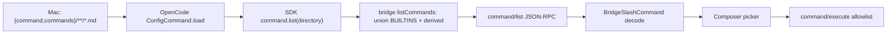
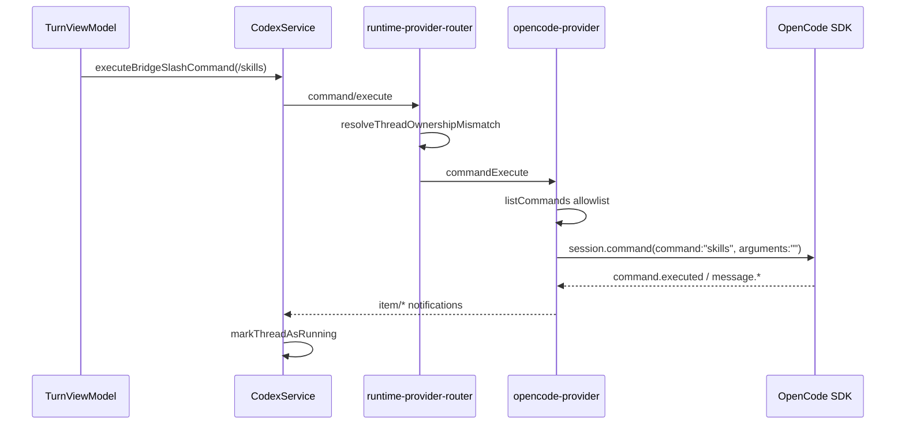
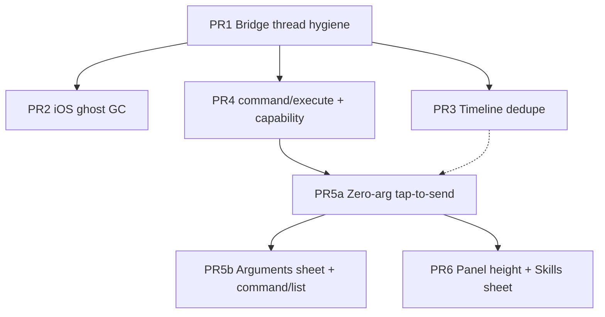

# Engineering Design: iPad OpenCode E2E Bug Fixes & Composer UX

**Workspace:** `$REMODEX_WORKSPACE`  
**Active code:** `repos/remodex-opencode/` (phodex-bridge + CodexMobile iOS)  
**Baseline commits:** `605142b` (slash builtins fallback), `932d8d5` (iOS build fix)  
**Author:** design-doc-writer persona  
**Date:** 2026-06-06  
**Revision:** 7 (production hardening: PR6 cherry-pick, `userStartedInProcess` on turn/command, idempotency, sign-off addendum)

---

## Overview

Remodex on iPad pairs to a Mac bridge running Codex and OpenCode. Recent device E2E exposed five reliability/UX clusters: **ghost threads** in Projects after QR login, **duplicate timeline messages**, **cramped slash/skills autocomplete**, **slash selection only prefilling** (not executing), and a **broken Skills “See all”** affordance. This document proposes P0 fixes on the bridge and iOS timeline/thread layers, then P1 composer polish, with capability-driven UI and no Codex regressions when `REMODEX_DISABLE_OPENCODE=1`.

---

## Background

### Architecture (relevant slice)

| Layer | Role |
|-------|------|
| **CodexMobile** | SwiftUI app; `CodexService` owns RPC, thread list, messages; `TurnViewModel` owns composer; `TurnTimelineReducer` projects timeline |
| **phodex-bridge** | Composition root: `bridge.js` → `runtime-provider-router.js` merges Codex + OpenCode; `opencode-provider.js` owns OpenCode threads/sessions/turns |
| **OpenCode SDK** | `@opencode-ai/sdk` v2: `client.command.list`, `Session.command` → `POST /session/{sessionID}/command` |

### Reported issues (with user evidence)

| ID | Symptom | Hypothesis (verified in code) |
|----|---------|-------------------------------|
| **A** | 65+ duplicate “OpenCode chat” rows, all “now” | `restoreSessions()` rehydrates every `opencode-sessions.json` entry into `threads` Map; `listThreads()` returns all `threads.values()` without validation; iOS `reconcileLocalThreadsWithServer` retains local-only threads (Codex-correct) but re-pins ghosts from bad server rows |
| **B** | User “Hey” ×2, assistant reply ×2; plain left “Hey” with doc icon | Optimistic `appendUserMessage` + server/history echo; `beginAssistantMessage` + stream/hydrate paths; possible `commandExecution` rows for prompt text; **also** double-tap / optimistic+echo race (see §2) |
| **C** | Slash panel too tall on iPad | `SlashCommandAutocompletePanel.bridgeMaxVisibleRows = 12`, `bridgeRowHeight = 60` → up to 720pt + header |
| **D** | `/skills` prefills, user expects tap-to-send | `TurnViewModel.onSelectBridgeSlashCommand` only mutates `input`; contract says “insert token into draft only” |
| **E** | `/skills` runs as chat text, model echoes “Hey” | `turn/start` → `buildPromptFromTurnInput` sends literal `/skills` to `session.prompt`, not `session.command` |
| **F** | Full slash sheet OK | Keep `BridgeSlashCommandsFullListSheet` layout; **change `onSelect` behavior** in PR5a |
| **G** | Skills panel cramped; See all noop | Same 12×60 layout; `onSeeAllSkills` defaults `{}`; `TurnComposerHostView` wires slash sheet only |

### Key code anchors

- Ghost threads: `opencode-provider.js` — `ownershipStubFromStore`, `listThreads`, `restoreSessions`, `pruneOpenCodeStorageMismatch`; `runtime-provider-router.js` — `mergeThreadListResult`, Codex-only `thread/list` arm (`150–166`); iOS — `CodexService+Sync.reconcileLocalThreadsWithServer`, `CodexService+Helpers.upsertThread`, `recentActiveThreadListLimit = 70` (`CodexService+ThreadsTurns.swift:25`)
- Duplication: `CodexService+Messages.appendUserMessage`, `TurnTimelineReducer`, `CodexService+History.swift`, `CodexService+Incoming.swift`
- Slash/skills: `SlashCommandAutocompletePanel.swift`, `SkillAutocompletePanel.swift`, `TurnComposerHostView.swift`, `BridgeSlashCommandsFullListSheet`, `TurnViewModel`
- Commands: `runtime-provider-router.js` `command/list`; SDK `Command` type + `Session.command` in `types.gen.d.ts` / `sdk.gen.js`; bridge maps only `token/title/description` today (`opencode-client.js:355–359`)

---

## Goals

1. **P0:** Eliminate ghost OpenCode threads on connect; prune stale `~/.remodex` ownership/session stores safely — **Codex/upstream parity**, not arbitrary retention windows.
2. **P0:** Stop duplicate user/assistant bubbles (and stray command-echo rows) on OpenCode turns.
3. **P0:** Execute OpenCode slash commands via bridge/SDK (`/skills`, user `command/*.md` commands from `command/list`), not as plain `turn/start` text.
4. **P1:** Composer autocomplete: ~2–3 visible rows + working See all; **tap-to-send** on zero-argument slash surfaces; **production arguments sheet** for commands that need input (PR5b).
5. **Capability-driven UI** — `supportsSlashCommandExecute` and existing flags; no `if provider == opencode` in views.
6. **Codex regression safety** — `REMODEX_DISABLE_OPENCODE=1` unchanged; explicit regression matrix below.

## Non-Goals

- Rewriting OpenCode CLI/TUI.
- Full timeline reducer refactor.
- Changing `BridgeSlashCommandsFullListSheet` visual layout (only `onSelect` wiring).
- iPad-only hardcoded heights (use `GeometryReader` + caps).
- Short-term “prefill fallback” as the v1 arguments UX (removed in rev 4).

---

## Proposed Design

### 1. Ghost threads (Issue A) — Codex parity model

#### Root cause (confirmed)

1. **`restoreSessions()`** (`opencode-provider.js:1510–1530`) calls `rehydrateThreadIfNeeded` for every `sessions.entries()` row not in `threads` — **materializes** Map entries the user never started on this bridge process.
2. **`listThreads()`** (`611–739`) concatenates **all** `threads.values()` into `localThreads` (`622–624`) with no per-row SDK/message validation.
3. **`LIST_THREADS_SESSION_VALIDATE_CAP = 5`** today (`opencode-provider.js:56`) applies only to ownership **stubs** when `threads.get(threadId)` is absent; live in-memory rows skip validation (`634–638`). **PR1 raises this to 20** (PM-2), aligned with `STARTUP_PRUNE_SESSION_VALIDATE_CAP`.
4. **`pruneOpenCodeStorageMismatch`** runs only when `REMODEX_PRUNE_OPENCODE_OWNERSHIP=1` — design changes to default-on with bounded work.
5. **Router** (`runtime-provider-router.js:150–166`): `thread/list` → Codex app-server **only** for Codex threads; OpenCode via `listProviderThreads` — correct split; bug is OpenCode provider over-listing, not merge.
6. **iOS** `reconcileLocalThreadsWithServer` (`CodexService+Sync.swift:242–249`): keeps local-only threads when missing from server list — **matches Codex upstream**; does **not** invent rows. Pagination cap `recentActiveThreadListLimit = 70` (`CodexService+ThreadsTurns.swift:25`).

#### Codex parity model (comparison)

| Behavior | Codex (upstream / today) | OpenCode (today) | Target (PR1 + PR2) |
|----------|--------------------------|------------------|---------------------|
| `thread/list` source | Codex app-server only (`runtime-provider-router.js:152`) | All in-memory `threads` + ownership stubs | Same router merge; OpenCode list **filtered** |
| Local-only threads when server omits id | **Keep** (`reconcileLocalThreadsWithServer` L242–249) | Same iOS rule | Same — **never delete** local threads with recent messages when server list capped at 70 |
| Server list invents conversations | **No** — app-server is source of truth | **Yes** — `restoreSessions` + unvalidated `localThreads` | **No** — list only rows user actually started or validated |
| Pagination | iOS fetches ≤70 active | Bridge returns up to `limit` (50 default) unvalidated rows | Bounded, validated set |
| Prune philosophy | Archive on explicit `thread/read` / `turn/start` not-found | Orphan store prune opt-in | Prune **bare OpenCode stubs** only; async startup prune for invalid sessions |
| Rehydrate on startup | N/A (Codex server owns state) | Rehydrate **every** `opencode-sessions.json` entry | Lazy: patch metadata only in `restoreSessions`; rehydrate on explicit RPC paths |

**Primary list rule (replaces 7-day inactivity filter):**  
`thread/list` must **not materialize conversations the user never started on device**. One canonical rule (R4-1 + R4-4):

| Class | Inclusion rule |
|-------|----------------|
| **(a) User-started this process** | In-memory thread with `userStartedInProcess === true` (set on successful `threadStart`, **or** first `turn/start`, **or** first `command/execute` in this bridge process) → **include without `getSession` or `getMessages`** |
| **(b) Active turn** | `activeTurns` references `threadId` → include (even if stub has no `userStartedInProcess`) |
| **(c) Ownership stub or resurrected in-memory** | Not (a) and not (b): require **`getSession` valid** AND **`validateThreadHasActivity(threadId)`** — `activeTurns` hit **or** (within shared `LIST_THREADS_SESSION_VALIDATE_CAP` budget) `getMessages` returns length ≥ 1. Empty sessions that pass `getSession` alone are **omitted** (fixes ghost “OpenCode chat” rows) |
| **(d) In-memory, not user-started** | Same as (c): `userStartedInProcess === false` must pass `getSession` + activity check; invalid session → omit + async prune |

**Helper (PR1):**

```javascript
async function validateThreadHasActivity(threadId, sessionId) {
  for (const active of activeTurns.values()) {
    if (active.thread.id === threadId) return true;
  }
  // Uses same sdk validation budget as getSession in listThreads
  const messages = await client.getMessages({ sessionID: sessionId, limit: 1 });
  return Array.isArray(messages) && messages.length > 0;
}
```

Share `sdkValidations` counter with `validateOwnedThreadSession` — do not double-charge budget per thread per list call.

> **Removed:** “In-memory threads stale >7 days must pass `getSession`” as primary filter. Optional PM tuning footnote only: env `REMODEX_OPENCODE_LIST_STALE_DAYS` for ops diagnostics — **not** default product behavior.

#### Proposed bridge changes (PR1)

| Change | Detail |
|--------|--------|
| **Lazy rehydrate** | `restoreSessions()` only patches `sessionId` / metadata onto **existing** in-memory `threads` entries; **no** `rehydrateThreadIfNeeded` in the loop |
| **Default startup prune** | After `healthy && client`, run `pruneOpenCodeStorageMismatch()` on every `ensureStarted()` success (async). `REMODEX_PRUNE_OPENCODE_OWNERSHIP=1` forces full pass |
| **Startup performance** | Prune via `setImmediate`; cap `STARTUP_PRUNE_SESSION_VALIDATE_CAP` (20); log `opencode_storage_mismatch`. Transient `getSession` error → **exclude** from this list call, **do not** delete store. 404/invalid → `removeOrphanOpenCodeThread` |
| **`LIST_THREADS_SESSION_VALIDATE_CAP`** | **20** in PR1 (was 5); same budget as startup prune. Log `sdk_validations_cap` on `opencode_list_threads_filtered`. Optional ops override `REMODEX_LIST_THREADS_VALIDATE_CAP` — **not** default product behavior |
| **`userStartedInProcess` flag** | Set `thread.userStartedInProcess = true` before `threads.set` on: **`threadStart` success** (`opencode-provider.js:789+`), **first successful `turn/start`** for thread, **first successful `command/execute`** for thread. OpenCode threads often appear via turn without a phone `threadStart` — all three paths required. On `rehydrateThreadIfNeeded` / store resurrection: default **`false`**. `publicThread()` may omit from wire payload |
| **`listThreads` filtering** | Do **not** emit all `threads.values()` blindly. Per row: (a) OR (b) OR (c). Rows failing (c) log `materialization_blocked` |
| **Ops migration hint** | If `materialization_blocked` or startup prune count **> 50** in one `opencode_list_threads_filtered` / `opencode_storage_mismatch`, log one-line hint: run `node phodex-bridge/scripts/prune-opencode-ownership.js --apply` |
| **Structured logging** | Extend `opencode_list_threads_filtered` with `local_memory`, `user_started_included`, `activity_validated`, `rehydrate_skipped`, `pruned_invalid`, `validation_errors`, `materialization_blocked`, `sdk_validations_cap` |

#### Rehydrate trigger table (lazy model)

| RPC / path | Rehydrate session → `threads` Map? |
|------------|-----------------------------------|
| `restoreSessions()` at startup | **No** — metadata patch only |
| `listThreads()` | **No** — validate or omit. **No v1 RPC:** `include_full_rehydrate` stays internal/env-only if needed for ops; do not document on wire until contract exists |
| `thread/read` / `thread/resume` | **Yes** if `sessionId` missing — `ensureThreadSession(thread)` |
| `thread/turns/list` | **Yes** if `sessionId` missing — before `getMessages` |
| `turn/start` | **Yes** — `resolveSessionIdForThread` |
| `command/execute` | **Yes** — same as `turn/start` |

**PR1 helper:**

```javascript
async function ensureThreadSession(thread) {
  if (readString(thread?.sessionId)) return thread;
  return rehydrateThreadIfNeeded(thread.id);
}
```

Use at start of `threadRead`, `threadTurnsList`, `commandExecute` (after `requireThread`). Do **not** change `requireThread` to always rehydrate.

#### Acceptance criteria (Issue A)

- After QR connect + `thread/list`, Projects shows **no burst** of duplicate “OpenCode chat” rows with identical `updatedAt`.
- `thread/list` OpenCode contribution is **bounded**: rows are `userStartedInProcess`, **active turn**, or **`getSession` valid + activity** (`activeTurn` or ≥1 message) — not 65+ empty-session stubs.
- iOS still shows local OpenCode chats with messages when server list omits them (pagination parity).
- Migration: large `opencode-sessions.json` may need multiple startups (cap 20) or `node phodex-bridge/scripts/prune-opencode-ownership.js --apply`.

#### Proposed iOS changes (PR2) — Codex reconcile philosophy

**Hard-depend on PR1.**

Gate `pruneStaleOpenCodeLocalThreads` in `reconcileLocalThreadsWithServer` **only when all are true**:

| Guard | Rationale |
|-------|-----------|
| `CodexModelOption.normalizedProvider(thread.modelProvider) == "opencode"` | Codex threads never deleted |
| `serverThreadIDs` does not contain `thread.id` | Server omitted this id |
| Stub heuristic: title “OpenCode chat” (or empty) **and** (`cwd` nil/empty **or** no `gitWorkingDirectory`) | Ghost rows only |
| `messagesByThread[thread.id]` **empty** | **Never prune** threads user actually chatted in (Codex parity) |
| `thread.id != activeThreadId` | Current chat safe |
| `!isThreadPinned(thread.id)` | Pinned snapshots safe |
| `!threadHasActiveOrRunningTurn(thread.id)` | Running turn safe |

**Removed:** “newest message older than 24h” — not Codex-like; PR1 stops server from returning bare stubs.

**Bare stub upsert:** In `CodexService+Helpers.upsertThread` / `mergedThread`, skip promoting default-title OpenCode rows into pinned snapshot when `cwd` nil.

**Tests:** `CodexServiceThreadListTests` — “server list missing thread but local has recent messages → **keep**”; “bare stub, no messages, not on server → **prune** after PR1”.

---

### 2. Message duplication (Issue B)

#### Root cause hypotheses (code-backed)

| Path | Mechanism |
|------|-----------|
| **Optimistic + confirmed user** | `appendUserMessage` (pending) + history echo; `removeDuplicateUserMessages` requires `matchingIndices.count == 1` (`TurnTimelineReducer.swift:582–589`) |
| **Assistant twin** | `beginAssistantMessage` + stream + `hydrateAssistantFromSessionMessages` (`hadText` guard) |
| **Command echo row** | `commandExecution` kind; reducer only strips **thinking** command lines today |
| **Double-send / double-tap** | User taps `/skills` twice before picker dismisses → two `command/execute` or `turn/start` calls; optimistic row + RPC echo |
| **Turn idempotency gap** | No client-side dedupe key on `turn/start` for identical body within debounce window |

#### Proposed fixes (PR3)

**Files:**

- `TurnTimelineReducer.swift`
- `CodexService+History.swift`
- `CodexService+Incoming.swift` — `turn/started` mirror skip when pending user exists
- `CodexService+Messages.swift` — shared `commandExecutionPreviewKey` helper
- `opencode-provider.js` — hydrate guard test
- `opencode-client.js` — audit `dispatchEvent` does not map user text to `commandExecution`

**iOS timeline:**

- Relax user dedupe: multiple pending matches → merge **nearest** pending within 12s.
- Assistant: strengthen exact replay merge for same `turnId` + text, different `itemId`, one streaming.
- **Command echo:** `suppressCommandExecutionUserTextEchoes(in:)` using `commandExecutionPreviewKey` — drop `commandExecution` rows where preview equals latest user text for same `turnId`.

**Send-path dedupe (PR3 + PR5a):**

- Debounce `sendBridgeSlashCommand` / `startTurn` with same normalized body within ~300ms.
- **PR5a:** iOS generates `clientCommandId` (UUID) per tap; bridge keeps in-memory map `threadId + commandToken + clientCommandId` → drop duplicate within **5s** (log `opencode_command_execute_deduped`).
- ViewModel guards duplicate **in-flight** execute for same `threadId` + `command` token (UI layer).

**Bridge:**

- Test: stream deltas then `hydrateAssistantFromSessionMessages` with same text → **one** assistant delta when `hadText` true.

#### Regression tests (PR3)

- Double pending user rows same text → one bubble.
- Assistant stream + hydrate same text → one bubble.
- `commandExecution` “Hey” + user “Hey” → command row suppressed.
- Double-tap `/skills` → at most one execute RPC (PR5a test).

---

### 3. Slash & skills panel UX (Issues C, G) — PR6

#### Dynamic panel height (iPad + iPhone)

Replace fixed `bridgeMaxVisibleRows = 12` with **`GeometryReader`**-driven cap:

```swift
// SlashCommandAutocompletePanel + SkillAutocompletePanel (shared helper)
private static let inlineVisibleRows = 3
private static let maxScreenFraction: CGFloat = 0.28

private func cappedPanelHeight(
    rowHeight: CGFloat,
    headerHeights: CGFloat,
    rowCount: Int,
    screenHeight: CGFloat
) -> CGFloat {
    let rowCap = rowHeight * CGFloat(min(rowCount, inlineVisibleRows)) + headerHeights
    let screenCap = screenHeight * maxScreenFraction
    return min(rowCap, screenCap)
}
```

- Wrap panel in `GeometryReader { geo in ... cappedPanelHeight(..., screenHeight: geo.size.height) }`.
- **Dynamic Type:** use `@ScaledMetric` or `UIFontMetrics` for `bridgeRowHeight` / section headers so 3 rows still fit under `min(28%, …)` at accessibility sizes.
- `codexMaxVisibleRows = 6` — **unchanged**.
- Update `docs/contracts/ios-composer-state.md` RP-CMD-2: “up to 3 visible inline; See all for full list”.

#### Skills See all (Issue G)

- `TurnComposerHostView`: `@State isShowingAllSkills`; wire `onSeeAllSkills`.
- `.sheet` → `BridgeSkillsFullListSheet` using `viewModel.skillAutocompleteItems` and scope grouping from `SkillAutocompletePanel`.

**PR6 does not** change slash execute (PR5a) or arguments sheet (PR5b).

---

### 4. Slash selection: tap-to-send (Issue D) — PR5a

#### Product decision

**Tap invokes an immediate action** (dismiss picker, clear trailing `/token`) — not draft prefill for zero-argument commands.

| Source | Tap behavior |
|--------|----------------|
| **OpenCode** zero-arg (`requiresArguments == false`) | `sendBridgeSlashCommand` → `command/execute` when `supportsSlashCommandExecute` |
| **OpenCode** requires arguments | Present **`SlashCommandArgumentsSheet`** (PR5b) — **no** silent prefill fallback |
| **OpenCode** `BridgeSlashCommandsFullListSheet` | Same routing as inline |
| **Codex** `.compact` | **Preserve** `codex.compactThread(thread.id)` — **not** `turn/start` with `/compact` |
| **Codex** `.status` / `.feedback` | **Preserve** `onShowStatus()` / `onOpenFeedbackMail()` |
| **Codex** multi-step | `.codeReview`, `.fork`, `.subagents` — unchanged |

#### Centralized routing (PR5a) — single entry point (R4-3)

**Only** `TurnViewModel.onSelectSlashCommandItem(item, hostContext:)` dispatches tap behavior. **`TurnComposerHostView` becomes a thin wrapper** — no Codex `switch` in the host.

**Delete** the inline Codex handler block in `TurnComposerHostView.swift` (`onSelectSlashCommand` ~306–332: `.compact` / `.status` / `.feedback` / fork arms). Host wires:

```swift
onSelectSlashCommand: { item in
    viewModel.onSelectSlashCommandItem(
        item,
        hostContext: TurnSlashHostContext(
            codex: codex,
            thread: thread,
            onShowStatus: onShowStatus,
            onOpenFeedbackMail: onOpenFeedbackMail,
            availableForkDestinations: availableForkDestinations,
            onStartCodeReviewThread: onStartCodeReviewThread,
            // …existing fork/review closures
        )
    )
    viewModel.saveLocalDraft(...)
}
```

**Full sheet** (`BridgeSlashCommandsFullListSheet` ~409–411): call `onSelectSlashCommandItem`, **not** `onSelectBridgeSlashCommand` (removes prefill-only path).

**ViewModel routing tree:**

```
onSelectSlashCommandItem(item, hostContext)
  ├─ dismiss picker + clear trailing /token (shared)
  ├─ .bridge(command)
  │    ├─ command.requiresArguments → present SlashCommandArgumentsSheet (PR5b)
  │    └─ else → sendBridgeSlashCommand → command/execute
  └─ .codex(command) → sendCodexSlashCommand(command, hostContext)
         ├─ .compact → compactThread(thread.id)
         ├─ .status → onShowStatus()
         ├─ .feedback → onOpenFeedbackMail()
         └─ .codeReview / .fork / .subagents → existing panel/destination arms (from hostContext)
```

**Must not:** duplicate Codex RPCs in HostView **and** ViewModel; HostView must not call `onSelectBridgeSlashCommand` for sheet selection.

**Running indicator when `turnId` absent:** On `command/execute` success, `markThreadAsRunning` until `turn/completed`, `session.idle`, or first `item/agentMessage/delta`.

**Removed (rev 4):** prefill fallback on `arguments_required` — replaced by arguments sheet (§5b).

**Capability grey-out (rev 7):** When `supportsSlashCommands` is true but `supportsSlashCommandExecute` is false, slash rows remain visible but **disabled** with reason string (AGENTS.md — no fake-enabled tap). Do not fall through to prefill.

**Catalog drift (rev 7):** On bridge `command_not_allowed` / execute 403, iOS invalidates persisted slash catalog for `directory` and refetches `command/list` before showing error.

**Scaffolding note:** `onSelectSlashCommandItem` exists on `main` (execute-plan CMD-2) but still delegates bridge items to **prefill-only** `onSelectBridgeSlashCommand` — PR5a replaces that path.

#### PR5a tests

- Tap OpenCode `/clear` (zero-arg) → `command/execute`, not `turn/start`.
- Tap OpenCode `/skills` → `command/execute` with `arguments: ""` (verify OpenCode opens skills flow — PR4 mock test).
- Tap Codex `.compact` → `compactThread`; assert `turn/start` not called with `/compact`.
- Tap Codex `.status` / `.feedback` → callbacks invoked via **ViewModel only** (grep HostView: no `compactThread` / `onShowStatus` left).
- Full sheet tap → same RPC path as inline (not `onSelectBridgeSlashCommand`).
- Double-tap within 300ms → single RPC.

---

### 5. Slash command execution (Issue E) — PR4

#### Root cause

`turn/start` + `buildPromptFromTurnInput` sends `/skills` as chat text to `session.prompt`, not OpenCode command runner.

#### SDK + client wrapper (PR4)

OpenCode SDK v2 **`Session.command`** — body requires `arguments: string` (`types.gen.d.ts`).

Add `sessionCommand` to `opencode-client.js`; provider calls facade; log `opencode_command_execute`.

#### Command name normalization (R4-2)

OpenCode SDK / TUI expect the **slash-stripped** command name on `session.command`, not the UI token:

| Layer | Form | Example `/skills` |
|-------|------|-------------------|
| iOS / JSON-RPC `command/execute` param | Leading `/` allowed (UX token) | `"/skills"` |
| Bridge allowlist compare | Normalize to lowercase `/token` | `"/skills"` |
| **`client.session.command` body** | **Strip leading `/`** | `{ command: "skills", arguments: "..." }` |

Evidence: OpenCode TUI `command.slice(1)` before `session.command` (`repos/opencode/packages/opencode/src/cli/cmd/tui/component/prompt/index.tsx:1168–1171`).

**PR4 implementation (`opencode-client.js`):**

```javascript
function normalizeCommandNameForSdk(token) {
  const t = readString(token).trim();
  return t.startsWith("/") ? t.slice(1) : t;
}

async function sessionCommand({ sessionID, command, arguments: args, ... }) {
  const sdkName = normalizeCommandNameForSdk(command);
  return client.session.command({
    sessionID,
    command: sdkName,
    arguments: args || "",
    ...
  });
}
```

**Logging:** `opencode_command_execute` includes `commandToken` (wire), `commandSdk` (stripped), `ok`, `errorCode`.

**PR4/PR5a `command/list` (R4-5):** `buildStaticSlashCommands()` entries include **`requiresArguments: false`** explicitly so PR5a routing works before PR5b extends SDK-derived commands.

#### Router pattern — router-only

```javascript
if (method === "command/execute") {
  respondAsync(parsed, async () => {
    const ownershipMismatch = resolveThreadOwnershipMismatch(parsed, threadOwnership);
    if (ownershipMismatch) throw ownershipMismatch;
    const opencodeProvider = runtimeProviders.find((p) => p.id === OPENCODE_PROVIDER_ID);
    if (!opencodeProvider?.commandExecute) {
      return { ok: false, errorCode: "opencode_unavailable" };
    }
    return opencodeProvider.commandExecute(parsed);
  });
  return true;
}
```

#### Allowlist at execute time

Bridge `listCommands(directory)` at execute; compare allowlist using **normalized `/token`**; call SDK with **stripped name** via `normalizeCommandNameForSdk`; reject unknown with `command_not_allowed`.

#### `/skills` specifically

- Builtin in `opencode-client.js` `BUILTINS` (`/skills` token).
- OpenCode TUI maps slash `skills` → `prompt.skills` (`repos/opencode/.../tui/component/prompt/index.tsx`).
- **PR4 test:** mock SDK `session.command({ command: "skills", arguments: "" })` and assert provider forwards; document expected side effect (skills selector / command.executed event) — if headless mock cannot open TUI, assert RPC + event subscription only.

#### Custom user commands (`command/*.md` on Mac)

End-to-end flow:



| Step | Location |
|------|----------|
| User adds `command/my-cmd.md` in project dir | OpenCode `config/command.ts` glob `{command,commands}/**/*.md` |
| Template + hints in SDK `Command` | `name`, `template`, `hints[]`, optional `$ARGUMENTS` / `$1`… (`command/index.ts` `hints()`) |
| Bridge maps full shape | **PR5b** extends `opencode-client.js` map beyond `token/title/description` |
| iOS | `BridgeSlashCommand` + `requiresArguments` |
| Execute | `command/execute` with `argumentFields` → bridge `serializeCommandArguments` → SDK string (PM-1, §5b) |

#### Capability ripple (PR4)

| Artifact | Change |
|----------|--------|
| `provider-capabilities.js` | `supportsSlashCommandExecute` (17th key) — **distinct from** `supportsSlashCommands` (list/catalog visibility) |
| `ProviderCapabilities.swift` | Decode default false |
| `docs/contracts/bridge-rpc.md`, `002-capability-model.md` | Document |
| `opencode-regression.test.js` | **`command/execute` returns unavailable when OpenCode disabled** (mirrors `command/list` test) |

#### Sequence: tap `/skills` (zero-arg)



---

### 5b. Slash command arguments (production) — PR5b

**Product requirement:** production-grade arguments UX — not prefill-only phase 1.

#### SDK / bridge contract extension

**OpenCode `Command` type** (`@opencode-ai/sdk` `types.gen.d.ts:1236–1245`):

- `name`, `description`, `template`, `hints[]`, `agent`, `model`, `source`, `subtask`
- Placeholders: `$ARGUMENTS`, `$1`, `$2`, … (`repos/opencode/packages/opencode/src/command/index.ts` `hints()`)

**Extend `command/list` payload** (bridge `opencode-client.js` `listCommands`) — **PR5b for SDK-derived**; **PR4/PR5a for builtins (R4-5)**:

| Field | Source | Notes |
|-------|--------|-------|
| `token` | `name` with `/` prefix | unchanged |
| `title`, `description` | SDK / static | unchanged |
| `template` | SDK only | PR5b — omitted for static builtins |
| `hints` | SDK only | PR5b |
| `requiresArguments` | **derived** | **PR4/PR5a:** `buildStaticSlashCommands()` → **`false` for all builtins** (`/skills`, `/clear`, …). **PR5b:** SDK-derived — `hints.length > 0` **or** (`template` matches `\$ARGUMENTS|\$\d+`) |
| `agent`, `model`, `source` | SDK | PR5b pass-through |

**iOS (PR5a + PR5b):**

- Extend `BridgeSlashCommand` with `requiresArguments` (decode **default `false`** if missing — safe for builtins until PR5b adds template/hints).
- PR5b adds `template`, `hints`; `BridgeSlashCommandDecodeTests` for derivation on SDK rows only.

#### `SlashCommandArgumentsSheet` (SwiftUI)

| Element | Behavior |
|---------|----------|
| Header | Command `title` + `description` |
| Fields | **Default (rev 7):** one text field per `hints[]` entry. When hints empty, extract `$1`…`$n` from `template` (one field each). **Exception:** template has only `$ARGUMENTS` → single multiline field bound to full user string |
| Validate | Client-side required checks on each field (empty hint → block submit with inline error) |
| Submit | `CodexService.executeBridgeSlashCommand` → `command/execute` with **structured fields** (see PM-1 hybrid below); bridge produces SDK `arguments` string |
| Zero-arg commands | `/skills`, `/clear`, static builtins with `requiresArguments == false` → **execute immediately on tap** (PR5a), no sheet |
| Error path | SDK/bridge 400 → **inline field errors** from parsed body; **never** silent prefill |

#### PR5 split rationale

| PR | Delivers | Merge when |
|----|----------|------------|
| **PR5a** | Execute path, zero-arg tap-to-send, Codex handler preservation, send debounce | After PR4 |
| **PR5b** | Extended `command/list`, `BridgeSlashCommand` + sheet, field validation tests | After PR5a |

Keeps PR5a shippable for `/skills` P0 while arguments UX lands atomically in PR5b.

#### PM-1 — Hybrid arguments serialization (**closed**)

OpenCode accepts a **single** `arguments` string on `session.command`; parsing lives in `session/prompt.ts` (`argsRegex`, `$1`…`$n`, `$ARGUMENTS`, append-if-no-placeholders). Remodex must not invent a parallel JSON dialect on the SDK wire.

| Layer | Responsibility |
|-------|----------------|
| **iOS** (`SlashCommandArgumentsSheet`) | Collect ordered field values aligned with `hints[]` (or `$1`…`$n` order extracted from `template` when hints empty). Send **structured** payload on `command/execute` — not a hand-rolled CLI string |
| **Bridge** (`serializeCommandArguments`) | Convert `{ template, hints, fields }` → one `arguments` string matching OpenCode CLI rules before `sessionCommand` |
| **SDK** | Receives only the serialized string (slash-stripped `command` name unchanged from PR4) |

**Wire shape (PR5b)** — extend `command/execute` params:

```json
{
  "threadId": "...",
  "command": "/my-cmd",
  "argumentFields": [{ "key": "hint-label-or-$1", "value": "user text" }],
  "template": "...",
  "hints": ["..."]
}
```

- `argumentFields` optional; omitted or `[]` when `requiresArguments == false` (PR5a zero-arg path).
- Bridge **rejects** if `requiresArguments` command arrives without fields when template/hints imply placeholders.
- **Do not** pass raw JSON objects to `session.command.arguments` unless bridge has converted them.

**Bridge serializer rules** (mirror `repos/opencode/packages/opencode/src/session/prompt.ts:1525–1548`):

1. **Template has `$1`…`$n` only:** emit space-separated tokens parseable by `argsRegex` — quote values containing spaces or quotes (`"foo bar"`).
2. **Template uses `$ARGUMENTS`:** set SDK `arguments` to the **full** user string from the single multiline field (rev 7).
3. **No placeholders and no `$ARGUMENTS`:** pass trimmed user text; OpenCode appends to template when non-empty.
4. **Multi-hint, no numeric placeholders:** join field values in `hints[]` order with spaces; quote as needed for `argsRegex`.

**Tests (PR5b):** `phodex-bridge/test/opencode-command-arguments.test.js` — table-driven fixtures from `repos/opencode/packages/opencode/command/template/*.txt` (or representative templates copied into test fixtures). Assert `serializeCommandArguments` output → mock `session.command` receives expected string.

**iOS tests:** sheet validation only; serialization correctness is bridge-owned (no duplicated OpenCode regex in Swift).

---

## Device E2E acceptance matrix

Maps screenshot symptoms → checklist step → PR. Full checklist: `docs/operations/device-e2e-opencode.md` (O0–O17).

| Symptom ID | User-visible symptom | Test step | Pass criterion | PR |
|------------|---------------------|-----------|----------------|-----|
| **A** | 65+ “OpenCode chat” rows after QR | **O0** connect + open Projects sidebar | ≤ handful of OpenCode rows; no duplicate titles all “now” | PR1, PR2 |
| **A′** | Ghost returns after relaunch | **O7** bridge restart + resume thread | Same thread resumes; Projects not repopulated with stubs | PR1 |
| **B** | “Hey” sent twice | **O6** single send on OpenCode thread | One user bubble, one assistant reply | PR3 |
| **B′** | Stray doc-icon “Hey” row | **O6** (same) | No duplicate `commandExecution` echo of user text | PR3 |
| **C** | Slash panel covers half screen | **O8** type `/` on iPad | ≤3 rows visible; scroll/See all for more | PR6 |
| **D** | `/skills` only prefills | **O8** tap `/skills` inline | Command runs without manual Send | PR5a, PR4 |
| **E** | `/skills` behaves like chat | **O8** tap `/skills` | No model echo of prior “Hey”; skills/command path | PR4, PR5a |
| **F** | Full slash sheet same bug | **O8** See all → tap command | Same execute behavior as inline | PR5a |
| **G** | Skills See all dead | **O9** type `$` → See all | Full skills sheet opens and inserts | PR6 |
| **G′** | Skills panel cramped | **O9** | Skills inline panel ≤3 rows | PR6 |
| **H** | Custom `command/foo.md` | **O8** (Mac project with `command/foo.md`) | Appears in list; sheet if hints; execute allowlisted | PR5b, PR4 |
| **Codex** | Regression | **O17** `REMODEX_DISABLE_OPENCODE=1` | Codex threads/models/slash unchanged | All |

---

## Risk register

| # | Risk | Sev | Mitigation |
|---|------|-----|------------|
| R1 | PR2 merges before PR1 → iOS prunes real threads while bridge still lists ghosts | **High** | Hard dependency PR2→PR1; CI check in PR template |
| R2 | Lazy rehydrate breaks `thread/read` after restart until explicit resume | **Med** | `ensureThreadSession` on read/turns-list; O7 device test |
| R3 | `command/execute` allowlist drift vs cached iOS catalog | **Med** | Bridge authoritative; **PR5a:** invalidate + refetch `command/list` on `command_not_allowed` |
| R4 | Arguments serialization mismatch if iOS and bridge diverge | **Med** | **Closed (PM-1):** bridge-only `serializeCommandArguments`; fixture tests from `command/template/*.txt` + `session/prompt.ts` rules |
| R5 | Validation cap leaves stale rows until N startups | **Low** | Cap **20** on list + startup (PM-2); document `prune-opencode-ownership.js --apply`; log `materialization_blocked` |
| R6 | Double-tap slash before picker dismisses | **Med** | **PR5a:** `clientCommandId` + bridge 5s dedupe; ViewModel in-flight guard |

---

## Regression matrix: `REMODEX_DISABLE_OPENCODE=1`

Explicit sign-off (**O17**). Automated parity in `opencode-regression.test.js`.

| Surface | Expected with OpenCode disabled | Test / step |
|---------|--------------------------------|-------------|
| `runtime/catalog` | No OpenCode runtime entry or `enabled: false` | O4 (Codex-only mode) |
| `model/list` | Codex models only | O5 |
| `thread/list` | Codex app-server only; **no** provider merge rows | Router unit test + O17 |
| `command/list` | `{ commands: [] }` | `opencode-regression.test.js` |
| `command/execute` | `opencode_unavailable` / error — **no** provider call | **New** regression test mirroring `command/list` |
| `skills/list` | Codex path only (no OpenCode merge) | Existing router tests |
| `thread/start` / `turn/start` | Codex ownership routing unchanged | O6/O17 on Codex thread |
| iOS slash UI | `usesBridgeSlashCommands == false`; Codex enum list | O8 on Codex thread |
| iOS OpenCode threads | Stale rows may show unavailable state; **no crash** | O17 |
| Codex `.compact` / `.status` | PR5a handlers still Codex-only | O8 Codex thread |

---

## API Changes

| Method | Direction | Params | Result | Notes |
|--------|-----------|--------|--------|-------|
| `command/execute` | iOS → bridge | `threadId`, `command`, `clientCommandId?` (PR5a UUID), `argumentFields?`, `template?`, `hints?`, `directory`/`cwd` | `{ ok, sessionId?, turnId?, errorCode? }` | Bridge strips `/` for SDK; dedupe on `clientCommandId`; **PM-1:** serialize fields in PR5b |
| `command/list` | extended | `directory`/`cwd` | `{ commands: [{ token, title, description, requiresArguments, template?, hints?, … }] }` | PR4: builtins `requiresArguments: false`; PR5b: SDK fields |
| `thread/list` | existing | unchanged shape | — | Behavior change only (PR1) |
| `runtime/catalog` | extended | — | `supportsSlashCommandExecute` | 17th capability |

---

## Data Model

| Store | Path | Change |
|-------|------|--------|
| Thread ownership | `~/.remodex/thread-ownership.json` | Prune orphan/invalid on bridge startup (batched) |
| OpenCode sessions | `~/.remodex/opencode-sessions.json` | Same; does **not** persist `userStartedInProcess` |
| **OpenCode in-memory thread** | `opencode-provider.js` `threads` Map value | **PR1:** `userStartedInProcess: boolean` — `true` on `threadStart`, first `turn/start`, or first `command/execute` in process; `false` on rehydrate/store resurrection. Drives `listThreads` fast-path (R4-4) |
| iOS local threads | `CodexService.threads` | Prune **bare OpenCode stubs** only (PR2) |

---

## Security

- `command/execute`: `resolveThreadOwnershipMismatch` before provider (same as `turn/start`).
- Allowlist: bridge `listCommands(directory)` at execute; normalized `/token`; SDK body uses stripped name (R4-2).
- Arguments sheet: no shell injection — registered commands only.
- `REMODEX_DISABLE_OPENCODE=1`: router returns unavailable consistent with `command/list`.

---

## Observability

| Event | Layer | Fields |
|-------|-------|--------|
| `opencode_list_threads_filtered` | bridge | `local_memory`, `pruned`, `validated`, `materialization_blocked`, `sdk_validations_cap` |
| `opencode_storage_mismatch` | bridge | `durationMs`, counts |
| `opencode_command_execute` | bridge | `threadId`, `commandToken`, `commandSdk`, `clientCommandId`, `ok`, `latencyMs`, `errorCode`, `deduped` |
| `ios_thread_list_prune` | iOS | `debugSyncLog` |
| `ios_dedupe_decision` | iOS | suppression reasons |
| `ios_slash_arguments_validation` | iOS | field-level errors (PR5b) |

---

## Rollout

1. **PR1** bridge — ghost fix; may take multiple startups for large orphan stores (cap 20); watch logs for prune-script hint.
2. **PR2** iOS after PR1 merged.
3. **PR4** before **PR5a**; **PR3** parallel after PR1.
4. **PR5a** after PR4 — tap-to-send, Codex routing cleanup, `clientCommandId`, catalog invalidation.
5. **PR6 (recommended cherry-pick)** after **PR5a** — panel height + Skills See all; **does not** require PR5b (layout-only; update `ios-composer-state.md` RP-CMD-2 from “12 rows” → “3 rows + See all”).
6. **PR5b** after PR5a (may land after or parallel to PR6 if composer files conflict — resolve in merge order).
7. Recovery: `node phodex-bridge/scripts/prune-opencode-ownership.js --apply`
8. **Device sign-off addendum (rev 7):** After PR1–PR6 on `main`, run **targeted** checklist — acceptance matrix rows **A–H** + **O17** (`REMODEX_DISABLE_OPENCODE=1`) per [`device-e2e-opencode.md`](docs/operations/device-e2e-opencode.md). Append short entry to [`device-e2e-signoff.md`](docs/operations/device-e2e-signoff.md) (date, devices, “composer + ghost fix stack”). Full O0–O17 only if pairing/transport touched (not in this design).

---

## PR dependency diagram



**Merge order (recommended):** `PR1 → (PR2 ‖ PR3 ‖ PR4) → PR5a → (PR6 ‖ PR5b)` — **PR6 cherry-pick after PR5a** for iPad UX; PR5b can follow or parallel PR6 with careful merge.

---

## PR Plan

| PR | Title | Scope | Depends on |
|----|-------|-------|------------|
| **PR1** | Bridge: OpenCode thread storage hygiene | Lazy `restoreSessions`; `userStartedInProcess` on threadStart/turn/command; `validateThreadHasActivity`; list rules (a–d); `ensureThreadSession`; async default prune; cap **20**; ops prune hint log; tests | — |
| **PR2** | iOS: Pagination-safe ghost GC | `pruneStaleOpenCodeLocalThreads` (bare stubs, **empty messages only**); `upsertThread` guard; `CodexServiceThreadListTests` | **PR1 (hard)** |
| **PR3** | iOS + bridge: Timeline deduplication | Reducer + history + incoming; preview key; send debounce; hydrate test | — |
| **PR4** | Bridge: `command/execute` + capability #17 | `sessionCommand` + slash-strip; allowlist; builtins `requiresArguments: false`; `/skills` mock; **`opencode-regression` `command/execute` disabled test**; docs + Swift decode | — |
| **PR5a** | iOS: Slash execute + Codex preserve | **Single** `onSelectSlashCommandItem` (replace prefill path); **delete** HostView Codex `switch`; `executeBridgeSlashCommand`; **`clientCommandId`**; catalog invalidate on `command_not_allowed`; grey-out when `!supportsSlashCommandExecute`; debounce | **PR4 (hard)** |
| **PR5b** | iOS + bridge: Production arguments UX | Extended `command/list`; `BridgeSlashCommand` + sheet (**one field per hint**); **`serializeCommandArguments`**; fixture tests; inline SDK 400 errors | **PR5a (hard)** |
| **PR6** | iOS: Panel height + Skills sheet | `GeometryReader` + `min(28%, rows)`; Dynamic Type; `BridgeSkillsFullListSheet`; wire `onSeeAllSkills`; **update `ios-composer-state.md` RP-CMD-2** (3 rows, not 12) | **PR5a (soft)** — cherry-pick after PR5a; not blocked on PR5b |

**Not parallel:** PR5b and PR6 if both touch same composer files in one PR — prefer **PR6 then PR5b** or separate merges. PR3 and PR4 may parallelize after PR1.

---

## Key Decisions

1. **Ghost threads:** **Codex parity** — list = `userStartedInProcess` OR active turn OR (`getSession` + activity); `userStartedInProcess` on threadStart / first turn / first command (PR1). **No 7-day filter.**
2. **Duplication:** Reducer + history + incoming + send debounce; investigate double-tap on slash path.
3. **Slash execution:** Router-only `command/execute` → `sessionCommand` with **slash-stripped** SDK name (R4-2).
4. **Tap-to-send:** Zero-arg → immediate `command/execute` (PR5a); builtins `requiresArguments: false` in PR4 (R4-5).
5. **Codex slash:** All handlers in **`onSelectSlashCommandItem` only**; HostView thin wrapper; delete duplicate host `switch` (R4-3).
6. **Panel height:** `GeometryReader`; `min(28% height, rowHeight×3 + headers)`; Dynamic Type aware.
7. **Skills See all:** `skillAutocompleteItems` + host sheet (PR6).
8. **Custom commands:** Mac `command/*.md` → OpenCode config → SDK → bridge union BUILTINS → iOS → execute allowlist.
9. **`/skills`:** Builtin; execute via `session.command`; verify in PR4 mock — expect skills/TUI-equivalent behavior.
10. **Capabilities:** `supportsSlashCommandExecute` full ripple in PR4.
11. **Allowlist:** Bridge `listCommands` at execute time.
12. **Codex regression:** `REMODEX_DISABLE_OPENCODE=1` matrix above.
13. **PM-1 Arguments wire format:** **Hybrid (closed)** — iOS structured `argumentFields`; bridge `serializeCommandArguments` → single SDK string per `session/prompt.ts` (§5b).
14. **PM-2 List validation cap:** **20 (closed)** — `LIST_THREADS_SESSION_VALIDATE_CAP = 20` in PR1, aligned with `STARTUP_PRUNE_SESSION_VALIDATE_CAP`; log `sdk_validations_cap` (§1).
15. **PR6 order:** Cherry-pick **after PR5a** — layout/Skills independent of arguments sheet; faster iPad relief (§ Rollout).
16. **`userStartedInProcess`:** Also set on first **`turn/start`** and **`command/execute`**, not only `threadStart` (§1).
17. **Execute idempotency:** `clientCommandId` + bridge 5s dedupe (PR5a); complements UI debounce (§2, §4).
18. **Slash capabilities:** `supportsSlashCommands` (list) vs `supportsSlashCommandExecute` (tap); grey-out when execute false (§4).
19. **Multi-hint sheet:** One field per `hints[]`; single multiline only for lone `$ARGUMENTS` templates (§5b).
20. **Sign-off:** Targeted A–H + O17 addendum to `device-e2e-signoff.md` after stack lands (§ Rollout).

---

## Implementation status (`main` at rev 7)

Execute-plan Theme B (slash V2 panel, `command/list`) is on `main`; **this design’s P0 fixes are not**. Notable partial scaffolding: `onSelectSlashCommandItem` still prefills bridge commands; `restoreSessions` still rehydrates; `LIST_THREADS_SESSION_VALIDATE_CAP` still **5**.

---

## Open Questions

1. ~~Codex upstream slash tap~~ → **Closed:** tap-to-send; Codex preserves existing handlers (§4).
2. ~~`session.command` turn binding~~ → **Closed:** thread-level busy until idle/delta (§4).
3. ~~Ghost retention / 7-day filter~~ → **Closed:** Codex parity model (§1); optional env tuning only.
4. ~~Arguments UI~~ → **Closed:** production `SlashCommandArgumentsSheet` in **PR5b** (§5b).
5. ~~**PM-1** Arguments serialization~~ → **Closed:** hybrid — iOS `argumentFields`, bridge `serializeCommandArguments` → OpenCode single string; **not** raw JSON on SDK wire (§5b).
6. ~~**PM-2** `LIST_THREADS_SESSION_VALIDATE_CAP`~~ → **Closed:** **20** in PR1, same as startup prune cap; optional `REMODEX_LIST_THREADS_VALIDATE_CAP` for ops only (§1).
7. ~~PR6 merge order~~ → **Closed:** cherry-pick after PR5a (rev 7).
8. ~~Multi-hint arguments sheet UX~~ → **Closed:** one field per hint; single multiline for `$ARGUMENTS`-only templates (§5b).
9. ~~Device sign-off scope~~ → **Closed:** targeted A–H + O17 addendum (§ Rollout).

**No remaining PM blockers** for implementation.

---

## References

| Resource | Path |
|----------|------|
| OpenCode provider | `repos/remodex-opencode/phodex-bridge/src/opencode-provider.js` |
| Router | `repos/remodex-opencode/phodex-bridge/src/runtime-provider-router.js` |
| OpenCode client | `repos/remodex-opencode/phodex-bridge/src/opencode-client.js` |
| SDK `Command` / `Session.command` | `repos/opencode/packages/sdk/js/src/v2/gen/types.gen.ts` (or `node_modules/@opencode-ai/sdk/...` after `npm install`) |
| TUI command strip | `repos/opencode/packages/opencode/src/cli/cmd/tui/component/prompt/index.tsx` |
| OpenCode command hints | `repos/opencode/packages/opencode/src/command/index.ts` |
| OpenCode `command/*.md` loader | `repos/opencode/packages/opencode/src/config/command.ts` |
| OpenCode argument parsing | `repos/opencode/packages/opencode/src/session/prompt.ts` (`argsRegex`, `$ARGUMENTS`, `$1`…`$n`) |
| Command templates (fixtures) | `repos/opencode/packages/opencode/command/template/*.txt` |
| Capabilities | `repos/remodex-opencode/phodex-bridge/src/provider-capabilities.js` |
| Bridge RPC contract | `docs/contracts/bridge-rpc.md` |
| Composer contract | `docs/contracts/ios-composer-state.md` |
| Device E2E | `docs/operations/device-e2e-opencode.md` |
| Device sign-off record | `docs/operations/device-e2e-signoff.md` |
| iOS reconcile | `repos/remodex-opencode/CodexMobile/.../CodexService+Sync.swift` |
| iOS thread limit | `repos/remodex-opencode/CodexMobile/.../CodexService+ThreadsTurns.swift` |
| `BridgeSlashCommand` | `repos/remodex-opencode/CodexMobile/.../TurnComposerCommandState.swift` |

---

## Revision 5 — review closure (R4-1–R4-5)

| ID | Status | Response |
|----|--------|----------|
| **R4-1** | **Addressed** | Canonical list rule (a–d): empty sessions no longer pass on `getSession` alone; `validateThreadHasActivity` (`activeTurn` OR budgeted `getMessages` ≥1) for stubs/non-user-started rows |
| **R4-2** | **Addressed** | Documented slash-strip for SDK; `commandToken` vs `commandSdk` logging; API table updated |
| **R4-3** | **Addressed** | PR5a: single `onSelectSlashCommandItem`; HostView thin wrapper; **delete** host Codex `switch`; full sheet uses same entry; regression tests listed |
| **R4-4** | **Addressed** | `userStartedInProcess` at `threadStart`; **rev 7:** also first `turn/start` and `command/execute` |
| **R4-5** | **Addressed** | PR4/PR5a: static builtins `requiresArguments: false`; PR5b extends SDK-derived template/hints derivation |

---

## Revision 6 — PM closure

| ID | Decision | Rationale |
|----|----------|-----------|
| **PM-1** | **Hybrid serialization** | OpenCode SDK is single-string `arguments`; duplicating `session/prompt.ts` in Swift risks drift. iOS owns UX/validation; bridge owns CLI-compatible serialization with fixture tests |
| **PM-2** | **`LIST_THREADS_SESSION_VALIDATE_CAP = 20`** | Matches existing `STARTUP_PRUNE_SESSION_VALIDATE_CAP`; improves first `thread/list` accuracy for ownership stubs without unbounded SDK fan-out. No 7-day hide; optional env for ops |

---

## Revision 7 — production hardening (post-review)

| Topic | Change |
|-------|--------|
| **PR6** | Recommended **cherry-pick after PR5a**; update RP-CMD-2 contract; not gated on PR5b |
| **`userStartedInProcess`** | Also set on first `turn/start` and `command/execute` |
| **Idempotency** | `clientCommandId` + bridge 5s dedupe (PR5a) |
| **Catalog** | Invalidate persisted slash cache on `command_not_allowed` (PR5a) |
| **Capabilities** | Grey-out execute when `supportsSlashCommandExecute` false |
| **PR4 tests** | `command/execute` regression when OpenCode disabled |
| **PR1 ops** | Log prune-script hint when blocked/pruned count > 50 |
| **Sign-off** | Targeted A–H + O17 addendum to `device-e2e-signoff.md` |
| **`main` status** | Implementation status section — P0 fixes not landed |

---

*End of design document (revision 7).*