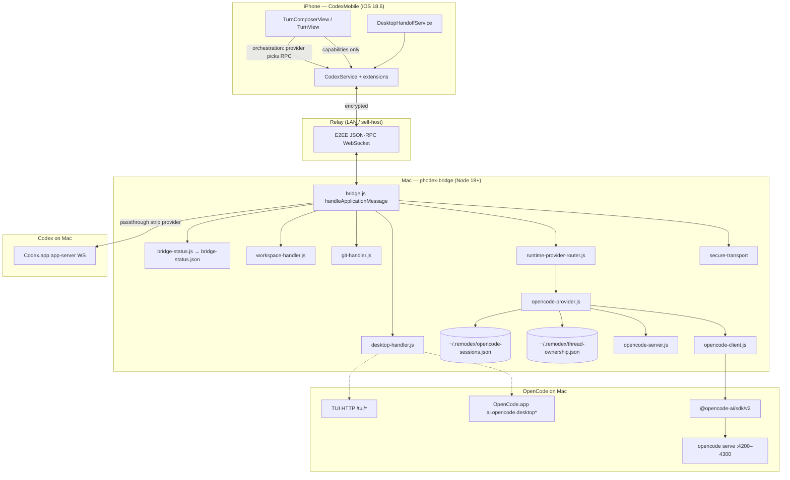
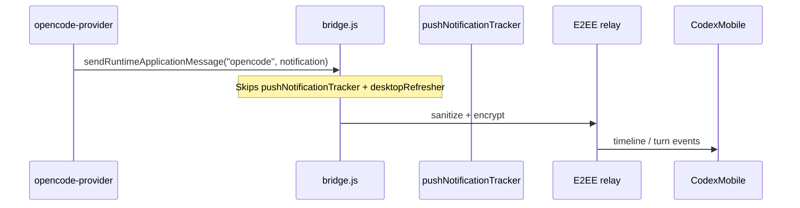
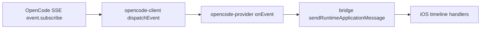
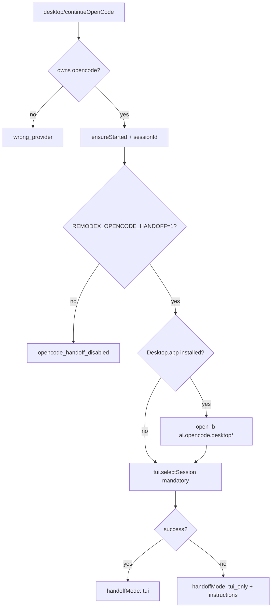

# Remodex Master Architecture & OpenCode Integration Design

| Field | Value |
|-------|-------|
| **Title** | Full OpenCode Support in Remodex — Master Architecture & Integration Plan |
| **Author** | Systems Architecture (design-doc-writer) |
| **Date** | 2026-06-02 |
| **Status** | Draft for approval (rev. 4 — user decisions incorporated). **Device E2E signed off on `main`** — see `docs/operations/device-e2e-signoff.md`. |
| **Workspace** | `$REMODEX_WORKSPACE` |
| **Active code** | `repos/remodex-opencode/` (`phodex-bridge/` + `CodexMobile/`) |
| **Supersedes** | `docs/design/full-opencode-integration.md` — **blocking:** prior doc must be amended in Phase 0 before “plan approved” |
| **Path convention** | All `docs/*` and workspace `AGENTS.md` paths are **workspace-root** relative unless prefixed with `repos/remodex-opencode/` |

---

## Overview

Remodex pairs an **iPhone app** (`CodexMobile`) with a **Mac Node bridge** (`phodex-bridge`) over an **encrypted relay**. The bridge is the **composition root** (`bridge.js`) and routes JSON-RPC to **Codex app-server** and/or **OpenCode** (`opencode serve` + `@opencode-ai/sdk/v2`, ADR-004).

This document is the **single authoritative plan** for:

1. What is **already built** (verified in code, June 2026)
2. What is **planned but not shipped end-to-end** (Phase 1 — evolved PR1–8)
3. What was **never planned** and needs explicit Phase 2 design (gaps from gap analysis)

**Non-negotiable:** Codex regression with `REMODEX_DISABLE_OPENCODE=1` must remain identical to today. Device E2E on `main` is signed off (`docs/operations/device-e2e-signoff.md`); upstream PRs require explicit release approval.

**Critical audit correction:** Thread **rehydration after bridge restart** is **implemented** (`opencode-provider.js` `rehydrateThreadIfNeeded`, `test/opencode-restart-rehydrate.test.js`). Phase 1 **drops the old PR2 rehydration work** and reallocates effort to docs honesty + remaining UX gaps.

### Status update (2026-06-05)

| Item | State |
|------|--------|
| Device E2E on `main` | **Signed off** — [device-e2e-signoff.md](../operations/device-e2e-signoff.md) |
| PR8 `supportsDesktopHandoff` (OpenCode catalog) | **`true`** on `main` (restored after erroneous revert in `4e3527c`) |
| Phase 1 exit checklist (§ below) | **Complete** — unchecked boxes in this doc are stale |
| Upstream PRs | Allowed after sign-off; coordinate release timing with Kartik |
| Execute-plan follow-on (16 PRs) | Separate track — [`execute-plan-a6c7a11c-INDEX.md`](../operations/execute-plan-a6c7a11c-INDEX.md) |

---

## Background & Motivation

Kartik invoked `/design` for depth beyond gap analysis. Remodex already runs OpenCode sessions on device/simulator for core turn streaming, but **documentation overstates parity** (e.g. slash commands `enabled` while iOS still uses a Codex enum), and several **production-adjacent paths** (push, SSE completeness, plugins, multimodal, Mac daemon env) were never in PR1–8.

### Reference repos (read-only)

| Repo | Role |
|------|------|
| `repos/opencode/` | SDK/TUI/desktop bundle IDs; ACP is reference only |
| `repos/dpcode/` | `OpenCodeAdapter.ts` — canonical SSE → UI event mapping |
| `repos/litter/` | Mobile architecture reference (Codex-only) |

### Enablement policy (code truth)

`phodex-bridge/src/opencode-runtime-policy.js`:

| Env | Effect |
|-----|--------|
| Default | OpenCode runtime registered |
| `REMODEX_DISABLE_OPENCODE=1` (or `true`) | Codex-only regression |
| `REMODEX_ENABLE_OPENCODE=0` (legacy) | Same as disable |

**Doc drift:** `docs/operations/release-compatibility.md` step 8 still mentions `REMODEX_ENABLE_OPENCODE`; must be `REMODEX_DISABLE_OPENCODE=1` (checklist step 10 is correct).

---

## Goals & Non-Goals

### Goals

| # | Goal |
|---|------|
| G1 | Honest parity: matrix/contracts match code; no fake-enabled composer rows |
| G2 | Phase 1: dynamic slash (`command/list`), structured skills probe + 16th flag, OpenCode desktop/TUI handoff, device E2E sign-off |
| G3 | Phase 2: design + PR backlog for push, SSE parity, plugins, images, auth, sandbox, bridge status, version skew, daemon env, collaboration mapping |
| G4 | `REMODEX_DISABLE_OPENCODE=1` — zero Codex behavior change |
| G5 | Update map for workspace `docs/*`, workspace `AGENTS.md`, and supersede `docs/design/full-opencode-integration.md` before plan approval |

### Non-Goals

| Item | Treatment |
|------|-----------|
| Upstream PRs to `opencode` / public Remodex before device E2E | Blocked |
| ACP stdio replacing HTTP SDK | Rejected (ADR-004) |
| OpenCode **voice**, **Codex Plan (+)** | Hidden via capabilities |
| OpenCode **steer** | Greyed (`supportsSteer: false`) until SDK exists |
| OpenCode **worktree handoff** | Greyed (`supportsWorktree: false`); git panel stays bridge-local |
| Vendored `repos/opencode/` modifications | Out of scope |
| Terminal control from iPhone for OpenCode | Phase 2+ / explicit non-goal unless handoff covers TUI |

---

## System Map

### End-to-end architecture



### Handler cascade (load-bearing)

Order in `repos/remodex-opencode/phodex-bridge/src/bridge.js` `handleApplicationMessage()` (lines 568–629):

1. Handshake / bridge-managed account  
2. Voice  
3. Thread context  
4. Workspace  
5. Project  
6. Pet  
7. Notifications  
8. **Desktop** (`desktop/*`) — OpenCode handoff extends here (position 8)  
9. Git  
10. **Runtime provider router** (`model/list`, `thread/*`, `turn/*`, `runtime/catalog`, `command/list`, `skills/list`)  
11. Desktop refresher / rollout / IPC (observe)  
12. Bridge-managed `thread/turns/list` JSONL fallback  
13. **Passthrough** → Codex (`stripRuntimeProviderFieldsForCodex`)

**Invariant:** New OpenCode desktop RPCs go in `desktop-handler.js`, **not** after the router.

### Outbound notifications path



**Gap:** Codex outbound notifications feed `pushNotificationTracker`; OpenCode does not (`bridge.js:640–644`).

---

## Implementation Status Taxonomy

### (a) Already built — core path

| Area | Evidence | Notes |
|------|----------|-------|
| Handler cascade + composition root | `bridge.js` | Desktop before git before router |
| Runtime router | `runtime-provider-router.js` | Ownership-aware dispatch |
| OpenCode transport | `opencode-server.js`, `opencode-client.js` | Dynamic ESM `@opencode-ai/sdk/v2` |
| Provider harness | `opencode-provider.js` | Lazy session, permissions, fork, rehydrate |
| Thread ownership | `thread-ownership-store.js` | Durable `~/.remodex/thread-ownership.json` |
| Session persistence | `opencode-session-store.js` | `sessionId`, `cwd`, `model`, `agent`, `title` |
| **Restart rehydration** | `rehydrateThreadIfNeeded`, `opencode-restart-rehydrate.test.js` | **Done — not Phase 1 work** |
| 15 capability flags | `provider-capabilities.js` | ADR-002 text still says "12" |
| Merged `model/list`, `thread/list` | `runtime-provider-router.js` | Provider field on items |
| `runtime/catalog` | router `buildOpenCodeRuntimeCatalog` | `unavailableReason`, agents |
| `command/list`, `skills/list` | router + `opencode-client.js` | Bridge-only for slash today |
| Approvals | `permission.reply` mapping | iOS approval UI |
| Fork | `session.fork` | `supportsFork: true` |
| iOS capability composer | `TurnComposerRuntimeState`, `ComposerCapabilityCopy` | No provider checks in views |
| Agent selection | OpenCode agents in catalog | Per-thread override |
| Queue | `supportsQueue: true` | iOS-local queue; steer greyed |
| Opt-out policy | `opencode-runtime-policy.js` | Tests in `opencode-runtime-policy.test.js` |
| Codex regression tests | `opencode-regression.test.js` | `REMODEX_DISABLE_OPENCODE=1` |

### (b) Planned — Phase 1 (not end-to-end)

| Item | Blocker |
|------|---------|
| Doc/capability parity honesty | ADR-002, `bridge-rpc.md`, matrix slash row |
| iOS dynamic slash | Hardcoded `TurnComposerSlashCommand` enum |
| Structured skills + 16th flag | Client-only `supportsStructuredSkillInput`; text flatten in `buildPromptFromTurnInput` |
| OpenCode desktop/TUI handoff | `supportsDesktopHandoff: false`; Codex-only `desktop-handler.js` |
| Device E2E sign-off | Matrix still `simulator-only` / overstated `enabled` cells |
| Parity promotion rules | After PR3/4/5+device video |

### (c) Not planned — Phase 2+

See **Phase 2** and **Parity Matrix v2** below.

---

## Capability Matrix

**Source of truth:** `phodex-bridge/src/provider-capabilities.js` (`CAPABILITIES` array, 15 flags).

| Flag | Codex default | OpenCode default | Per-feature status | Phase |
|------|---------------|------------------|------------------|-------|
| `supportsAgentSelection` | false | true | **enabled** (OpenCode) | — |
| `supportsReasoningEffort` | true | false* | **enabled/greyed** per model | — |
| `supportsFastMode` | true | false* | **enabled/greyed** per model | — |
| `supportsPlanMode` | true | false | **n/a** (hidden) | — |
| `supportsVoice` | true | false | **n/a** (hidden) | — |
| `supportsDesktopHandoff` | true | false | **greyed** — thread menu shows disabled “Hand off to Desktop” + subtitle “Not supported by this runtime” (`TurnToolbarContent.swift:128–136`); enabled branch at `:118–126` | Phase 1 PR5–8 |
| `supportsWorktree` | true | false | **greyed**; git local | Phase 2 doc |
| `supportsFork` | true | true | **enabled** | — |
| `supportsApprovals` | true | true | **enabled** | — |
| `supportsStreamingTools` | true | true | **partial** (SSE gaps) | Phase 2 PR10 |
| `supportsSlashCommands` | true | true | **partial** (iOS enum) | Phase 1 PR3 |
| `supportsMCP` | true | true | **partial** (honesty) | Phase 2 PR12 |
| `supportsSkillAutocomplete` | true | true | **partial** (text prompt) | Phase 1 PR4 |
| `supportsSteer` | true | false | **greyed** | — |
| `supportsQueue` | true | true | **enabled** (iOS-local) | — |
| **`supportsStructuredSkillInput`** (proposed 16th) | true | **false** | **greyed** until SDK spike | Phase 1 PR4 |

\*Overridden when model lists reasoning efforts / fast mode.

**Orchestration rule (ADR-002 intent):** Capabilities gate **visibility**; `modelProvider` / thread metadata gate **which RPC/list** (slash source, handoff method). Never show enabled UI when capability is false.

---

## Parity Matrix v2

Legend: **enabled** | **partial** | **greyed** | **n/a** | **phase2**  
Owner: **bridge** | **ios** | **docs**

| Feature | Codex | OpenCode | Owner | Notes |
|---------|-------|----------|-------|-------|
| Model/thread lists | enabled | enabled | bridge | Merged router |
| Agent picker | n/a | enabled | ios | Catalog-driven |
| Reasoning / fast | enabled | partial | bridge/ios | Per-model override |
| Plan mode (+) | enabled | n/a | ios | Capability hidden |
| Voice | enabled | n/a | ios | Capability hidden |
| Slash commands | enabled | **partial** | ios | Bridge `command/list`; iOS `TurnComposerSlashCommand` |
| Skills `/$` | enabled | **partial** | bridge/ios | Text flatten; no 16th flag on bridge yet |
| Plugins `@` | enabled | **phase2** | ios | `plugin/list` Codex-only |
| Multimodal images | enabled | **partial** | bridge | `[image attached: …]` placeholder |
| MCP settings row | enabled | **partial** | ios/docs | Flag true; MCP runs on Mac in OC process |
| Queue | enabled | enabled | ios | Local queue |
| Steer | enabled | greyed | ios | No OC SDK steer |
| Desktop handoff | enabled | **greyed** | ios | `supportsDesktopHandoff: false` → menu row present, `isEnabled: false`, subtitle “Not supported by this runtime” (`TurnToolbarContent.swift:128–136`); PR8 may flip capability to **enabled** |
| Worktree | enabled | greyed | ios | Non-goal v1 |
| Git/workspace | enabled | enabled | bridge | Bridge-local |
| Streaming timeline | enabled | **partial** | bridge | Missing several SSE types |
| Tool cards | enabled | partial | bridge | Depends on SSE mapping |
| Approvals | enabled | enabled | bridge/ios | `permission.asked` |
| Fork | enabled | enabled | bridge | |
| Push notifications (background) | enabled | **phase2** | bridge | Skipped for `opencode` outbound |
| Thread rehydration | enabled | **enabled** | bridge | Implemented |
| Bridge status (OpenCode) | partial | **phase2** | bridge | Only `codexLaunchState` in publisher |
| OpenCode auth on phone | n/a | **phase2** | ios/bridge | `account/status` is Codex-shaped |
| Access/sandbox on turn | enabled | **phase2** | ios | `sandboxPolicy` on Codex turns only |
| Version skew UX | enabled | **phase2** | bridge/ios | Matrix CLI 2.0.0 vs SDK 1.15.x |
| Git writer model slug | enabled | **phase2** | ios | Codex model IDs in settings |
| Review/subagent slash UX | enabled | **phase2** | ios | Codex canned prompts; OC needs mapping |
| launchd daemon OpenCode env | n/a | **phase2** | bridge/ops | Plist lacks `REMODEX_*` OpenCode vars |
| Codex regression disable | enabled | n/a | bridge | `REMODEX_DISABLE_OPENCODE=1` |
| Device E2E proof | enabled | **partial** | ops | Simulator vs device |

---

## Phase 0 / Phase 1 / Phase 2

### Phase 0 — Documentation honesty (immediate)

**Scope:** Align ADRs, contracts, parity matrix, **workspace** `AGENTS.md`, enablement env names, **supersede prior integration doc**. No behavior change.

**Blocking before “plan approved” or external release:** Phase 0 exit criteria complete (including `full-opencode-integration.md` supersession).

**Exit criteria:**

- [ ] **`docs/design/full-opencode-integration.md`:** Top banner “**Superseded** by master architecture doc (2026-06-02).” Strike **PR2** and rehydration gap text; mark rehydration **complete** with pointers to `repos/remodex-opencode/phodex-bridge/src/opencode-provider.js` (`rehydrateThreadIfNeeded`) + `test/opencode-restart-rehydrate.test.js`; remove “PR2 blocks PR5/7” ordering; link to this master doc.
- [ ] **`docs/architecture/002-capability-model.md`:** Full **15-flag** table including `supportsSkillAutocomplete`, `supportsSteer`, `supportsQueue`; optional 16th footnote; **hidden vs greyed** table — OpenCode handoff when false = **greyed** (disabled menu row with reason string per `TurnToolbarContent.swift:128–136`), not hidden.
- [ ] **Workspace `AGENTS.md`** (repo root, not only `repos/remodex-opencode/AGENTS.md`): “12 capability flags” → **15**; disable env `REMODEX_DISABLE_OPENCODE`.
- [ ] **`docs/contracts/bridge-rpc.md` (PR1 only):** Opt-out enablement (`REMODEX_DISABLE_OPENCODE`); full 15-flag `runtime/catalog` example; `opencode_not_enabled` → disable flag; cross-link ADR-004. **Do not** add handoff RPC here (PR5 adds `desktop/continueOpenCode` without reverting enablement text).
- [ ] **`docs/operations/release-compatibility.md`:** Replace parity table with **Parity Matrix v2** (or embed v2 as sole matrix). OpenCode: slash, skills, MCP, streaming, tool cards → **partial** / **phase2** as in v2; desktop handoff → **greyed** (matches iOS menu today); fix regression step to `REMODEX_DISABLE_OPENCODE=1` (not “without `REMODEX_ENABLE_OPENCODE`”). **PR1 checklist:** no OpenCode user-visible row is **enabled** without matching code + device proof.
- [ ] **Version matrix footnote (Phase 0):** “**Min** = policy (`opencode serve` required); **Current** = probe at bridge startup (`opencode-server.js` / lockfile), may lag vendored label until PR16.”
- [ ] **`docs/testing/strategy.md`:** Replace opt-in `REMODEX_ENABLE_OPENCODE=1` narrative with opt-out disable + `npm run test:opencode` / per-file `REMODEX_TEST=1` preload.
- [ ] **`docs/architecture/006-session-lifecycle.md`:** Rehydration section matches implemented `rehydrateThreadIfNeeded`.

### Phase 1 — Planned integration complete (evolved PR1–8)

**Scope:** Slash iOS wiring, skills flag/spike, OpenCode handoff, device E2E, catalog promotions. **Exclude rehydration PR.**

| Milestone | Deliverable |
|-----------|-------------|
| P1-A | Docs-only PR (parity honesty) — can parallel all code PRs |
| P1-B | iOS `command/list` for OpenCode provider |
| P1-C | 16th flag `supportsStructuredSkillInput` + prompt mapping spike |
| P1-D | `desktop/continueOpenCode` + `REMODEX_OPENCODE_HANDOFF=1` env gate |
| P1-E | iOS provider-aware handoff UX |
| P1-F | Device E2E video + matrix promotion (`supportsDesktopHandoff` flip only after TUI proof) |

**Parity promotion rules (PR8 only):**

| Matrix row | Promote to **enabled** only when |
|------------|----------------------------------|
| Slash commands | PR3 merged + device step **8a** (dynamic `command/list`) |
| Skills `/$` | PR4 merged + device step **8b** |
| Desktop handoff | PR5/6 + env on + device step **8c** (`handoffMode: tui`) + PR8 catalog flip |

**PR3 may merge before PR1** for development; **external release requires PR1 + device steps.** PR3 alone does **not** justify flipping slash to **enabled** in the matrix.

**Exit criteria:**

- [ ] `docs/operations/device-e2e-checklist.md` steps 6–8 and **8a–8e** pass on **physical iPhone + Mac**
- [ ] Parity rows promoted per table above with checklist evidence
- [ ] `cd repos/remodex-opencode/phodex-bridge && npm test` green including `npm run test:opencode`
- [ ] `REMODEX_DISABLE_OPENCODE=1` device checklist step 10 pass
- [ ] Kartik sign-off — **then** upstream PRs allowed

### Phase 2 — Unplanned gaps

Grouped thematically; ~12 PRs max (see PR Plan).

**User priority (orchestrator, final):** Ship **push + SSE first** — **PR9** then **PR10** before other Phase 2 themes. Remaining PRs (PR11–PR20, optional PR12a/PR19a) follow after push/SSE land unless a security blocker appears.

**Recommended Phase 2 order:** **PR9 → PR10** → (PR11 multimodal, PR12 MCP honesty, PR13 auth, …) → PR14–PR20 as capacity allows. PR10 may parallel PR9 only if bridge test isolation is clean; default serial **9 then 10**.

| Theme | Examples | Priority |
|-------|----------|----------|
| **Notifications & event/stream (first)** | OpenCode push path (`bridge.js`); `session.idle`, `session.error`, `todo.updated`, `session.compacted`, `message.part.added` | **P0 — PR9, PR10** |
| Notifications & observability (later) | `bridge-status` OpenCode section | PR15+ |
| Composer attachments | Real multimodal or honest grey-out; `@plugin` bridge list | After PR10 |
| Security & policy | Access mode / sandbox for OC turns; version skew errors | PR16–PR17 |
| Settings & ops | OpenCode auth status; git writer slug guard; launchd env documentation | PR13–PR14 |
| Collaboration | Map `/review`, `/subagents` to OpenCode commands or grey with copy | PR20 |

**Exit criteria:** Phase 2 PRs each have contract updates + matrix row movement; no Phase 2 item marked **enabled** without device proof where user-visible.

---

## Composer Surface Area

| Surface | Codex today | OpenCode today | Target |
|---------|-------------|----------------|--------|
| **Slash `/`** | `TurnComposerSlashCommand` enum (6 commands) | Same enum (wrong) | OpenCode: `command/list`; Codex: enum |
| **Skills `$`** | `skills/list` + structured items (client probe) | Autocomplete + text expansion | Bridge 16th flag + SDK-shaped prompt |
| **Plugins `@`** | `plugin/list` → `CodexPluginMetadata` | UI may show autocomplete; **no OC RPC** | Phase 2: grey or `plugin/list` merge |
| **Queue** | Local drafts | Same | Unchanged |
| **Steer** | Codex `turn/steer` | Greyed | Until SDK |
| **Images** | Codex multimodal | Placeholder strings in `buildPromptFromTurnInput` | Phase 2: SDK parts or grey + copy |
| **Agents** | n/a | Catalog agents | Unchanged |
| **MCP settings** | Codex MCP UX | Row visible (`supportsMCP: true`) | Copy: "configured in OpenCode on Mac" |
| **Access mode** | Composer bottom bar | Still shown; params go to Codex path only | Phase 2: hide or map OC sandbox |
| **Review/subagents** | Canned Codex prompts | If slash panel used, wrong semantics | Phase 2: dynamic only or hide on OC |

**iOS routing pseudocode (slash):**

```swift
func slashCommandSource(provider: String, caps: ProviderCapabilities) -> SlashCommandSource {
    guard caps.supportsSlashCommands else { return .disabled }
    if CodexModelOption.normalizedProvider(provider) == "opencode" {
        return .bridgeCommands // command/list
    }
    return .codexEnum
}
```

---

## Event Mapping Spec

### Canonical pipeline



### Mapped today (`opencode-client.js` `dispatchEvent`)

| OpenCode SDK `type` | Bridge notification | iOS expectation |
|---------------------|---------------------|-----------------|
| `turn.started` | `turn/started` | Turn spinner |
| `message.part.delta` | `item/reasoning/textDelta`, `item/toolCall`, `item/toolCallUpdate`, `item/agentMessage/delta` | Streaming text/tools |
| `message.part.updated` | `item/toolCall`, `item/toolCallUpdate` | Tool state |
| `message.completed` | `item/completed` | Final message |
| `turn.completed` | `turn/completed` | Turn end |
| `permission.asked` | `permission/request` | Approval sheet |
| `message.part.added` | **no-op** | **Gap** — dpcode uses for early part setup |
| *(default)* | dropped | — |

### dpcode reference — should add (Phase 2 PR10)

From `repos/dpcode/apps/server/src/provider/Layers/OpenCodeAdapter.ts`:

| OpenCode `type` | dpcode canonical | Remodex bridge target | Priority |
|-----------------|------------------|----------------------|----------|
| `session.idle` | turn completion | `turn/completed` (with idle guard) | **P0** |
| `session.error` | error surface | `turn/failed` or `thread/error` | **P0** |
| `session.compacted` | context compacted | `thread/context/compacted` (new or reuse) | P1 |
| `todo.updated` | `turn.tasks.updated` | `turn/tasks/updated` | P1 |
| `session.status` (busy/retry) | runtime warning | `runtime/warning` notification | P1 |
| `message.part.added` | part initialization | map before deltas | P1 |
| `session.next.*` | assistant deltas | extend delta mapper | P2 |

**Design rule:** Map to **existing Codex notification shapes** where possible so iOS timeline code stays shared. New shapes require `docs/contracts/bridge-rpc.md` notification section + iOS decode tests.

**Turn completion:** dpcode treats `session.idle` as completion when turn active; Remodex today relies primarily on `turn.completed` — risk of **stuck spinner** if SDK emits idle without `turn.completed`.

---

## Proposed Design (Phase 1 detail)

### 1. Slash commands (PR3)

- **Bridge:** `command/list` → `{ commands: [{ token, title, description }] }` (`runtime-provider-router.test.js` ~513)
- **iOS:** `BridgeSlashCommand` Codable; cache per `directory` TTL ~60s; invalidate on reconnect/cwd change
- **Contract:** `docs/contracts/ios-composer-state.md` routing table

### 2. Structured skills (PR4)

- Add `supportsStructuredSkillInput` to `CAPABILITIES`; OpenCode default **false**
- Spike live `session.prompt` on Kartik Mac; document in `docs/contracts/opencode-sdk.md`
- Until proven: `$skill` expanded in text (`buildPromptFromTurnInput`)
- **iOS honesty:** Stop defaulting `supportsStructuredSkillInput = true` on connect for OpenCode threads — update `CodexService.swift`, `CodexService+Connection.swift`, `CodexService+ThreadsTurns.swift` (fallback paths ~1565/1849). **Acceptance:** OpenCode catalog path never sets structured skill send true unless bridge 16th flag is true.

### 3. Desktop handoff (PR5–6, PR8 catalog flip)

**New RPC:** `desktop/continueOpenCode` in `desktop-handler.js` (position 8).

**Algorithm:**



**Bundle IDs:** `ai.opencode.desktop`, `.dev`, `.beta` (from vendored desktop package).

**Capability:** `supportsDesktopHandoff` stays **false** until TUI device E2E; only **PR8** flips `OPENCODE_CAPABILITIES` after video evidence.

**iOS UX today (code truth):** When the flag is false, the thread actions menu still lists “Hand off to Desktop” as a **disabled** row with subtitle “Not supported by this runtime” (`TurnToolbarContent.swift:128–136`) — parity row **greyed**, not hidden. **Optional (not default):** PR6 could remove the `else` branch to truly hide the row; plan and PR1 matrix use **greyed** unless that follow-up is explicitly scoped.

### 4. Rehydration (no PR — done)

`rehydrateThreadIfNeeded` loads `opencode-sessions.json`, `client.getSession`, rebuilds `threads` Map, optional `messagesToTurns`. Called from `requireThread` on read/resume/turn-start/turns-list/fork. `restoreSessions()` clears in-memory `activeTurns` on provider init.

**Residual edge case (accepted for Phase 1):** After restart, `turn/start` checks only in-memory `activeTurns` (empty), not SDK session busy state — a duplicate `turn/start` could race an in-flight OpenCode turn. **No Phase 1 PR2.** Optional hardening: SDK session-status probe on `turn/start` after rehydrate — track as **R13** / Phase 2 (PR7 bridge tests or PR10 SSE `session.status` work).

---

## API / Interface Changes (summary)

**`bridge-rpc.md` edit split (avoid conflicting enablement stories):**

| PR | `docs/contracts/bridge-rpc.md` changes |
|----|----------------------------------------|
| **PR1** | Opt-out enablement; 15-flag catalog example; `opencode_not_enabled` → `REMODEX_DISABLE_OPENCODE`; ADR-004 cross-link |
| **PR5** | Add `desktop/continueOpenCode` / `desktop/detectOpenCodeApp` only — **do not** revert PR1 enablement text |
| **PR10+** | Notification / SSE error shapes as needed |

| Method / artifact | Phase | Change |
|-------------------|-------|--------|
| `desktop/continueOpenCode` | 1 | New bridge-local handoff |
| `desktop/detectOpenCodeApp` | 1 | Optional probe |
| `runtime/catalog` | 1 | Handoff flag flip after E2E; optional 16th flag |
| `runtime/catalog` | 2 | `opencode: { version, serveUrl, sessionCount, lastError }` |
| `plugin/list` | 2 | OpenCode plugin discovery or documented omission |
| Notifications | 2 | OpenCode push eligibility |
| `opencode-sessions.json` | — | Schema already extended (no migration PR) |

---

## Data Model Changes

| Store | Path | Phase 1 | Phase 2 |
|-------|------|---------|---------|
| Thread ownership | `~/.remodex/thread-ownership.json` | — | — |
| OpenCode sessions | `~/.remodex/opencode-sessions.json` | — | Optional `lastEventAt` for status |
| Bridge status | `bridge-status.json` | — | OpenCode subsection |

---

## Documentation Update Map

| File | When | Changes |
|------|------|---------|
| `docs/design/full-opencode-integration.md` | **Phase 0 (blocking)** | Superseded banner; remove PR2; rehydration done; fix ordering notes |
| `AGENTS.md` (workspace root) | Phase 0 | 15 flags; `REMODEX_DISABLE_OPENCODE`; cross-ref ADR-002 |
| `repos/remodex-opencode/AGENTS.md` | Phase 0 | Pointer unchanged — ensure it links workspace `AGENTS.md` + ADR-002 |
| `docs/architecture/001-provider-interface.md` | Phase 1 | Handoff + harness notes |
| `docs/architecture/002-capability-model.md` | Phase 0/1 | 15 flags + 16th; hidden/greyed/n/a table; handoff = **greyed** when false (subtitle in `TurnToolbarContent`) |
| `docs/architecture/004-transport-decision.md` | Phase 0 | Cross-link from `bridge-rpc.md` enablement |
| `docs/architecture/005-error-taxonomy.md` | Phase 1 | `opencode_handoff_disabled`, `wrong_provider`, `opencode_session_expired` |
| `docs/architecture/005-error-taxonomy.md` | Phase 2 | SSE/session errors (`session.error`, version skew `reasonCode`s) |
| `docs/architecture/006-session-lifecycle.md` | Phase 0 | Rehydration complete; R13 busy-session note |
| `docs/contracts/bridge-rpc.md` | Phase 0 (PR1) / Phase 1 (PR5) / Phase 2 | See API split table above |
| `docs/contracts/ios-composer-state.md` | Phase 1 | Slash routing; handoff result fields |
| `docs/contracts/opencode-sdk.md` | Phase 1/2 | `session.prompt` skill shape; SSE table; PR19a plugin spike |
| `docs/operations/release-compatibility.md` | Phase 0 (PR1) | **Parity Matrix v2** replaces overstated table; version footnote; step 10 disable env |
| `docs/operations/device-e2e-checklist.md` | Phase 1 | Steps **8a–8e** (slash, skills, handoff, rehydration, Codex-only) |
| `docs/operations/observability.md` | Phase 2 / PR12a | `[remodex:opencode]` signals |
| `docs/testing/strategy.md` | Phase 0 | Opt-out disable; `test-env.js` default; `test:opencode` script |
| `repos/remodex-opencode/CodexMobile/RemodexMenuBar/BridgeControlService.swift` | Phase 2 PR15 | Consumer of `bridge-status.json` — document OpenCode subsection fields |
| `repos/remodex-opencode/CodexMobile/RemodexMenuBar/BridgeMenuBarStore.swift` | Phase 2 PR15 | UI binding for extended status |
| `repos/remodex-opencode/phodex-bridge/src/package-version-status.js` | Phase 2 PR16 | Registry vs local probe (tie to version matrix) |

---

## Testing & E2E Strategy

### Bridge automated

| Suite | Command | Covers |
|-------|---------|--------|
| Full | `cd phodex-bridge && npm test` | All `*.test.js` |
| OpenCode-focused | `npm run test:opencode` | regression, rehydrate, router, lifecycle |

**CI note:** `npm install` required so `@opencode-ai/sdk` resolves.

**Rehydration:** `opencode-restart-rehydrate.test.js` requires `REMODEX_TEST=1` preload; documents restart path.

**Test harness (load-bearing):** `phodex-bridge/test/test-env.js` sets `REMODEX_DISABLE_OPENCODE=1` by default so `npm test` is Codex-safe. OpenCode suites opt in via `npm run test:opencode` or explicit `delete process.env.REMODEX_DISABLE_OPENCODE` in test body.

### iOS automated

| Area | Tests |
|------|-------|
| Slash decode | **Add** `BridgeSlashCommandDecodeTests` (Phase 1) |
| Skills | `CodexSkillsListDecodeTests` (exists) |
| Handoff | Extend `DesktopHandoffServiceTests` for OC method |
| Capabilities | `CodexThreadRuntimeOverrideTests` |

Run Xcode tests only when explicitly requested (AGENTS.md).

### Device E2E extensions (Phase 1)

Add to `device-e2e-checklist.md`:

| Step | Check |
|------|-------|
| 8a | OpenCode `/` panel lists **dynamic** commands from Mac project |
| 8b | `$` skill autocomplete inserts; turn completes |
| 8c | Handoff: TUI session selected (`handoffMode: tui`) with env on |
| 8d | Bridge restart → resume OpenCode thread → send turn (rehydration) |
| 8e | `REMODEX_DISABLE_OPENCODE=1` — no OpenCode catalog, Codex composer unchanged |

---

## Risks Register

| ID | Risk | Sev | Mitigation |
|----|------|-----|------------|
| R1 | Parity doc claims ahead of iOS | **High** | Phase 0 docs-only PR first |
| R2 | OpenCode desktop has no session deeplink | **High** | Mandatory `tui.selectSession`; `sessionSelected: false` OK |
| R3 | Stuck turn spinner (`session.idle` unmapped) | **High** | Phase 2 PR10; dpcode parity |
| R4 | No push for OpenCode → missed background updates | Med | Phase 2 PR9; document limitation until fixed |
| R5 | Fake MCP enabled row | Med | Phase 2 copy + optional grey |
| R6 | Images silently degraded | Med | Placeholder + composer footnote or grey |
| R7 | Codex regression break | **High** | Mandatory `REMODEX_DISABLE_OPENCODE=1` gate |
| R8 | launchd daemon without OpenCode PATH | Med | Document `REMODEX_OPENCODE_COMMAND`; plist env PR14 |
| R9 | SDK/CLI version skew | Med | Health probe + structured `reasonCode` |
| R10 | Plugin/review commands wrong on OC | Med | Provider-gated slash source |
| R11 | Handler cascade mis-order | **High** | Code review checklist for `bridge.js` |
| R12 | Upstream PR before E2E | **High** | AGENTS.md enforcement |
| R13 | Duplicate `turn/start` after restart while SDK session busy | Med | Accepted Phase 1; optional SDK status probe in PR7/PR10 |

---

## Alternatives Considered

| Alternative | Verdict |
|-------------|---------|
| ACP stdio primary | Rejected (ADR-004) |
| iOS opens OpenCode.app directly | Rejected (composition root) |
| Unified slash enum for OpenCode | Rejected |
| Skip TUI, Terminal-only handoff | Rejected (poor UX) |
| Enable handoff in catalog at PR5 merge | Rejected (device proof required) |

---

## Security & Privacy

| Topic | Handling |
|-------|----------|
| Trust boundary | OpenCode inherits Mac user FS + API keys — user-facing copy |
| E2EE | Unchanged; no secrets on wire |
| Handoff | Ownership check + `DESKTOP_THREAD_ID_PATTERN` |
| Permissions | `permission.reply`; no global skip without opt-in |
| Logging | Full prompts only if `REMODEX_DIAGNOSTICS=1` |

---

## Observability

| Signal | Phase | Where |
|--------|-------|-------|
| Serve lifecycle | — | `opencode-server.js` `[remodex:opencode]` |
| Handoff branch | 1 | `opencode-desktop-handoff.js` |
| Empty command/skills | 1 | router warn logs |
| OpenCode in bridge-status | 2 | `bridge-status.js` → `bridge-status.json`; `RemodexMenuBar/BridgeControlService.swift` |
| Push skipped for OC | 2 | debug log in `sendRuntimeApplicationMessage` |

---

## Rollout Plan

| Stage | Audience | Flags |
|-------|----------|-------|
| Internal | Kartik TestFlight | Default OpenCode on |
| Handoff QA | Internal | `REMODEX_OPENCODE_HANDOFF=1` on Mac |
| Catalog handoff | After TUI video | PR8 flips capability |
| Production | App Store | Matrix all **enabled** rows proven |
| Rollback | Operators | `REMODEX_DISABLE_OPENCODE=1` |

---

## Open Questions

### Resolved (user / orchestrator)

1. **Handoff deeplink / desktop vs TUI** — **Resolved.** User decision: prefer **OpenCode desktop app when installed**; otherwise **OpenCode TUI** via `tui.selectSession`. TUI fallback is **mandatory** even after desktop launch; `sessionSelected: false` is acceptable when no URL/deeplink exists. No blocker on PR5 spike for optional URL scheme — handoff does not depend on it.

3. **`command/list` on Codex threads** — **Resolved (default: no).**

   **Explainer:** `command/list` returns **OpenCode project slash commands** discovered on the Mac (`client.command.list({ directory })`). Those commands are defined by the OpenCode runtime and project config—not the Codex app-server. **Codex threads** keep the **fixed iOS enum** (`TurnComposerSlashCommand`: `/review`, `/compact`, `/fork`, etc.) routed to Codex passthrough. We do **not** call `command/list` on Codex-owned threads unless product explicitly requests a merged list later.

### Still open

2. Exact `session.prompt` skill part shape? (PR4 spike)
4. OpenCode plugin discovery API — exists in SDK? (Phase 2 spike — after PR9/PR10)
5. Align CLI min 2.0.0 vs lockfile SDK 1.15.x — **PR16** owns single user-facing string; Phase 0 version-matrix footnote documents probe vs policy (`opencode-server.js`, `package-version-status.js`).

---

## References

| Path | Topic |
|------|-------|
| `AGENTS.md` | Non-negotiables |
| `docs/design/full-opencode-integration.md` | Prior PR1–8 draft |
| `docs/architecture/001`–`006` | ADRs |
| `docs/contracts/*` | RPC, iOS state, SDK |
| `docs/operations/release-compatibility.md` | Parity matrix |
| `repos/remodex-opencode/phodex-bridge/src/bridge.js` | Cascade, push skip |
| `repos/remodex-opencode/phodex-bridge/src/opencode-client.js` | SSE map |
| `repos/dpcode/.../OpenCodeAdapter.ts` | Reference SSE |
| `repos/remodex-opencode/phodex-bridge/src/macos-launch-agent.js` | launchd plist env |

---

## Key Decisions

1. **HTTP SDK transport** — Keep `opencode serve` + `@opencode-ai/sdk/v2`; ACP reference-only (ADR-004).
2. **Capability-driven visibility** — 15 flags from bridge; UI never checks provider name for show/hide.
3. **Provider id for orchestration only** — Slash list source, handoff RPC selection.
4. **Rehydration is complete** — No Phase 1 PR; document in ADR-006 / Phase 0.
5. **Phase 0 docs-before-release** — Parity honesty PR can merge before code; must precede external release.
6. **OpenCode slash via `command/list`** — OpenCode threads only; **Codex keeps hardcoded enum** (no `command/list` on Codex threads — OQ#3 resolved default: no).
7. **16th flag `supportsStructuredSkillInput`** — Do not overload `supportsSkillAutocomplete`.
8. **Handoff env gate** — `REMODEX_OPENCODE_HANDOFF=1` required; catalog flag false until TUI E2E. While false, iOS shows handoff as **greyed** in the thread menu: disabled row + “Not supported by this runtime” (`TurnToolbarContent.swift:128–136`). Optional later: PR6 may switch to **hidden** by removing the `else` branch — not the default plan.
9. **Handoff target selection (user decision)** — If OpenCode desktop app is installed → launch it (`open -b ai.opencode.desktop*`); if not → rely on TUI path. **`tui.selectSession` is mandatory** in every handoff attempt; desktop may return `sessionSelected: false` without deeplink. Matches §3 algorithm; Open Question #1 resolved.
10. **Phase 2 priority: push then SSE** — User decision: **PR9** (push) then **PR10** (SSE/dpcode-aligned) before other Phase 2 PRs.
11. **Push parity deferred to PR9** — Document background limitation until merged.
12. **SSE parity follows dpcode** — PR10; `session.idle` as completion source (default after PR9; serial 9→10).
13. **Codex regression opt-out** — `REMODEX_DISABLE_OPENCODE=1` is the only disable switch in docs/E2E.
14. **Plugins/review on OpenCode** — Phase 2; never fake Codex `plugin/list` semantics.
15. **Multimodal honesty** — Placeholders until SDK parts wired or capability greyed.
16. **launchd env explicit** — Phase 2 document/inject `REMODEX_OPENCODE_COMMAND`, disable flag for Codex-only daemon.
17. **No upstream PRs** — Until Phase 1 exit criteria + Kartik device sign-off.
18. **Default test env is Codex-only** — `test-env.js` sets `REMODEX_DISABLE_OPENCODE=1`; OpenCode tests opt in (`test:opencode`, per-file env).
19. **Doc paths are workspace-root** — `docs/*` and `AGENTS.md` at meta-repo root; code under `repos/remodex-opencode/`.

---

## PR Plan

**Path convention:** Tables list workspace-root `docs/*` unless prefixed with `repos/remodex-opencode/`.

### Phase 1 (evolved PR1–8)

| # | Title | Files (primary) | Depends | Notes |
|---|-------|-----------------|---------|-------|
| **PR1** | `docs: parity honesty + supersede prior design` | `docs/design/full-opencode-integration.md` (**banner, remove PR2**), `docs/architecture/002`, `docs/contracts/bridge-rpc.md` (**enablement only**), `docs/operations/release-compatibility.md` (**embed Parity Matrix v2**), workspace `AGENTS.md`, `docs/architecture/006`, `docs/testing/strategy.md` | — | Checklist: no OC row **enabled** without proof; slash/skills/MCP/streaming/tools **partial**; handoff **greyed** (matches `TurnToolbarContent.swift:128–136`); step 10 `REMODEX_DISABLE_OPENCODE=1` |
| ~~PR2~~ | ~~rehydrate~~ | — | — | **Removed — implemented** |
| **PR3** | `feat(ios): command/list slash for OpenCode` | `CodexService+*.swift`, `TurnComposerCommandState`, `TurnViewModel`, `docs/contracts/ios-composer-state.md`, iOS tests | — (PR1 before **release**) | May merge ∥ PR1; **release** needs PR1 + step 8a; does not promote matrix alone |
| **PR4** | `feat: structured skills 16th flag + prompt spike` | `provider-capabilities.js`, `opencode-models.js`, `ProviderCapabilities.swift`, **`CodexService.swift`**, **`CodexService+Connection.swift`**, **`CodexService+ThreadsTurns.swift`**, `ComposerCapabilityCopy.swift`, `docs/contracts/opencode-sdk.md` | — | Acceptance: OpenCode never sets `supportsStructuredSkillInput` true without bridge 16th flag true |
| **PR5** | `feat(bridge): OpenCode desktop/TUI handoff` | `opencode-desktop-handoff.js`, `desktop-handler.js`, `docs/contracts/bridge-rpc.md` (**handoff RPC only**), `docs/architecture/005-error-taxonomy.md`, tests | — | Env off by default; no catalog flip |
| **PR6** | `feat(ios): provider-aware handoff` | `DesktopHandoffService.swift`, `TurnView.swift`, `TurnToolbarContent.swift`, tests | PR5 | Provider-aware RPC when flag true; **default:** keep greyed `else` row until PR8; optional: remove `else` at `:128–136` for true hidden |
| **PR7** | `test: handoff + opencode integration` | extend lifecycle/regression tests; optional iOS `DesktopHandoffServiceTests` | **PR5, PR6** | Bridge tests after PR5; iOS handoff tests after PR6; optional busy-session probe note |
| **PR8** | `chore: device E2E + parity promotion` | `release-compatibility.md`, `device-e2e-checklist.md` (8a–8e), `provider-capabilities.js` handoff flip | **PR3, PR4, PR5, PR6, PR7** + device | Only PR flipping `supportsDesktopHandoff`; evidence per promotion table |

**Recommended merge order:** PR1 ∥ PR3 ∥ PR4; PR5→PR6→PR7; PR8 last.

### Phase 2 (new PRs, max 12)

| # | Title | Depends | Theme |
|---|-------|---------|-------|
| **PR9** | `feat(bridge): OpenCode outbound push eligibility` | — | `bridge.js` push path |
| **PR10** | `feat(bridge): OpenCode SSE parity (dpcode-aligned)` | — | `opencode-client.js` |
| **PR11** | `feat(bridge): multimodal prompt parts or capability grey` | PR10 | `opencode-models.js`, iOS copy |
| **PR12** | `docs+ios: MCP honesty for OpenCode` | — | Settings copy, matrix |
| **PR13** | `feat: OpenCode auth/status surface` | — | bridge + iOS settings |
| **PR14** | `ops: launchd REMODEX OpenCode env + daemon docs` | — | `macos-launch-agent.js`, operations |
| **PR15** | `feat(bridge): bridge-status OpenCode section` | — | `bridge-status.js`, MenuBar |
| **PR16** | `feat: version skew detection + iOS banner` | PR15 | `opencode-server.js`, `package-version-status.js`, `release-compatibility.md` version row, catalog `unavailableReason` |
| **PR17** | `ios: access mode + sandbox policy for OpenCode turns` | — | `CodexService+RuntimeConfig` |
| **PR18** | `ios: git writer model guard for non-Codex` | — | Settings runtime card |
| **PR19a** | `docs: plugin discovery spike (OpenCode)` | — | `runtime-provider-router.js` survey, `docs/contracts/opencode-sdk.md`, `TurnComposerView` / mention autocomplete — **output:** grey `supportsPluginMentions` vs bridge `plugin/list` merge |
| **PR19** | `feat(ios): plugin mentions — grey or bridge list` | **PR19a** | `CodexService+ThreadsTurns.swift` (`plugin/list`), composer plugin state; implement spike decision |
| **PR20** | `ios: review/subagent slash mapping for OpenCode` | PR3 | Hide or map to `command/list` |

**Phase 2 recommended merge order (user priority):** **PR9 → PR10** first; then PR11+ (multimodal benefits from PR10 SSE). PR12–PR20 and optional PR12a/PR19a are not started until PR9 and PR10 are merged unless explicitly reprioritized.

**Phase 2 docs PR:** Fold matrix v2 updates into each PR; optional **PR12a** → `docs/operations/observability.md` consolidated OpenCode signals (listed in Documentation Update Map).

---

*End of master design document.*