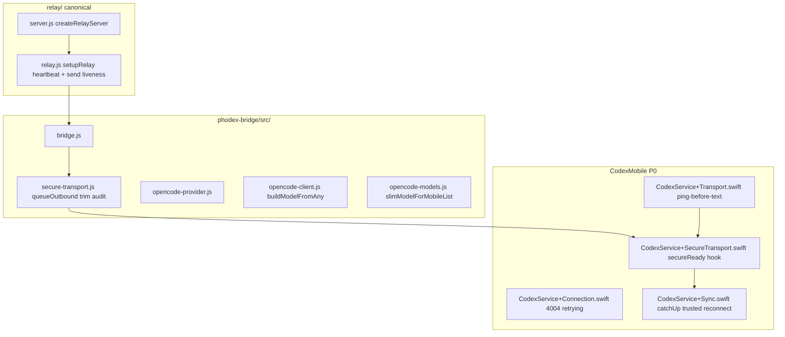

# Design: OpenCode Turn Completion Delivery to Initiating iOS Client

| Field | Value |
|-------|-------|
| **Status** | Draft — revised per review `grok-design-review-b038ef0d` (2026-06-03) |
| **Author** | Remodex reliability (Grok design pass) |
| **Date** | 2026-06-03 |
| **Workspace** | `$REMODEX_WORKSPACE/repos/remodex-opencode/` |
| **Repro log** | `/tmp/remodex-local.log` (session `<SESSION-ID>`, lines 785–795) |
| **Planner input** | `/tmp/grok-design-plan-b038ef0d.md` |

---

## Overview

When an iPhone initiates an **OpenCode Zen / big-pickle** turn over the LAN relay, the Mac bridge completes inference and may show a native **OpenCode.app** notification, but the **initiating iPhone never receives the assistant output** and remains on **“Remodex is thinking”** (or surfaces **“Connection was interrupted”**). Production reliability requires the **relay + secure transport + iOS turn state** path to survive long OpenCode runs and relay flaps without relying on Remodex push (disabled in repro).

This document specifies observability, relay liveness (bidirectional), iOS pong/keepalive (**P0 co-requisite**), secure replay audit, iOS trusted-reconnect recovery, and Zen composer branding.

---

## Background & Motivation

### User-visible repro (confirmed)

| Step | Observation |
|------|-------------|
| 1 | iPhone paired to Mac relay; model **OpenCode Zen / big-pickle** |
| 2 | User sends prompt; Mac generates response; **Mac notification** appears (native OpenCode.app — not Remodex push) |
| 3 | **Initiating iPhone** never shows completion; thinking indicator persists |

### Log fingerprint (`/tmp/remodex-local.log` L785–795)

```
{"event":"opencode_turn_prompt","providerID":"opencode","modelID":"big-pickle",...}
[relay] heartbeat terminated iphone session#<SESSION-ID>
[relay] Mobile disconnected (iphone) -> session#<SESSION-ID> (0 remaining)
[remodex][secure] serverHello mode=trusted_reconnect session=<SESSION-ID> keyEpoch=2 ...
```

**Causation caveat (review Issue 2):** These lines are **adjacent but untimestamped**. Relay termination requires `_relayAlive === false` at a **30s** `HEARTBEAT_INTERVAL_MS` tick (`relay.js` L71–85). The pattern is **consistent with** a missed-pong cycle around turn time but **does not prove** sub-30s termination caused by `opencode_turn_prompt`. PR1 must add ISO timestamps and `msSinceLast*` fields before treating log order as causal.

Additional confirmed facts:

- **Push disabled:** L68 `[remodex] push notifications disabled: no push service URL configured` (`push-notification-service-client.js` L140; `pushServiceUrl` empty).
- **Mac path healthy:** L73 `[remodex]:server OpenCode serve ready`; `opencode_turn_prompt` from `opencode-provider.js` / `opencode-client.js`.
- **Thread ID** (user report): `opencode-thread-<REDACTED>` @ 2026-06-03 20:15:30 local.
- **iOS thinking clearance:** `turn/completed` via `handleTurnCompleted` → `markTurnCompleted`. `thread/status` idle guarded when `protectedRunningFallbackThreadIDs` active (`CodexService+Incoming.swift` L749–754).
- **Zen logo:** `ComposerBottomBar.swift` uses `modelProvider` (`"opencode"`); `resolveLogoProviderId` only on inventory, not `buildModelFromAny`.

### Architectural context

```
iPhone (CodexMobile)
  └─ WebSocket → relay/server.js → relay/relay.js setupRelay (canonical)
       └─ Mac bridge phodex-bridge/src/bridge.js
            ├─ secure-transport.js (outboundBuffer, resumeState, replay)
            └─ opencode-provider.js → OpenCode serve
```

**Canonical relay entrypoint:** `relay/server.js` `createRelayServer()` → `setupRelay(wss)` from **`relay/relay.js`** (`relay/README.md` L128). `relay/phodex-backend-relay.mjs` duplicates heartbeat logic without `heartbeatTerminations` metrics — **not** the local/production path; PR1/PR2 will document this and sync or delete the duplicate to prevent drift.

---

## Goals & Non-Goals

### Goals

| ID | Goal |
|----|------|
| **G1** | Initiating iPhone receives OpenCode assistant output within a stable connect cycle when possible. |
| **G2** | Relay mobile leg survives long OpenCode runs; **no** `[relay] heartbeat terminated iphone` during active receive-heavy turns (validated with timestamped PR1 logs, not line adjacency). |
| **G3** | After `trusted_reconnect`, replay + iOS catch-up deliver `turn/completed` so thinking clears. |
| **G4** | UI exits “Remodex is thinking” on `turn/completed` (turn-id-less fallback per AGENTS.md). |
| **G5** | OpenCode Zen shows `opencode-zen` logo in composer. |
| **G6** | `npm test` with `REMODEX_DISABLE_OPENCODE=1`; Codex unchanged. |

### Non-Goals

- Remodex push / `pushServiceUrl` / APNs.
- OpenCode.app Mac notification timing.
- Upstream OpenCode serve fixes.
- PR8 catalog flip (complete on `main` — see `docs/operations/device-e2e-signoff.md`).
- VPS/TLS relay deployment.
- Repo-root ad-hoc markdown.

---

## Assumptions

| ID | Assumption | Falsify if |
|----|------------|------------|
| **A1** | LAN relay; likely manual TCP when `prefersDirectRelayTransport` | Transport log shows only NW/URLSession |
| **A2** | `[relay] heartbeat terminated` is `relay.js` 30s tick, not bridge `[remodex] relay heartbeat stalled` | Only bridge stall logs |
| **A3** | Phone `lastAppliedBridgeOutboundSeq` lags Mac across flap | Replay tests: phone seq ≥ Mac, UI empty |
| **A4** | Go “stuck sending” shares transport path | Go repro with healthy relay, broken provider only |
| **A5** | Zen: `upstreamProviderId: "opencode"` + display “OpenCode Zen” | `model/list` differs |
| **A6** | Device E2E mandatory (`AGENTS.md`) | Product waives E2E |
| **A7** | **New:** Repro termination may be a **prior** missed pong, not prompt-triggered | PR1 `msSinceLastPong` at terminate &lt; 30s from prompt |

---

## Dependencies

### Module graph



### PR ordering (revised)

| PR | Depends on | P0? |
|----|------------|-----|
| PR1 Relay diagnostics | — | Yes (hypothesis validation) |
| **PR2 Relay liveness (inbound + outbound send)** | PR1 | **Yes** |
| **PR3 iOS pong / keepalive** | PR1 | **Yes — co-requisite with PR2, not optional** |
| PR4 Bridge replay audit + trim metrics | PR2 | P1 |
| PR5 iOS trusted-reconnect recovery | **PR2 + PR3 + PR4** | P1 |
| PR6 Zen logo | — (after `buildModelFromAny`) | P2 |
| PR7 Device E2E | PR2–PR5 | Gate |

**Minimum compatible deploy set for delivery path:** **PR2 + PR3 + PR4** together (relay liveness without iOS pong still fails receive-heavy turns; bridge audit without relay fix does not prevent disconnect).

**P0 pairing:** PR2 and PR3 ship together for any field validation of G2. PR4 can merge in parallel with PR3 but must land before PR5.

---

## Proposed Design

### Root cause (code-verified; log correlation hypothesis)

| Layer | Finding | Evidence |
|-------|---------|----------|
| **P0 Relay** | Only `pong` resets `_relayAlive` (L104–107). `ws.on("message")` (L175–198) handles **mobile→Mac** only; **Mac→phone** uses `client.send(msg)` (L182–186) and does **not** touch mobile `_relayAlive`. OpenCode turns are **receive-heavy** on iPhone (streaming `encryptedEnvelope`s). | Adjacent L785–786; 30s interval logic |
| **P0 iOS** | Manual path: `drainManualWebSocketFrames` processes `0x1` text (`processIncomingWireText`) in loop order before `0x9` ping (L1023–1035); backlog can delay pong → missed relay `pong`. | `CodexService+Transport.swift` |
| **P1 Replay** | `handleResumeState` already replays (L414–422); `bindLiveSendWireMessage` calls `replayBufferedOutboundMessages()` (L480). Gap: stale `lastAppliedBridgeOutboundSeq` + `includeCurrentSessionEntries`; silent `trimOutboundBuffer` (L484–501, **no log today**). | `secure-transport.js` |
| **P1 UI** | Thinking needs `turn/completed`; `thread/status` idle blocked by `protectedRunningFallback` (L749–754). | `CodexService+Incoming.swift` |
| **P2 Logo** | Composer `modelProvider` only. | `ComposerBottomBar.swift` L506 |

**Primary hypothesis:** False-positive relay heartbeat on mobile socket during receive-heavy turn (missed `pong`, no outbound-send liveness). **Requires PR1 timestamps to confirm timing.**

**Secondary:** Replay/catch-up gaps after `trusted_reconnect` mid-turn (not cold `performPostConnectSyncPass`, which already catch-ups at L571–574).

---

### Workstream WS-1 — Relay liveness & observability (P0)

**Files:** `relay/relay.js`, `relay/server.js`, new `relay/relay-heartbeat.test.js`. **Not** `phodex-backend-relay.mjs` (sync/delete in PR1 per operability).

#### PR1 — Timestamped diagnostics (no behavior change)

On each heartbeat terminate log (and optional debug tick):

| Field | Meaning |
|-------|---------|
| `ts` | ISO-8601 timestamp |
| `msSinceLastPong` | Since last `pong` on this socket |
| `msSinceLastMobileInbound` | Since last mobile `message` received |
| `msSinceLastMobileOutbound` | Since last successful `client.send` **to** this mobile socket |
| `role`, `relaySessionLogLabel(sessionId)`, `readyState`, `bufferedAmount` | Per AGENTS.md redaction |

Extend `getRelayStats()` with per-role counters. Repro acceptance uses **structured timestamps**, not adjacent log lines.

#### PR2 — Bidirectional activity liveness (Option A + A′)

**Option A (mobile inbound):** In `ws.on("message")`, when `isRelayMobileRole(role)`, set `ws._relayAlive = true` and update `ws._relayLastMobileInboundAt`.

**Option A′ (mobile outbound — required with A):** When relay **successfully sends** to an open mobile socket (`client.send` at L182–186), set that `client._relayAlive = true` and update `ws._relayLastMobileOutboundAt`. Rationale: Mac→phone streaming does not invoke the mobile socket’s `message` handler; Option A alone is **insufficient** for receive-heavy OpenCode turns (review Issue 1).

**Option B (fallback):** Two consecutive missed pongs and/or 60s mobile interval.

**Option C (fallback):** App-level `relayPing` / `relayPong` in `processIncomingWireText` before secure layer.

**Flag:** `REMODEX_RELAY_MESSAGE_LIVENESS=1` gates A+A′.

#### Tests (`relay/relay-heartbeat.test.js`)

| Case | Expect |
|------|--------|
| Mobile sends inbound, never pongs 35s | Alive (Option A) |
| Mobile **receives** Mac relay sends only, no inbound 35s | Alive (Option A′) |
| Mobile neither sends nor receives 70s+ | Terminate (dead leg) |

---

### Workstream WS-2 — iPhone transport keepalive (P0, co-requisite with PR2)

**Files:** `CodexService+Transport.swift`, `CodexService+Connection.swift`, `CodexService+ThreadsTurns.swift`.

**Not optional hardening** — without PR3, relay `ping` may still find `_relayAlive === false` on manual TCP when decode backlog delays pong.

1. **Ping-before-text drain (PR3 acceptance):** In `drainManualWebSocketFrames`, when both `0x9` and `0x1` frames are pending in the same buffer, handle **all `0x9` first** (send `0xA`), then process `0x1` / `processIncomingWireText`. Test: inject `0x9` ahead of large `0x1` backlog; assert pong sent before text processing.

2. **NW path:** `autoReplyPing = true`; log transport in pairing logs (A1).

3. **Active-turn keepalive:** Shorten `CodexWebSocketKeepAlivePolicy` interval or `probeForegroundConnectionIfNeeded()` after `turn/start`.

4. **UX:** Suppress “Connection was interrupted…” (`L1122`) when `connectionRecoveryState == .retrying` within bounded trusted-resume window.

---

### Workstream WS-3 — Secure replay audit & trim observability (P1)

**Files:** `secure-transport.js`, `bridge.js` (read-only audit), tests.

**Already implemented (do not add redundant replay):**

- `handleResumeState` replays `missingEntries` inline (L414–422).
- `bindLiveSendWireMessage` → `replayBufferedOutboundMessages()` (L476–481).

**PR4 scope = audit + metrics + tests, not a third replay invocation:**

1. **Audit** `replayableOutboundEntries` / `includeCurrentSessionEntries` (L532–546) for stale phone `lastAppliedBridgeOutboundSeq` suppressing post-`trusted_reconnect` `turn/completed`.

2. **Trim observability:** In `trimOutboundBuffer()` (L484–501), add counter `bridge_outbound_trim_dropped` + structured log: `{ event: "bridge_outbound_trim_dropped", droppedCount, droppedBytes, firstSeq, lastSeq }`. Extend `secure-transport.test.js`: under cap, `turn/completed` not dropped; over cap, log emitted.

3. **Buffered-send log (replaces `opencode_turn_complete_buffered` at provider):** In `queueOutboundApplicationMessage` (L107–129), when `!activeSession?.isResumed`:

   ```json
   { "event": "bridge_outbound_buffered", "bridgeOutboundSeq": N, "payloadBytes": B }
   ```

   Correlates all providers (including OpenCode `completeTurn` emit) without duplicating logging in `opencode-provider.js`.

4. **Integration test:** `relay/simulated-pairing-reconnect.test.js` — mid-prompt relay drop → `turn/completed` received after `trusted_reconnect` replay.

---

### Workstream WS-4 — iOS trusted-reconnect turn recovery (P1)

**Files:** `CodexService+SecureTransport.swift`, `CodexService+Sync.swift`, `CodexService+Connection.swift`, `CodexService+Incoming.swift`.

#### What already exists (do not re-document as greenfield)

- **Cold/post-connect catch-up:** `performPostConnectSyncPass` → `catchUpRunningThreadIfNeeded(..., shouldForceResume: true)` (`CodexService+Connection.swift` L571–574).
- **4004 copy + foreground reconnect:** `explicitRelayDropMessage` (L1221–1227); `shouldAutoReconnectOnForeground` true when `explicitRelayDropMessage != nil` (L871–872).

#### PR5 delta (narrow)

| # | Change | Rationale |
|---|--------|-----------|
| 1 | **Trusted-reconnect hook:** After `secureReady` with `handshakeMode == .trustedReconnect` and `initializeSession` complete, call new `reconcileProtectedThreadsAfterTrustedReconnect()` that iterates `protectedRunningFallbackThreadIDs` ∪ `activeTurnIdByThread.keys` and runs `catchUpRunningThreadIfNeeded(threadId:, shouldForceResume: true)`. Hook site: completion path in `CodexService+SecureTransport.swift` after matching `secureReady` (near `waitForMatchingSecureReady` consumer), **not** only `performPostConnectSyncPass`. | Mid-turn flap bypasses cold connect path |
| 2 | **4004 → `.retrying`:** Include `4004` in `shouldAttemptAutoRecovery` (today L846–847 excludes when `explicitRelayDropMessage != nil`). Set `connectionRecoveryState = .retrying` with cap/backoff; keep existing user copy. | Auto-reconnect during drop, not only on foreground |
| 3 | **`turn/completed` without `turnId`:** Verify `handleTurnCompleted` fallback (L607–614) clears protected fallback via `markTurnCompleted` → `clearRunningState` (L458). | AGENTS.md |

---

### Workstream WS-5 — OpenCode Zen logo (P2)

| Layer | File | Change |
|-------|------|--------|
| Bridge | `opencode-client.js` `buildModelFromAny` | `logoProviderId` via `resolveLogoProviderId` |
| Bridge | `opencode-models.js` **`slimModelForMobileList`** | Pass through `logoProviderId` when set (not `slimModelForRelay`) |
| iOS | `CodexModelOption.swift`, `ComposerBottomBar.swift`, `TurnComposerRuntimeUIKitMenu.swift` | `composerLogoProviderId = logoProviderId ?? modelProvider` |

---

## API / Interface Changes

| Surface | Change |
|---------|--------|
| Relay logs/stats | Timestamped terminate diagnostics; outbound-send liveness timestamps |
| Relay env | `REMODEX_RELAY_MESSAGE_LIVENESS` |
| Bridge log | `bridge_outbound_buffered`, `bridge_outbound_trim_dropped` |
| `model/list` | Optional `logoProviderId` via `slimModelForMobileList` |
| iOS | `CodexModelOption.logoProviderId`; 4004 → `.retrying` |
| Wire (optional) | `relayPing` / `relayPong` |

---

## Alternatives Considered

(Unchanged rationale: push rejected; heartbeat-off rejected; relay buffering rejected; iOS-only polling insufficient; iOS slug map rejected.)

**Added:** Option A without A′ rejected — code proves Mac→phone send does not reset mobile `message` handler.

---

## Security & Privacy

(Unchanged: `relaySessionLogLabel`, seq dedupe, strip app pings before secure layer.)

---

## Observability

| Signal | Acceptance |
|--------|------------|
| PR1 terminate logs | Include `ts`, `msSinceLastPong`, `msSinceLastMobileInbound`, `msSinceLastMobileOutbound` |
| G2 validation | No terminate with `msSinceLastMobileOutbound` &lt; 30s during active turn (timestamp-based) |
| `bridge_outbound_buffered` | Present when relay flap during OpenCode run |
| `bridge_outbound_trim_dropped` | Zero during normal turns; non-zero only under forced cap tests |
| `trusted_reconnect` | ≤1 flap with UI delivery; catch-up hook logged |

---

## Rollout Plan

PR1 → **(PR2 + PR3) together** → (PR4 ‖ PR5 after PR4 tests) → PR6 → PR7.

---

## Rollback Strategy (per PR)

| PR | Rollback |
|----|----------|
| PR1 | Revert diagnostics only |
| PR2 | Revert `relay.js`; restart relay; unset flag |
| PR3 | Revert iOS transport |
| PR4 | Revert trim logs + tests |
| PR5 | Revert trusted-reconnect hook + 4004 retrying |
| PR6 | Revert logo fields |

**Partial fleet:** Rolling back PR2 without PR3 restores false-positive terminate on receive-heavy turns. Minimum set for delivery fix: **PR2 + PR3**; replay path needs **PR4**; UI recovery needs **PR5**.

---

## Implementation Sequencing

**Merge order:** PR1 → **(PR2 + PR3)** → PR4 → PR5 → PR6 → PR7.

PR2 and PR3 are one logical release for E2E sign-off.

---

## Verification / Done Bar

### Automated

```bash
cd phodex-bridge && npm ci && npm test
npm run test:opencode   # after PR4
cd ../relay && npm test # after PR1–2
```

| Test | Asserts |
|------|---------|
| `relay/relay-heartbeat.test.js` | Inbound-only and **receive-only** liveness |
| `secure-transport.test.js` | Trim log; replay audit cases |
| `simulated-pairing-reconnect.test.js` | Mid-prompt drop + `turn/completed` |
| PR3 manual/unit | Ping before text in drain |

### Device E2E

1. OpenCode Zen / big-pickle, prompt ≥30s.
2. iPhone shows output; thinking clears.
3. Log: **timestamped** proof — no terminate with recent `msSinceLastMobileOutbound` during stream.
4. ≤1 `trusted_reconnect` with success.
5. Background 10s mid-turn → foreground → delivery.
6. Zen logo in composer.
7. Codex with `REMODEX_DISABLE_OPENCODE=1`.

---

## Risks

| Risk | Severity | Mitigation |
|------|----------|------------|
| Option A without A′ — false confidence | **Major** | Ship A+A′; test receive-only case |
| Message/send liveness masks dead TCP | Medium | 2× interval cap; no inbound+outbound idle &gt; 70s |
| `trimOutboundBuffer` silent drop | **Major** | PR4 `bridge_outbound_trim_dropped` + test |
| Duplicate `turn/completed` | Medium | Seq dedupe L979–982 + test |
| Codex regression | High | `REMODEX_DISABLE_OPENCODE=1` + device Codex smoke |
| Main-actor backlog | Medium | PR3 ping-before-text |
| 4004 UX | Low | Keep L1227 copy; add `.retrying` only |
| `phodex-backend-relay.mjs` drift | Low | PR1 canonical doc + sync/delete |

---

## Open Questions

**Resolved 2026-06-03 (orchestrator investigation — see conversation).**

| # | Resolution |
|---|------------|
| 1 | **Repro uses manual TCP websocket** (`prefersDirectRelayTransport` for `<LAN-IP-OTHER>`). PR3 ping-before-text is on the critical path. |
| 2 | **First drop = relay heartbeat terminate** (L786–787); **later drops = reconnect churn** without heartbeat (L791, L795). PR1 must log mobile `close` code/reason. |
| 3 | **Add `threadId`, `turnId`, `sessionId` to `opencode_turn_prompt`** in `opencode-client.js` `prompt()` via provider call site (`opencode-provider.js` `executeTurn`). |

---

## References

| Resource | Path |
|----------|------|
| Canonical relay | `relay/server.js`, `relay/relay.js`, `relay/README.md` |
| Duplicate (non-canonical) | `relay/phodex-backend-relay.mjs` |
| Secure transport | `phodex-bridge/src/secure-transport.js` |
| iOS 4004 | `CodexService+Connection.swift` L846–872, L1221–1227 |
| iOS post-connect catch-up | `CodexService+Connection.swift` L571–574 |
| Repro log | `/tmp/remodex-local.log` L785–795 |

---

## Key Decisions

1. **P0 is bidirectional relay liveness (A + A′) plus iOS pong (PR3)** — not push; not inbound-only Option A.
2. **PR3 is P0 co-equal with PR2** — merge together for field validation.
3. **Log adjacency ≠ causation** — PR1 timestamps required before claiming prompt-triggered terminate.
4. **PR4 = audit + trim/buffer logs + tests** — no redundant third `replayBufferedOutboundMessages` call.
5. **`bridge_outbound_buffered` at `queueOutboundApplicationMessage`** when `!isResumed` — not provider-local log.
6. **PR5 = trusted-reconnect hook + 4004 `.retrying`** — not replacing existing 4004 copy/foreground reconnect.
7. **`slimModelForMobileList`** is the model/list slim path (not `slimModelForRelay`).
8. **`relay.js` via `server.js` is canonical** — deprecate/sync `phodex-backend-relay.mjs`.
9. **PR8** — catalog flip complete after device E2E sign-off (`docs/operations/device-e2e-signoff.md`).

---

## PR Plan

### PR1 — Relay heartbeat diagnostics

| Field | Value |
|-------|-------|
| **Depends** | — |
| **Files** | `relay/relay.js`, `relay/server.js`, `relay/README.md`; sync or remove `phodex-backend-relay.mjs` |
| **Description** | ISO timestamps; `msSinceLastPong`, `msSinceLastMobileInbound`, `msSinceLastMobileOutbound`; per-role stats; document canonical entrypoint. **No liveness behavior change.** |

### PR2 — Relay bidirectional liveness

| Field | Value |
|-------|-------|
| **Depends** | PR1 |
| **Co-requisite** | **PR3** (same release) |
| **Files** | `relay/relay.js` (A: mobile `message`; A′: successful mobile `send`); `relay/relay-heartbeat.test.js` |
| **Description** | Reset `_relayAlive` on inbound **and** outbound relay send. Tests include receive-only Mac→phone case. |

### PR3 — iOS pong / keepalive (P0)

| Field | Value |
|-------|-------|
| **Depends** | PR1 |
| **Co-requisite** | **PR2** |
| **Files** | `CodexService+Transport.swift` (ping-before-text), `CodexService+Connection.swift`, `CodexService+ThreadsTurns.swift` |
| **Description** | Process `0x9` before `0x1` in drain; active-turn keepalive; softer interrupt copy during `.retrying`. **Blocking for G2.** |

### PR4 — Bridge replay audit + trim metrics

| Field | Value |
|-------|-------|
| **Depends** | PR2 |
| **Files** | `secure-transport.js`; `test/secure-transport.test.js`; `relay/simulated-pairing-reconnect.test.js` |
| **Description** | Audit `replayableOutboundEntries` / `includeCurrentSessionEntries`; `bridge_outbound_trim_dropped` + `bridge_outbound_buffered`; mid-prompt integration test. **No duplicate replay call.** |

### PR5 — iOS trusted-reconnect recovery

| Field | Value |
|-------|-------|
| **Depends** | PR2, PR3, PR4 |
| **Files** | `CodexService+SecureTransport.swift` (`secureReady` + `.trustedReconnect` hook), `CodexService+Sync.swift`, `CodexService+Connection.swift` (4004 → `.retrying`) |
| **Description** | `reconcileProtectedThreadsAfterTrustedReconnect()` after mid-turn `secureReady`; 4004 enters `shouldAttemptAutoRecovery`; do not duplicate `performPostConnectSyncPass` behavior. |

### PR6 — Zen `logoProviderId`

| Field | Value |
|-------|-------|
| **Depends** | — (after PR4 `buildModelFromAny` if concurrent) |
| **Files** | `opencode-client.js`, `opencode-models.js` (`slimModelForMobileList`), Swift composer files |
| **Description** | Propagate `logoProviderId` to composer. |

### PR7 — Device E2E

| Field | Value |
|-------|-------|
| **Depends** | PR2–PR5 |
| **Description** | Timestamp-based G2 proof; full done bar; PR8 prep. |

**Merge order:** PR1 → **(PR2 + PR3)** → PR4 → PR5 → PR6 → PR7.

---

## Revision History

| Date | Change |
|------|--------|
| 2026-06-03 | Initial draft |
| 2026-06-03 | Review `grok-design-review-b038ef0d`: A+A′ liveness; PR3 P0 co-requisite; soften log causation; PR4 audit; PR5 narrow; ping-before-text; canonical relay; trim/buffer logs |