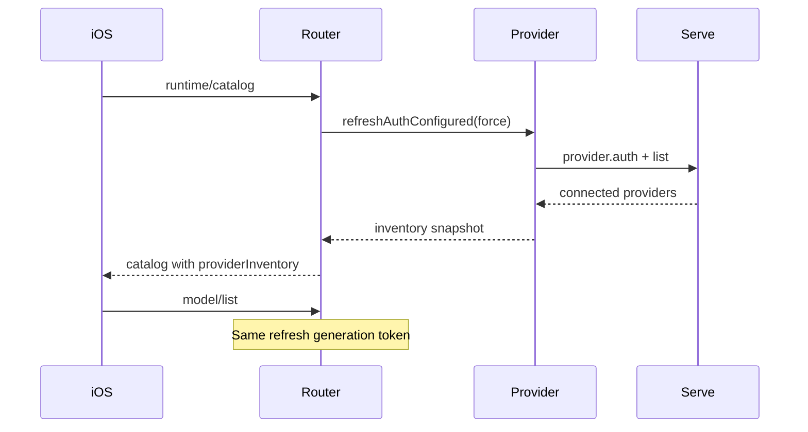

# Remodex OpenCode Integration — Implementation-Ready Execution Plan

**Document ID:** `grok-design-doc-a65ae84c`  
**Version:** 1.2 (re-review)
**Date:** 2026-06-08  
**Baseline commit:** `a5c2c5fb` (`repos/remodex-opencode/`)  
**Test snapshot (verified):** `npm test` 690/690, `npm run test:opencode` 278/278  
**Target:** iPhone-first production for thousands of direct users  
**Out of scope:** Upstream PR to Emanuele-web04/remodex; TestFlight release ops  

---

## Overview

This document pressure-tests `.cursor/plans/remodex-opencode-finish.plan.md` (v3) against the live codebase and user requirements (Tier A+B+C essential). It reorders work to unblock **turn completion** before **streaming polish**, defines work packages **WP-00 through WP-15**, gates, risks, and a **26-PR** execution sequence.

**Integration surface:** `repos/remodex-opencode/` — `phodex-bridge/` + `CodexMobile/`

**Canonical documentation root:** `<workspace>/docs/operations/` (parent of `repos/remodex-opencode/`). Repo-local `AGENTS.md` links via `../../docs/operations/`. New ops docs (baseline, e2e updates) live at workspace root, not inside the git submodule path alone.

---

## Work Package → PR Mapping (single source of truth)

| WP-ID | Name | Critical path? | PR-IDs | Parallel track |
|-------|------|----------------|--------|----------------|
| **WP-00** | Baseline & symptom map | Gate | PR-01 | — |
| **WP-01** | Transport teardown + A1 reconnect | **Yes** | PR-02, PR-03 | — |
| **WP-02** | Permission routing + rich UI | **Yes** | PR-04, PR-05, PR-06, PR-07 | — |
| **WP-03** | Skill file injection | **Yes** | PR-08 | **Track B** (parallel after PR-01) |
| **WP-04** | SSE streamError recovery | **Yes** | PR-09, PR-10 | — |
| **WP-05** | Push (relay APNs) | **Yes** | PR-11, PR-12 | — |
| **WP-06** | Image attachments | P0 | PR-13, PR-14 | **Track B** (parallel after PR-01) |
| **WP-07** | Project RPCs | P1 | PR-15 | **Track B** |
| **WP-08** | Multi-provider + All Models | **Yes** | PR-16, PR-17, PR-18 | — |
| **WP-09** | Branding `logoAssetId` | P1 | PR-19, PR-20 | — |
| **WP-10** | Handoff verify + doc sync | P1 (G4 only) | PR-21 | **Track C** (non-blocking) |
| **WP-11** | Process health | P1 | PR-22 | — |
| **WP-12** | Jank + performance budgets | P1 | PR-23 | — |
| **WP-13** | Queue E2E, iOS test debt, Mac ops | P1 | PR-24, PR-25 | — |
| **WP-14** | CI, git hygiene, doc drift | Gate | PR-26 | — |
| **WP-15** | iPhone O0–O17 (G4) | **Ship gate** | — (user device) | — |

**Revised critical path (WP-IDs only):**
```
WP-00 → WP-01 → WP-02 → WP-04 → WP-05 → WP-08 → WP-14 → WP-15
                              ↘ WP-03 (skills) ────┘
                              ↘ WP-06 (images) ────┘
```
**Track B P0 (WP-03, WP-06) is ship-blocking for GATE-FINAL** — runs in parallel after WP-01 but **must complete before WP-15**. WP-07 runs on Track B (P1, not ship-gated). WP-10 is **verify + doc sync** (Track C, non-blocking).

---

## Background & Motivation

OpenCode integration is functionally broad (router, provider, handoff, push tracker, catalog, 690+ bridge tests) but **production gaps block real iPhone usage**:

| Symptom (user-reported) | Verified root cause |
|-------------------------|---------------------|
| Permissions hang / turns stall | `permission/request` SSE → bridge `emit()` works; iOS has **no** `permission/request` handler; `permission/reply` **not** routable (`ROUTABLE_THREAD_METHODS` excludes it) |
| Skills picked via `$` don't apply | `supportsStructuredSkillInput: false` → iOS skips `type:skill` items in `CodexService+ThreadsTurns.swift` |
| No images on OpenCode | `TurnViewModel.allowsComposerImageAttachments` hard-blocks `provider == "opencode"` |
| Close app → error / flash-bang / Stop loss | **Bug A1:** `disconnect()` → `finalizeAllStreamingState()` wipes `activeTurnIdByThread` + running markers, approvals, timeline — see §WP-01 |
| Thinking-only UI / stream death | SSE `event/streamError` emitted (`opencode-client.js:358`); **no resubscribe** in `opencode-provider.js`; 2s poll fallback (`CodexService+Sync.swift`) |
| Multi-provider incomplete | Model cap **120**; no All Models sheet; **mixed** env+non-env inventories drop env providers from preferred set |
| Handoff docs drift | Catalog `supportsDesktopHandoff: true`; `device-e2e-opencode.md` still says O12 blocked until PR8 |
| Push “doesn't work” | Tracker + relay endpoints exist; **relay APNs not configured** |
| Branding missing | `logoAssetId` undefined for most external providers despite committed assets |

### Bug A1 — corrected root cause (code-audited, v1.2)

`CodexService+Connection.disconnect()` (**lines 151–215**) does **not** call `activeTurnIdByThread.removeAll()` **directly**, but **line 167** calls `finalizeAllStreamingState()`, which at `CodexService+Messages.swift:4324–4327` executes:

```swift
activeTurnId = nil
activeTurnIdByThread.removeAll()
clearAllRunningState()
```

**Additional wipe sites (full session reset only):**
- `resetThreadRuntimeStateForServerSwitch()` (Connection.swift:677)
- `clearInMemoryMacScopedState()` (`CodexService+MacContext.swift:247`)

**What `disconnect()` actually clears (causes A1 symptoms):**
| Call | Effect |
|------|--------|
| `finalizeAllStreamingState()` (line 167) | **`activeTurnIdByThread.removeAll()`** + second `clearAllRunningState()` + streaming delta flush |
| `clearPendingApprovals()` (line 166) | Drops **all** `pendingApprovals` (Codex approvals) |
| `clearAllRunningState()` (line 191) | Clears `runningThreadIDs`, mirrored-running sets (`Messages.swift:470–484`) — *also called inside finalizeAllStreamingState* |
| `removeAllThreadTimelineState()` (line 178) | Wipes per-thread timeline caches |
| `clearHydrationCaches()` (line 209) | Loses catch-up hydration state |
| `failAllPendingRequests(.disconnected)` (line 214) | RPC failures → flash errors |

**What survives transport `disconnect()` today:** **No turn-related state survives** — `activeTurnIdByThread`, running markers, timeline, approvals, and hydration are all wiped. This is the **primary driver** of Stop loss and flash-bang on reconnect catch-up.

---

## Goals & Non-Goals

### Goals (Tier A+B+C — all essential per user)

1. **Permissions:** Rich UI — Allow now / Allow always / Deny
2. **Skills:** `$` picker injects real `SKILL.md` file parts (multi-skill)
3. **Images:** Camera, photos, screenshots, paste — parity with Codex
4. **Reconnect:** Transport disconnect ≠ session reset (fix A1)
5. **Push:** Background turn-complete + permission-needed alerts
6. **Handoff:** Verify desktop → TUI (`opencode-handoff.js` exists) + doc sync
7. **Multi-provider:** All Models sheet; mixed-inventory auth filter; catalog race
8. **Branding:** Wire `logoAssetId` (user: no legal blocker)
9. **Streaming:** SSE reconnect + incremental hydration
10. **Performance:** Cold start, reconnect, catalog budgets; suppress flash-bang
11. **Regression:** `REMODEX_DISABLE_OPENCODE=1` identical to Codex
12. **Ops:** launchd/menubar playbook; `test:opencode` in CI
13. **Device proof:** iPhone O0–O17 + **O6b** permission (G4)

### Non-Goals

- Upstream PR to Emanuele-web04/remodex
- TestFlight / App Store ops
- Plugin `@` (Codex-only — document N/A)
- Steer (no SDK — stays greyed)
- iPad as primary target

### Handoff scope clarification (Issue 14)

Handoff is **Tier A for G4 verification** but **not critical-path implementation** — `opencode-handoff.js` already implements desktop-first → TUI. **WP-10 = verify + doc sync + optional polish**, not greenfield. Critical path messaging treats handoff as **O12–O16 device matrix**, not blocking PR-04–PR-12.

---

## AGENTS.md reconciliation — PR10 SSE “Done” vs WP-04

`repos/remodex-opencode/AGENTS.md` marks **PR10 SSE Done** for:
- `session.next.*` event mapping in `opencode-client.js`
- `session.idle` duplicate `turn/completed` dedupe in provider

**Still outstanding (WP-04):** `event/streamError` handling — emitted at `opencode-client.js:358` with **no resubscribe loop** in `opencode-provider.js`. Implementers must not assume SSE work is complete because Phase 2 PR10 is checked off.

---

## Key Decisions

| ID | Decision | Status | Rationale |
|----|----------|--------|-----------|
| **D1** | Reconnect + permissions before SSE | Resolved | Permissions block turns; A1 timeline wipe causes flash-bang |
| **D2** | Push is ship-blocker | Resolved | Background iPhone is primary usage |
| **D3** | All Models sheet is iPhone P0 | Resolved | 120 cap hides models |
| **D4** | `supportsSkillFileInjection` distinct from `supportsStructuredSkillInput` | Resolved | Bridge supports file parts; SDK gate irrelevant |
| **D5** | `supportsImageAttachments` capability-driven UI | Resolved | Remove provider-string block |
| **D6** | Branding: wire `logoAssetId`; **replace** BLOCKED section with user sign-off policy | Resolved | See §WP-09 doc policy — not delete-and-forget |
| **D7** | Rich permission sheet (not UIAlert) | Resolved | allow now / always / deny |
| **D8** | `permission/reply` at router top-level | Resolved | Not in `ROUTABLE_THREAD_METHODS` |
| **D9** | SSE reconnect with backoff | Resolved | streamError currently terminal |
| **D10** | Preserve **`activeTurnIdByThread` + running markers + timeline + queues** on transport teardown | Resolved | `finalizeAllStreamingState()` on disconnect wipes turn map — transport-only path must skip or scope it |
| **D11** | Handoff: verify + doc sync | Resolved | Code exists |
| **D12** | Steer stays greyed | Resolved | No SDK |
| **D13** | iOS full XCTest green not gating; **minimum new tests per P0 WP** required | Resolved | See §iOS test minimums |
| **D14** | Upstream PR out of scope | Resolved | Owner handles |
| **D15** | `model/list` + `params.full: true` for All Models (Q4 resolved) | Resolved | No new RPC |
| **D16** | OpenCode permissions use **separate queue** from Codex `pendingApprovals` | Resolved | Avoid collision; WP-02 depends on WP-01 preservation semantics |

---

## Permission State Model (WP-02)

### Bridge notification schema

```json
{
  "method": "permission/request",
  "params": {
    "permissionId": "perm-abc123",
    "threadId": "opencode-thread-…",
    "turnId": "turn-…",
    "sessionId": "ses-…",
    "tool": "bash",
    "args": { "command": "npm test" },
    "cwd": "/Users/me/project",
    "requestedAt": "2026-06-08T12:00:00Z"
  }
}
```

Emitted today via `opencode-client.js:840–845` → `opencode-provider.js:1603` `emit()`. WP-02 adds stable schema + server-initiated RPC envelope for offline catch-up.

### iOS types (new — do not overload `CodexApprovalRequest`)

```swift
struct OpenCodePermissionRequest: Identifiable, Sendable {
    let id: String              // permissionId
    let permissionId: String
    let threadId: String
    let turnId: String?
    let sessionId: String?
    let tool: String
    let argsSummary: String     // redacted/truncated for UI
    let cwd: String?
    let receivedAt: Date
}

// CodexService.swift
var pendingOpenCodePermissions: [OpenCodePermissionRequest] = []
var sessionGrantedOpenCodeTools: Set<String> = []  // tool keys for UI hint only
```

**Queue rules:**
- Separate from `pendingApprovals` / `CodexApprovalRequest` (D16)
- FIFO per thread; one sheet at a time; global queue shows thread badge when not on active thread
- Max 20 pending; oldest evicted with system message
- Transport-only disconnect: **preserve** `pendingOpenCodePermissions` (requires WP-01 stopping `clearPendingApprovals()` on reconnect path — or selective clear: Codex approvals only)

### Reply RPC shape

```json
{
  "method": "permission/reply",
  "params": {
    "permissionId": "perm-abc123",
    "threadId": "opencode-thread-…",
    "sessionId": "ses-…",
    "allow": true,
    "scope": "once" | "session"
  }
}
```

Bridge validates `permissionId` matches `pendingPermissions` map before calling SDK (replay/wrong-id rejected).

### Allow-always grant design (R1)

```javascript
// opencode-provider.js — in-memory per bridge process
const sessionPermissionGrants = new Map(); // sessionId -> Set<toolKey>

function permissionReply(request) {
  // scope === "session" → add tool to sessionPermissionGrants
  // on permission/request: auto-allow if tool in grant set
  await client.replyToPermission(permissionId, allow);
}
```

**User-visible semantics:** “Allow always” = **this bridge session** (until bridge restart or `opencode serve` stop). Document in sheet footnote. Not persisted to disk in v1.

### Fail-safe when `REMODEX_OPENCODE_PERMISSIONS_UI=0`

- Bridge auto-denies pending permission after 30s watchdog
- iOS shows single system message: “Permission required — update Remodex to respond”
- Turn fails with `opencode_permission_denied` — never silent hang

### Permission UI redaction

- Args summary: max 500 chars; truncate with “…(n more lines)”
- Redact env var values matching `KEY=***`
- Push payload uses **same** redaction as sheet (no raw args in APNs)

---

## `model/list` full fetch design (Q4 — resolved)

**Decision D15:** Extend existing `model/list` RPC — no new method.

```json
{ "method": "model/list", "params": { "full": true, "provider": "opencode" } }
```

| Mode | Behavior |
|------|----------|
| Default (`full` absent/false) | Current capped list (120); meta includes `modelCountBeforeCap`, `modelCountAfterCap`, `truncated: true` |
| `full: true` | Uncapped list for All Models sheet; 15s budget (`REMODEX_MODEL_LIST_OPENCODE_FULL_BUDGET_MS`); iOS loads lazily on sheet open only |

**Bridge tests (PR-16):** uncapped fetch returns >120 when inventory has more; default list still capped; meta fields consistent.

---

## Work Packages

### WP-00 — Baseline & symptom map

| Field | Value |
|-------|-------|
| **Owner** | Agent + User (G0) |
| **Priority** | P0 — gate |
| **Files** | `<workspace>/docs/operations/recovery-baseline-2026-06-08.md` |

**Acceptance criteria:**
- [ ] G0 signed
- [ ] P0 gaps traced to file:line (including corrected A1 table)
- [ ] Canonical doc root stated

---

### WP-01 — Transport-only teardown + fix A1 (reconnect state)

| Field | Value |
|-------|-------|
| **Owner** | Agent |
| **Priority** | P0 — **critical path** |
| **Depends on** | WP-00 |
| **Blocks** | WP-02 (permission queue preservation) |

**Files:**
- `CodexMobile/.../CodexService+Connection.swift`
- `CodexMobile/.../CodexService+Messages.swift`
- `CodexMobile/.../ContentViewModel.swift`
- `CodexMobileTests/ContentViewModelReconnectTests.swift`
- `CodexMobileTests/CodexServiceConnectionErrorTests.swift`
- `CodexMobileTests/ReconnectRunningStateTests.swift` (new, **≥4 tests**)

**Preserve on transport-only teardown (`preserveReconnectIntent: true`):**

| State | Preserve? |
|-------|-----------|
| `activeTurnIdByThread` | **Yes** — currently wiped via `finalizeAllStreamingState()`; must preserve |
| `activeTurnId` | **Yes** (if matches single active thread) |
| `runningThreadIDs` / mirrored-running sets | **Yes** |
| `pendingApprovals` (Codex) | Yes |
| `pendingOpenCodePermissions` (WP-02) | **Yes** |
| Per-thread timeline caches | **Yes** |
| Streaming delta buffers (in-flight assistant text) | **Yes** — flush to UI, do not wipe turn maps |
| `clearHydrationCaches` | Partial — keep running-thread hydration tickets |
| `isConnected`, socket, pending RPC continuations | No — tear down |
| Server switch / logout | Full wipe (existing behavior) |

**Implementation:** `teardownTransportOnly()` must **not** call `finalizeAllStreamingState()` (or must call a new `finalizeStreamingPresentationOnly()` that clears `isStreaming` flags on message rows **without** `activeTurnIdByThread.removeAll()` / `clearAllRunningState()`).

**Wipe paths unchanged:** `resetThreadRuntimeStateForServerSwitch()`, `clearInMemoryMacScopedState()`, full `disconnect(preserveReconnectIntent: false)`.

**Merge conflict note:** PR-02 and PR-03 both touch `CodexService+Connection.swift` — **same author sequential merge** or combine into one PR if conflicts block. PR-03 depends on PR-02 landing first.

**Acceptance criteria:**
- [ ] Grep audit: transport-only path has **no** `finalizeAllStreamingState`, `activeTurnIdByThread.removeAll`, `clearAllRunningState`, `clearPendingApprovals`, `removeAllThreadTimelineState`
- [ ] `activeTurnIdByThread` preserved across `ECONNABORTED` disconnect
- [ ] `runningThreadIDs` preserved across `ECONNABORTED` disconnect
- [ ] Stop visible after background 30s → foreground
- [ ] `ReconnectRunningStateTests` ≥4 tests pass (include `activeTurnIdByThread` preservation case)
- [ ] `ContentViewModelReconnectTests` still green

**GATE-1:** Simulator airplane-mode test; grep audit pass (including `finalizeAllStreamingState`)

**Rollback smoke:** Revert → disconnect still wipes all (known-bad); verify app doesn't crash

---

### WP-02 — OpenCode permission routing + rich UI

| Field | Value |
|-------|-------|
| **Owner** | Agent + User (G1) |
| **Priority** | P0 — **critical path** |
| **Depends on** | **WP-01 complete** (queue + `clearPendingApprovals` semantics) |

**Files:** (see Permission State Model)
- Bridge: `runtime-provider-router.js`, `opencode-provider.js`, tests
- iOS: `OpenCodePermissionRequest.swift` (new), `CodexService+Incoming.swift`, `CodexService+ThreadsTurns.swift`, `OpenCodePermissionSheet.swift`, `TurnView.swift`
- Tests: `OpenCodePermissionSheetTests.swift` (≥6), `OpenCodePermissionQueueTests.swift` (≥4), router tests

**Acceptance criteria:**
- [ ] Permission sheet < 3s on tool turn
- [ ] Allow now / always / deny per D7
- [ ] `permission/reply` routed at top-level; `permissionId` validated
- [ ] `pendingOpenCodePermissions` survives transport disconnect (WP-01)
- [ ] Codex `pendingApprovals` still works (cross-provider regression test)
- [ ] `REMODEX_OPENCODE_PERMISSIONS_UI=0` auto-deny smoke test
- [ ] Push deep-link to sheet (coordinate with WP-05 / PR-12)

**GATE-2:** O6b on simulator; G1 UX sign-off

**Rollback smoke:** Flag=0 → auto-deny + actionable error within 30s

---

### WP-03 — Skill file injection

| Field | Value |
|-------|-------|
| **Priority** | P0 — **Track B** (parallel after WP-01) |
| **Depends on** | WP-00 |

**iOS tests:** `CodexTurnInputPayloadSkillTests` + **≥2 new** multi-skill cases

---

### WP-04 — SSE streamError recovery

| Field | Value |
|-------|-------|
| **Priority** | P0 — **critical path** |
| **Depends on** | WP-01, WP-02 |

**Note:** Distinct from AGENTS.md PR10 Done (session.next.* / idle dedupe only).

**Acceptance criteria:**
- [ ] Resubscribe on streamError with backoff
- [ ] Incremental hydrate — no full-text flash
- [ ] Log event `opencode_sse_resubscribe` in structured logs (test assertion)

**GATE-3:** SSE drop test passes. **Fail action:** Block G4 unless Kartik waives with poll-only evidence + follow-up ticket. Does not silently ship for production bar.

**Rollback smoke:** `REMODEX_OPENCODE_SSE_RECONNECT=0` → poll recovery within 10s

---

### WP-05 — Push notifications

| Field | Value |
|-------|-------|
| **Priority** | P0 — **critical path** |
| **Depends on** | WP-01, WP-02 (permission push) |

**Push failure UX (R2):**
- Token registration failure → Settings banner “Notifications unavailable — check relay”
- Relay push disabled → bridge-status `push.enabled: false`; iOS shows degraded banner
- APNs 4xx → log `push_delivery_failed`; no user-visible retry storm

**GATE-4:** Real device push for turn complete **and** permission. Token failure banner verified.

---

### WP-06 — Image attachments

| Field | Value |
|-------|-------|
| **Priority** | P0 — **Track B** |
| **Depends on** | WP-00 |

**Incremental note:** Bridge already has `imageItemToPromptPart` in `opencode-models.js:200–216` (placeholder). WP-06 adds `attachment-store.js` for durable `file://` paths, not greenfield image support.

**Security — attachment store threat model:**
- Directory: `~/.remodex/attachments/` mode `0700`
- Filename: UUID only — reject `..`, symlinks, paths outside store
- Max 4MB/image, 4 images/turn; MIME sniff validation
- TTL cleanup 24h; delete on turn complete

**iOS tests:** ≥3 new attachment composer tests

---

### WP-07 — Project RPCs

| Field | Value |
|-------|-------|
| **Priority** | P1 — **Track B** |
| **Depends on** | WP-00 |

---

### WP-08 — Multi-provider + All Models

| Field | Value |
|-------|-------|
| **Priority** | P0 — **critical path** |
| **Depends on** | WP-00; **Q4 resolved** (D15) |

**Auth filter bug (narrowed):** When inventory is **mixed** (env + non-env connected), env providers in `all` are excluded from preferred set even though they are connected. Env-**only** setups already work (`opencode-provider-inventory.test.js:50–65`). Fix: include all `connected` providers when building preferred list for model discovery.

**Catalog race sequence:**


**iOS tests:** `OpenCodeModelMenuGroupingTests` + `OpenCodeAllModelsSheetTests.swift` (≥5 new)

**GATE-5:** All Models finds model beyond cap

---

### WP-09 — Branding

**D6 doc replacement policy:** Update `<workspace>/docs/operations/provider-branding.md`:
- Replace `STATUS: BLOCKED` with `STATUS: PRODUCT_APPROVED` + date + “User sign-off 2026-06-08 — direct distribution”
- Keep license table for audit trail — do **not** delete legal history
- Require `logoAssetId` wired for all 30 providers in tests **before** doc status flip

---

### WP-10 — Handoff verify + doc sync (non-critical-path)

| Field | Value |
|-------|-------|
| **Priority** | P1 — G4 verification |
| **Depends on** | WP-01 |

**Scope:** Sync `device-e2e-opencode.md` O12 (unblock), verify O13–O16, optional `opencode-handoff.js` polish. **No greenfield handoff implementation.**

---

### WP-11 through WP-15

(Unchanged scope; see v1.0 with additions:)

**WP-12:** Tie budgets to log fields: `catalog_refresh_ms`, `reconnect_total_ms`, `first_delta_ms` in `bridge-status.json` + iOS debug logs.

**WP-13 iOS test minimums (D13):**

| WP | Minimum new XCTest cases |
|----|--------------------------|
| WP-01 | 4 (`ReconnectRunningStateTests`) |
| WP-02 | 10 (sheet 6 + queue 4) |
| WP-04 | 3 (catch-up regression) |
| WP-08 | 5 (`OpenCodeAllModelsSheetTests`) |
| WP-06 | 3 (attachment composer) |

Pattern: `ContentViewModelReconnectTests.swift` (exists, large).

**WP-14:** Update `device-e2e-opencode.md` pre-flight to 690/278; add **O6b** row; fix O12 handoff drift; CI `test:opencode` on `opencode-*` touches.

**WP-15:** O0–O17 + **O6b** on iPhone. **Depends on WP-03 + WP-06** (Track B P0) in addition to WP-14.

---

## API / Interface Changes

| Method | Change |
|--------|--------|
| `permission/reply` | Top-level route; validated `permissionId` |
| `permission/request` | Stable notification + server RPC |
| `project/knownProjects` | Implement |
| `project/rememberKnownProject` | Implement |
| `model/list` | `params.full: true` uncapped mode (D15) |

---

## Security & Privacy (expanded)

- **Permission reply validation:** Reject unknown/expired `permissionId`; log `permission_reply_rejected`
- **Allow-always grants:** In-memory only; lost on bridge restart — document in UI
- **Attachment store:** §WP-06 threat model
- **Push payloads:** Thread title + redacted tool name only; no raw args
- **OpenCode permissions:** No auto-approve in Full Access mode (D7) — unlike Codex `requestApproval` path

---

## Observability (expanded)

**Structured log fields (all permission/SSE events):**
`threadId`, `turnId`, `sessionId`, `permissionId`, `relaySessionId` (hashed), `bridgeSessionGeneration`

**bridge-status.json wiring (PR-22):**
```json
{
  "opencode": {
    "sseReconnectCount": 0,
    "permissionPendingCount": 0,
    "catalogRefreshMs": null
  },
  "push": {
    "enabled": false,
    "deliveredCount": 0,
    "failedCount": 0,
    "lastError": null
  }
}
```

**Tests:** `opencode-provider.test.js` asserts `sseReconnectCount` increments on streamError recovery.

**Runbook:** `<workspace>/docs/operations/observability.md` — APNs 4xx/5xx, relay push disabled, `push.enabled: false` operator steps.

---

## Staged Rollout & Rollback

| Stage | PR range | Feature flags | Operator action |
|-------|----------|---------------|-----------------|
| 1 | PR-02–03 | — | Deploy iOS + bridge reconnect fix |
| 2 | PR-04–07 | — | Enable permission UI (default on) |
| 3 | PR-08 | — | Skills file injection |
| 4 | PR-09–10 | `REMODEX_OPENCODE_SSE_RECONNECT=1` | Enable SSE reconnect |
| 5 | PR-11–12 | Relay `REMODEX_PUSH_ENABLED=1` | Configure APNs |
| 6 | PR-13–20 | — | Features + branding |
| 7 | PR-21–26 | — | Handoff docs, CI, device G4 |

**Version skew:** Bridge ahead of iOS during rollout is OK for RPC additions. iOS ahead of bridge for permission UI requires flag-off. Min coupling: document in release notes per PR.

**Rollback interaction:** Reverting WP-01 while WP-02 live strands in-flight permissions → rollback order: **disable permission UI flag first**, then reconnect changes.

**Per-flag rollback smoke tests (DoD):**

| Flag | Smoke test |
|------|------------|
| `REMODEX_OPENCODE_PERMISSIONS_UI=0` | Tool turn auto-denies < 30s |
| `REMODEX_OPENCODE_SSE_RECONNECT=0` | Turn completes via poll |
| `REMODEX_OPENCODE_ATTACHMENTS=0` | Image button greyed |
| `REMODEX_DISABLE_OPENCODE=1` | O17 regression pass |

---

## Gate Checkpoints (updated)

| Gate | After WP | Pass | Fail |
|------|----------|------|------|
| GATE-0 | WP-00 | G0 signed | Stop |
| GATE-1 | WP-01 | Grep audit + reconnect tests | Block UI |
| GATE-2 | WP-02 | O6b simulator + G1 | Block SSE |
| GATE-3 | WP-04 | SSE reconnect test | **Block G4** (waive only with evidence) |
| GATE-4 | WP-05 | Device push + failure banners | Block G4 |
| GATE-5 | WP-08 | All Models sheet | Block signoff |
| GATE-6 | WP-14 | 690+278 CI + docs | Block G4 |
| **GATE-4b** | WP-03 + WP-06 | PR-08 merged (skills); PR-13/14 merged (images); O9 skills criteria met | Block GATE-FINAL |
| GATE-FINAL | WP-15 | O0–O17 + O6b iPhone; **WP-03 + WP-06 complete** | No G3 |

---

## Definition of Done (production bar)

1. iPhone O0–O17 + **O6b** documented with evidence
2. Permissions: allow now / always / deny
3. Skills: `$` injects SKILL.md (multi-skill)
4. Images: all composer sources
5. Reconnect preserves running markers + timeline + permission queues
6. Push on background complete + permission; failure banners
7. Multi-provider All Models; mixed-inventory env providers visible
8. Branded logos wired + doc PRODUCT_APPROVED
9. SSE reconnect or documented waived exception
10. Performance budgets measured via observability fields
11. 690 + 278 green; `test:opencode` in CI; opencode-* PRs run opencode suite
12. O17 `REMODEX_DISABLE_OPENCODE=1`
13. Plugin `@` N/A documented
14. Rollback smoke tests pass per flag table

---

## PR Plan (26 PRs)

| PR | Title | WP | Depends | Tests |
|----|-------|-----|---------|-------|
| PR-01 | docs: recovery baseline | WP-00 | — | — |
| PR-02 | ios: transport-only teardown (A1 part 1) | WP-01 | PR-01 | Connection tests |
| PR-03 | ios: preserve running markers + timeline on reconnect | WP-01 | PR-02 | `ReconnectRunningStateTests` ≥4 |
| PR-04 | bridge: route permission/reply top-level + validation | WP-02 | PR-01 | router + permission tests |
| PR-05 | bridge: permission/request stable schema | WP-02 | PR-04 | permission tests |
| PR-06 | ios: OpenCode permission queue + incoming handler | WP-02 | PR-05 | `OpenCodePermissionQueueTests` ≥4 |
| PR-07 | ios: OpenCodePermissionSheet + TurnView | WP-02 | PR-06 | `OpenCodePermissionSheetTests` ≥6 |
| PR-08 | bridge+ios: supportsSkillFileInjection | WP-03 | PR-01 | structured-skills + ≥2 iOS |
| PR-09 | bridge: SSE streamError resubscribe | WP-04 | PR-03, PR-07 | client + provider tests |
| PR-10 | ios: incremental catch-up hydration | WP-04 | PR-09 | ≥3 catch-up tests |
| PR-11 | bridge: permission push + APNs docs | WP-05 | PR-07 | push-opencode test |
| PR-12 | ios: push tap routing + failure banners | WP-05 | PR-11 | push registration tests |
| PR-13 | bridge: attachment-store + image parts | WP-06 | PR-01 | attachments test |
| PR-14 | ios: supportsImageAttachments unblock | WP-06 | PR-13 | ≥3 composer tests |
| PR-15 | bridge: project knownProjects RPCs | WP-07 | PR-01 | project-handler test |
| PR-16 | bridge: auth filter + model/list full + catalog atomic | WP-08 | PR-01 | inventory + router tests |
| PR-17 | ios: All Models sheet | WP-08 | PR-16 | `OpenCodeAllModelsSheetTests` ≥5 |
| PR-18 | bridge: logoAssetId catalog | WP-09 | PR-16 | inventory tests |
| PR-19 | docs: provider-branding PRODUCT_APPROVED | WP-09 | PR-18 | — |
| PR-20 | ios: logo visual QA fixes | WP-09 | PR-19 | inventory decode test |
| PR-21 | handoff: verify + device-e2e doc sync | WP-10 | PR-03 | handoff test |
| PR-22 | bridge: PID liveness + bridge-status metrics | WP-11 | PR-09 | provider test |
| PR-23 | ios: flash error suppress + perf logs | WP-12 | PR-10 | reconnect tests |
| PR-24 | ios: XCTest triage + queue E2E | WP-13 | PR-08 | xcodebuild build |
| PR-25 | docs: launchd/menubar playbook | WP-13 | PR-21 | — |
| PR-26 | ci: test:opencode + doc drift + O6b | WP-14 | PR-24 | CI 690+278 |

**Parallel tracks (Gantt):**
- **Track A (critical):** PR-02→03→04→05→06→07→09→10→11→12→16→17→26
- **Track B:** PR-08, PR-13→14, PR-15 (after PR-01, parallel to permissions)
- **Track C:** PR-21 (handoff docs, after PR-03)

**PR-06 / PR-07 split:** Revertibility — handler without UI can ship behind flag; sheet reverts independently.

---

## Open Questions (resolved)

| # | Resolution |
|---|------------|
| Q1 | OpenCode.app deep link TBD; TUI fallback default |
| Q2 | Document both relay hosting options |
| Q3 | Session-scoped allow-always |
| Q4 | **Resolved D15:** `model/list` + `params.full: true` |
| Q5 | 4 images × 4MB (match Codex) |

---

## References

- `<workspace>/docs/operations/device-e2e-opencode.md`
- `<workspace>/docs/operations/launchd-opencode-env.md`
- `<workspace>/docs/operations/provider-branding.md`
- `<workspace>/docs/operations/observability.md`
- `<workspace>/.cursor/plans/remodex-opencode-finish.plan.md` (v3 input)
- `repos/remodex-opencode/AGENTS.md` (PR10 SSE scope note)
- `repos/remodex-opencode/phodex-bridge/src/runtime-provider-router.js:42-53`
- `repos/remodex-opencode/CodexMobile/.../CodexService+Connection.swift:151-215`
- `repos/remodex-opencode/phodex-bridge/src/opencode-provider-inventory.js:87-106`

---

*End of implementation-ready execution plan v1.2*